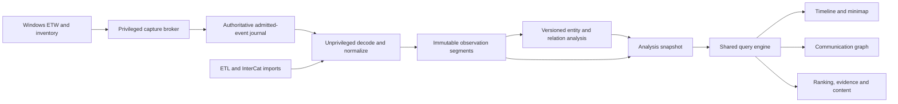
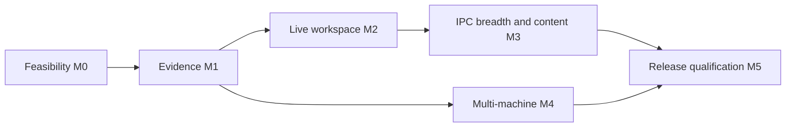
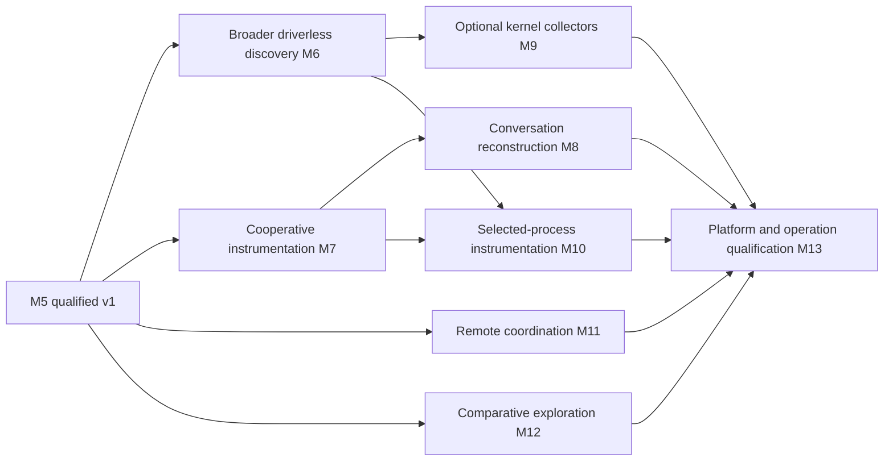
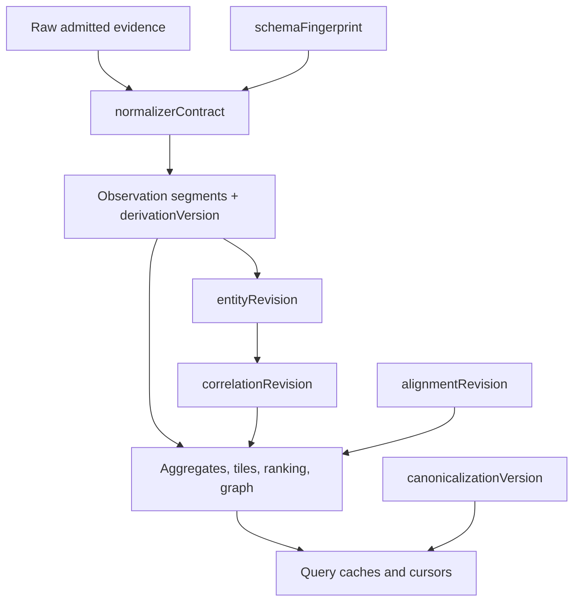

# InterCat / Windows IPC Visualizer

## 1. Purpose and product decisions

**Status:** reviewed product architecture and implementation blueprint, revision 97, 2026-09-24. M0 and its capture-impact follow-on are complete; M1 is in progress, with measured limitations and resume actions tracked in `docs/IMPLEMENTATION-STATUS.md`. This design document does not itself imply a capture benchmark or capability claim. Revision 20 implemented the Windows pipe-authentication boundary with first-instance/native-DACL creation, remote-client rejection, impersonated-token SID/logon/integrity/elevation derivation, owner matching and a bounded authenticated dispatch loop; PID remains diagnostic only. Revision 21 adds the broker-owned filesystem root: created with a protected DACL and a high-integrity no-write-up label in one call, validated from the open handle by reparse state, final path, volume and an ACE-for-ACE security read-back, held open without shared delete, and opened only by single validated names beneath it. §9.2 now states why the mandatory label rather than the DACL is what refuses an ordinary-integrity write, and §20.5 states why installation should pre-create the root. Revision 22 adds bounded ownership-log compaction with the generation and refusal rules §20.3 now states. Revision 23 freezes the canonical import contract of §18.4 in `contracts/import-v1.md`: source and import identity, the canonical record key and what it excludes, the ordering an import may claim, equal-time multiplicity, and the bounded spill and cancellation path. It also records that the buffer context is keyed content rather than consumer state, and that the tie-breaks which make a sort total are not an ordering claim. Revision 24 connects a real ETL to that contract through a new `InterCat.Capture.Journal` module and the `icat import` command, and records what reading one measured: evidence recorded outside InterCat carries no clock identity of ours, so both the clock and the host are derived from the file's own content - minting either per run would make two imports of one file disagree about their records' identities - and the recorded tick rate, which the adapter library does not expose, is derived from the file's own readings and then checked against every sampled one rather than assumed. Revision 25 implements the §20.1 commit protocol in `contracts/store-v1.md` - staged and completed files, immutable published names, a manifest that re-measures every dependency before naming it, a replacing pointer with a retained last-known-good, and a recovery that rolls a torn publication back rather than reading it - and ADR-010 settles the journal-lifetime decision §20.1 owed. Revision 26 adds IC-015a, which owns the physical derived store §20.1 specifies but no backlog item claimed: `contracts/segment-v1.md` freezes the segment and dictionary bytes, ADR-011 records what building them decided, and an import now publishes a generation - admitted journal, sorted columnar segments, their dictionaries and the committed boundary that names the evidence - which `icat session` reopens and verifies. It also records two rules that came out of it: a measurement slot and a measurement are separate facts, so an unknown value in a declared slot keeps its domain, side and unit and stays in the denominator; and an identity that appears inside a record's identity is derived from the evidence rather than minted per run, which fixed an importer that minted a capture identity per record. Revision 27 adds evidence leases and retention to §20.1 and §20.2: a reader acquires a generation and every dependency it names as one lease, retention publishes a record of what it released and why rather than merely deleting, and a journal release works in whole batches and is refused when it would leave no admitted evidence. It also splits IC-016a out of IC-016 for the part of §20.2's checkpoint that needs entity and operation revisions, and records a defect the work exposed: the orphan sweep treated the manifest the retained last-known-good pointer names as unreferenced, so removing orphans could delete the one thing a rollback needs. Revision 28 turns §5.3's matrix into a compiler and freezes `contracts/metrics-v1.md` for the source-observations basis, and corrects three places where the matrix could not be implemented as written (ADR-012). Endpoint activity, which §5.1, §5.2, §5.3 and §22 all describe as a metric of its own, had no `EN-Metric` code and was reachable only as an accounting side of `BytesSent` or `BytesReceived`, where it contradicts the metric's direction; it is now `EN-Metric` 15, `EndpointActivityBytes`. A row's side - which end a measurement describes - and a request's accounting - which rows a total takes - are now stated as different facts with one mapping between them. And a traffic metric takes only a traffic domain, because "required, exactly one" let `BytesSent` be asked for in `RequestedIo`, which is P3's own example. A request the matrix refuses means nothing and is refused before a session is read; a request it permits that a session cannot derive is unavailable with its reason, and a byte total that takes no known contribution is unavailable rather than zero (R21). The ADR table in §16 no longer reserves numbers for unwritten decisions. Revision 29 derives process instances from a session's own lifecycle records and binds every record to one (`contracts/entities-v1.md`, ADR-013), so a total can be grouped by process instance or by mechanism with the groups partitioning it. Two findings shaped it. Most traffic belongs to processes the capture never saw start, so a PID that records name and no lifecycle record does is one provisional instance witnessed by its earliest record rather than unattributable. And identity-v1's rule that a reused PID stays unresolved was stricter than its own rationale: only a record inside a *later* lifetime can be a late record of an earlier one, so a record inside the first lifetime resolves as a never-reused PID's would, and a later one is a candidate the default evidence policy does not admit. The boot a process key needs is derived from the capture's clock, because a monotonic clock does not survive a restart. The executable stays fail-closed until the live capture runtime and its cleanup boundary are composed.

Revision 30 adds the source-field carriage that revision 29 deliberately deferred. The additive `source-fields-v1` table is keyed to an observation by raw locator and fact key; `process-binding-v2` uses its provider start sequence, parent key and source time claims without rewriting `observation-v1`. Executable grouping uses a witnessed full image path, not an exit basename or PID. A missing path is explicit un-attribution, and an older generation with no paths says the grouping is unavailable. The bounded SID skip that admits a start/rundown image has been verified by schema tests and ETL replay; its changed live callback and capture-impact cost still requires a new elevated measurement before the earlier impact figures are reused.

Revision 31 implements the direct-owner part of §19.1's process filtering in `metrics-v1`: `owner(P)` selects an instance under the chosen binding evidence policy, after interval scoping and before layer/mechanism projection. Ungrouped totals, evidence lists and grouped totals consume the same admitted rows and report excluded owner rows separately. A missing instance is not presented as zero; cross-side owner accounting and `participant(P)` remain unavailable until a proven relation exists. `participant(P)` has explicit fail-closed request syntax, not an owner approximation. Capture-side admission and impact remeasurement noted in revision 30 remains owed.

Revision 32 implements the first R20 rebuild path: `icat rederive` streams a published generation's own committed journal through its retained compiled descriptor plan and atomically replaces derived segments in a new generation, leaving the prior manifest as last-known-good. The journal's schema fingerprint is not itself a field layout, so new imports retain the immutable bounded `normalizer-plan-v1` dependency. Legacy sessions without that plan and multi-journal sessions refuse re-derivation until a verified migration or complete multi-capture replacement exists. A future semantic normalizer change must introduce a real contract version and preserve raw identities in tests; incrementing a number alone is not an acceptance test.

Revision 33 makes that path discoverable in `icat session`: its report states whether the manifest has the structural prerequisites for an attempt, why not when it does not, and a command when it does. This is a preflight, not a claim that the journal and plan have replayed successfully; only `icat rederive` validates their contents before publishing. Connection ID alone remains insufficient proof of a TCP peer or transfer association, so revision 31's participant and cross-side refusals remain correct.

Revision 34 adds a read-only full replay check to that path. `icat rederive --check` validates the saved plan, journal digest, all checksummed frames and normalized rows without staging or publishing; it states that a later segment write or commit has not been tested. Both checking and publishing re-measure dependency digests on the handles they read, so an in-place change after store opening is refused even if the length remains the same. The two commands share one replay implementation to keep their interpretation consistent.

Revision 35 closes an import publication ambiguity: `--overwrite` never authorizes appending to or replacing evidence in a nonempty session directory. It applies only to an optional report file. An import with `--into` publishes into a fresh empty root, and the import API refuses a store that already has a generation before it reads an ETL. Appending the same capture as another generation would make every existing observation count twice; catalogue-backed reuse remains separate work. `contracts/import-v1.md` now states the session import that has existed since revision 26 instead of its stale pre-session limitation.

Revision 36 serializes publication across independently opened store instances through a root-owned exclusive file lock. A writer re-verifies the current pointer under that lock and refuses stale generations and existing immutable targets before publishing; retention follows the same rule. Opening no longer deletes an unreferenced staging file, because another process may have completed it but not yet committed. It reports the file for coordinated cleanup instead. This closes competing-manifest publication, not cross-process evidence leasing: retention in one process still cannot see another process's in-memory reader lease, so broker/viewer composition needs a single-owner retention coordinator or a persistent lease mechanism before concurrent retention is enabled.

Revision 37 closes that deletion gap with a root-owned lease guard. A reader takes a shared read handle before acquiring and verifying the pointer; retention takes an exclusive handle before deleting released evidence or orphans, and defers cleanup while any process holds a reader. A writer creates the guard before first publication, so a read-only viewer can lease a new broker-owned session. The guard is global and may delay unrelated cleanup, and a process exit releases its holds; it is neither a durable pin across restart nor a cross-process quota reservation. A stale reader refreshes its verified snapshot, but that does not refresh its writer publication baseline. Legacy sessions with no guard require an owner upgrade before a read-only viewer can lease them concurrently with retention.

Revision 38 makes a torn current-pointer rollback actionable without treating recovery as silent mutation. `icat recover` previews the verified last-known-good, reason and manifest digest; only confirmation bound to that digest backs up a bounded damaged pointer and re-points current under the publication lock, then verifies the result. It does not select a newer orphan or delete any evidence. A later publication skips generation numbers already used by immutable orphan files, so rollback to generation 1 with an orphan generation 2 can publish generation 3 whose predecessor is 1. A gap is valid; reusing generation 2 would overwrite recoverable evidence or leave the writer blocked.

Revision 39 discharges the measurement revision 30 left owed: the live callback cost and capture impact of the SID/name admission plan. With image paths admitted, both sources still classify `Low`, and the callback-admission p99 is in the same buckets as before. The process source's median classified cost moved from 0 to 0.91 percentage points, with wider per-pair dispersion. The plan's rule is unchanged: a material admission change re-measures before older impact figures are reused as evidence for it.

Revision 40 implements §7.4's network correlator and the process filters of §19.1 that rest on it (`contracts/relations-v1.md`, ADR-014). The join key had to be measured. On every admitted TCP descriptor, connect, accept and disconnect included, the source endpoint is the record's own and the destination the remote one. So a record whose end is another record's mirror is the other end of the same connection, and when every record at that end binds to one process instance, that instance is the record's peer. The provider's connection identifier is not used: it was zero on the measured build and is reusable. An end reused by a second instance stays ambiguous for the whole capture rather than being split by time, and an end nothing in the capture holds is `PeerNotObserved`, never inferred to be remote from its address. `participant(P)`, `sender(P)`, `receiver(P)` and `peer(P,Q)` are now answered, and the records a filter cannot decide are disclosed by reason. Cross-side totals group by process through the relation. `EN-Grouping` gains 9 `Peer`, which ranks the processes at the other end from a focused one. Two corrections came out of it. `owner(P)` with a cross-side total is now refused as meaningless rather than reported unavailable: it would relabel bytes P received as bytes it sent, and no derivation can fix that. And a relation proves which process is at a record's other end, not which of its records is the same transfer, so the canonical owner of §5.3 still needs per-transfer associations.

Revision 41 gives staged files an OS-held ownership marker from creation through completion and publication. A data stream closing is not abandonment: a writer may still be preparing a manifest. `icat staging` previews active, marker-proven abandoned, marker-only and unmarked legacy files. Only a digest-bound confirmation under the publication lock removes the exact reviewed abandoned set; it never removes active, unmarked or published evidence. The marker is released on abandonment or process exit and removed after successful publication. Old staging from before markers cannot be proved abandoned and stays for manual review. This closes coordinated cleanup for new files without making ordinary session open destructive.

Revision 42 starts IC-017's layout foundation. The desktop now consumes a separate immutable, graph-identity-labelled layout result rather than source-model coordinates. A pure layout core sorts nodes and edges, seeds nodes on a stable per-group lattice from the graph identity and instance ID, retains prior positions when the group still permits them, enforces hard pins, and runs a fixed 120-step bounded relaxation with a scored best state. It refuses a graph above its explicit 512-node/4096-edge provisional bound rather than omitting members. The five-node tour is small enough to compute synchronously; query scheduling, off-thread layout for real graphs, compaction, persisted pins and stale-result rejection remain IC-017 work. Visual inspection of both supported rendered window sizes also changed the canvas transform and label side so upper-band labels do not collide with lower-band nodes. The old "300 iterations or 120 ms, whichever comes first" instruction was internally inconsistent with deterministic final positions: a wall-clock stop changes the number of iterations with host load. The corrected contract uses a fixed bounded computation for results; responsiveness comes from off-thread scheduling and cancellation, not publishing a partial wall-clock-dependent geometry.

Revision 43 gives that layout its first off-thread publisher. `GraphLayoutScheduler` snapshots nodes, edges, prior positions and pins at submission; a new request invalidates and cancels the old one, and even a worker that ignores cancellation cannot publish a late layout. A result naming another graph identity is refused, a closed window cancels its work, and caller cancellation remains distinguishable from supersession. The desktop keeps the synthetic positions only as a first-frame fallback and applies the complete result on the UI continuation; render tests wait for that result. This implements R7 for layout, not for the still-owed numeric query bundle. The scheduler cancels outside its lock so a worker callback cannot reenter it and stall the UI.

Revision 44 freezes §10.5's canonical form for the members `metrics-v1` implements (`contracts/query-identity-v1.md`, ADR-015). §21.2 lists it as an M1 closure artifact, although the backlog had filed it under IC-018 in M2. Writing it against real requests found five defects. `requestedRows` sat in §23's hashed member order while §10.4 and §10.5 put it beside the hash; it now stays beside it, so the top 5 and the top 20 of one total share an identity hash. A rate had no member for its numerator; `rateNumerator` now follows `metric`. Filter terms were sorted "by dimension code", and no dimension had one; `EN-FilterDimension` now gives them codes, with a peer as a member of the process term (§19.1) rather than a term of its own. A snapshot entry named a generation number, which is local to one session; each entry now carries the manifest digest that pins its bytes. And what a metric means was not a version axis, though its rules changed twice in two days; `metricsContract` is now §24's fifteenth axis. Only the axes and terms an answer depends on are written, so an evidence policy that cannot change an ungrouped total does not split one query into two identities. Every `icat metric` answer, available or not, names its identity, and `--print-canonical` prints the bytes it hashes.

Revision 45 answers `ActivePeers`, one of the two distinct counts §5 defines and §5.2's peer ranking needs. A peer is a process instance at the other end under `relations-v1`, which is an identity, so counting peers establishes none from reusable values (R22). The count is a lower bound: a record whose other end is unresolved names no peer and is an unknown contribution with its reason, a remote process is never counted, and a count with no resolved peer is unmeasured rather than zero (R21). A count needs a subject process, a focus or a grouping by process or executable, and a grouped count's rows overlap, so it states that they do not partition its total. `ActiveChannels` stays unavailable, and the reason is now precise: a channel is a connection incarnation with a lifetime, and whole-capture ends would count a reused port once.

Revision 46 scopes connection ends by their witnessed lifecycle (`tcp-endpoint-relation-v2`, ADR-016), as §7.2 asks for port reuse. An end's records are divided into connection incarnations at the connects, accepts and disconnects the capture holds for it. Incarnations at the two ends pair in order when their counts match, since a 4-tuple carries one connection at a time, and otherwise only by a uniquely overlapping lifetime. An undecided pairing still names the other end when every candidate is held by the same instance. A reused port whose lifecycle was witnessed now pairs each connection with its own other end, where the whole-capture rule left both without a peer. An end whose lifecycle was not witnessed is one incarnation, exactly as before, and a lost boundary can merge two incarnations but never split one. The canonical query form now takes its version-axis values as input, so the new rule changes identities that depend on relations without changing the form or its golden corpus.

Revision 47 answers `ActiveChannels`, the second distinct count of §5, now that a connection incarnation is an instance with a lifetime. Two paired incarnations are one channel, a port reused by a later connection is another, and a connection whose other end no record holds is a one-sided channel. When pairing is undecided, only the side with more incarnations is counted, since each of those is bounded by its own lifecycle, so one connection is never counted twice. Records that identify no channel - another mechanism, no endpoint pair, the uncounted side of an undecided pairing - are the count's disclosed unknown part, making it a lower bound. A channel count needs no subject process; per process it overlaps as a peer count does.

Revision 48 completes §19.1's process filters with `between(A,B)` (ADR-017), whose direction policy §23 did not define. A record passes when its maker is a process of one set and its other end, under `relations-v1`, a process of the other. `EN-BetweenDirection` keeps either way, or only the data that left the first set for the second, or only the reverse. A record with no data direction passes under either way only. The filter names both ends, so combining it with a focus or a peer is refused rather than intersected. Its canonical term writes one meaning one way: each set sorted, and a backward direction written forward with the sets exchanged. Verifying it on the `peak` capture found a defect. An answer that reads process bindings without a focus or a process grouping derived instances without the session's start keys. So a between filter could not find the instances the process list prints, and a channel count over every process named no binding rule in its identity, although its relations read bindings. Every answer that reads a binding now derives instances one way, and its identity names the binding rule.

Revision 49 adds focused `ActiveChannels` grouped by peer. The overall distinct channel count remains the same as its ungrouped focus; each resolved counterpart gets its own distinct count of connection incarnations, while known channels with an unresolved counterpart remain unattributed by reason. Unknown channel identities remain a lower-bound disclosure, never zero. The grouped rows do not claim to partition the total, and a top-N remainder counts the union of hidden channel identities. The candidate-binding policy continues to apply to the counterpart. Grouped distinct requests refuse a record evidence list, which enumerates one ungrouped total rather than a group's records.

Revision 50 prepares IC-017's real-session workspace bridge without claiming it exists. The viewer now accepts an immutable non-tour snapshot under its own graph identity and opens an empty snapshot without selecting a made-up process. The header and selected-interval label describe that snapshot, and the coverage strip states its interval coverage states without asserting a gap duration the ledger did not measure. Workspace viewport time is explicitly 100-nanosecond presentation ticks; a future projector must convert the capture's native or session-relative readings to this scale and must keep graph, timeline and accessible tables on one leased generation. The default tour remains visibly synthetic.

Revision 51 starts the real-session read-side projection under one evidence lease. A bounded overview derives process instances and paired TCP relations using the session's own clock and source fields, aggregates only admitted relationships into stable display-order edges, and converts session-relative nanoseconds to the viewport's 100-nanosecond scale for an observed-only timeline. It refuses graphs above the provisional 512-node/4,096-edge bound instead of silently dropping entities. Candidate relations require explicit policy, unknown times and unresolved TCP counterparts are counted separately, byte totals are not invented, and timeline coverage remains unknown until the coverage ledger is composed. The timeline renderer now overlays a coverage hatch on observed bars instead of erasing them: incomplete coverage and observed activity are independent facts. This bundle is not yet the coherent graph, ranking and timeline view §19.3 requires; channel, operation, evidence and byte projections and numeric scheduling remain.

Revision 52 gives §19.3's eligible-set rule a concrete read-side join. A paired relation exposes the same within-derivation channel number that each of its two ends' records names. The overview keeps an all-observations timeline and separately constructs a graph-eligible timeline from only the channels of displayed, policy-admitted relations, on the same interval grid. It verifies that selected row count equals the displayed edges' record count before returning either. A one-sided or unresolved flow stays in the all-observations view and cannot become a graph bar; a candidate relation enters the graph and its timeline together only when policy admits it. The channel number is not a cross-generation identity, so the query/graph identity continues to name the derivation and generation. The UI still must publish these projections with its ranking and coverage as one applied bundle.

Revision 53 implements the first capture coverage ledger for imported sessions (`contracts/coverage-v1.md`, ADR-018). It publishes delivered, admitted, policy-omitted, undecodable and source-reported loss facts as an immutable manifest dependency, carries them unchanged through re-derivation and protects them from derived-file retention. A quiet mechanism in a standalone ETL remains unknown because the file cannot prove provider enablement; a reported zero loss is kept distinctly from an absent counter. An unknown descriptor version has no assigned mechanism and conservatively affects every collected mechanism. An ETL system record with no provider GUID remains counted only in the whole-provider policy-omission bucket; it cannot become admitted evidence under an invented identity. Coverage is bounded by delivered readings, never extrapolated outside them, and does not turn an empty metric into zero. Live capture must emit measured counters for every required loss layer and open epochs at policy/source changes before it may publish this contract. The desktop still needs to compose ledger state with its leased real-session overview.

Revision 54 joins a published coverage ledger to the leased real-session overview's time buckets using the source clock's exact native boundary conversion, including negative times around presentation tick zero. Each all-observations bucket rolls up the states of mechanisms with observed rows in that bucket; the graph-eligible TCP timeline uses the same ledger only where it has displayed, eligible rows. Empty buckets remain unknown, a quiet imported mechanism stays unknown in the bundle's mechanism summary, and an unlocated source loss makes every affected observed bucket partial without fabricating a loss time. The bundle names whether a ledger was published and preserves read-only results. The desktop still must apply this bundle atomically with its ranking and ladder; coverage over absent rows or unproven relations cannot be inferred from a covered source.

Revision 55 joins the same ledger to every metric answer under its evidence lease, separately from the observed value and its measurement availability. A mechanism-scoped request carries that mechanism's coverage over its native interval; an all-mechanism request carries separate states rather than a false single "covered" claim. Legacy generations remain unknown. A rate keeps exactly its observed numerator and whole-interval denominator, with no correction for a reported gap. The CLI reports this distinction in JSON and in a compact terminal summary, and `metrics-v1` now states it. Source coverage still does not prove the completeness of a process binding or relation, and live capture epochs are not yet published.

Revision 56 admits UDPv4 datagrams after measuring what their events mean (FX-UDP-001, ADR-019). The Kernel-Network source already delivered them under its IPv4 keyword, and the catalog omitted them because no measurement said which endpoint each descriptor names first. A new `udp-loopback` truth workload answered that. A send names its owner's endpoint first, as every TCP descriptor does, but a receive names the datagram's sender first, 16 of 16 each way. Records keep endpoints as the source names them, and a reader that needs a record's own end reads it through one measured orientation, by mechanism and kind. With it applied, the fixture met every traffic criterion of §14.2 at 100% and reached `TrafficVisualization`, reproduced by a second run. A focused capture now admits only the transport it names, and UDP is a focusable transport. The capture impact was re-measured with the wider plan. With seven pairs per source on a machine that was not quiet, both sources came out just over the Low ceiling (1.61 and 1.53 CPU percentage points, Moderate), well inside §12's target, and the catalog records that measurement rather than the older, narrower one. The relation rule still reads TCP only, so a UDP record's other end is `NoRelationRule` until a rule reads UDP.

Revision 57 relates UDP datagrams through their mirrored endpoints (`transport-endpoint-relation-v3`, ADR-020). A record's own end is read through the measured orientation of revision 56, and every end is keyed by its protocol as well as its endpoints, so a TCP and a UDP socket on the same numbers are never paired. A UDP end has no lifecycle records, so it is one incarnation - one datagram flow - for the capture, and a port reused by another process within it stays ambiguous rather than being split at a guessed moment. Every TCP answer is unchanged, and the rule's identity changes because relation-dependent answers now read UDP. On an imported capture of the UDP workload, a client's 23,008 B conversation was attributed to its server as correlated and partitioned by peer, and its three sockets were exactly three channels. The leased overview graph keeps its TCP relations exactly as before; UDP joins it when IC-017 gives edges a mechanism of their own.

Revision 58 records live captures straight into sessions (ADR-021). Until now every session came from an ETL another tool recorded, and the broker's capture runtime had only a test fake. `LiveSessionRecorder` drains an owned capture's admission queue on one writer thread into the session's own `journal-v1`, in acquisition order, and derives rows as the import does. When the capture stops, it publishes one generation through the §20.1 commit protocol, with a live coverage epoch: the providers whose enablement succeeded, and the session's own counters for lost events, lost consumer buffers, queue drops and records admitted but never journaled. A queue-dropped record is loss, not a delivery. An unreadable loss counter withholds the ledger, so coverage stays unknown, and a refused clock withholds the generation. `icat record` runs it from an elevated shell for a profile and a duration, and Ctrl+C keeps what was recorded. An 8-second Explore recording journaled 4,273 records, lost nothing, and reopened through every reader like an imported session. Building it found that an import's ledger named its providers by GUID, because an import enables none; the shared tally now names them from the source catalog. Publishing while recording, so a viewer can follow a capture, and the broker's binding of the same runtime remain.

Revision 59 publishes a live recording as it records (ADR-022). Every publication interval that admitted records completes a journal chunk, a complete and immutable `journal-v1` file with its own header, clock, schema table and terminal frame. It then publishes a generation carrying every earlier chunk and segment plus the new ones. Record ordinals continue across chunks. The coverage ledger comes only with the last generation, because an epoch still running has not stated what it lost. A reader follows the capture by acquiring the current generation again: during a 12-second recording published every 3 s, `icat metric` read 626 and then 961 observations. A growing journal whose generations name longer prefixes was the other reading of §20.1's committed boundary. It is deferred because it would make a published file change, make dependency checks measure prefixes, make readers share files with a writer, and leave prefixes without terminal frames. Chunks give the same following behaviour and keep every rule the store proves. Re-derivation and journal-prefix retention still read one journal and now refuse several by name, and §20.1's compaction targets become necessary as chunks accumulate.

Revision 60 re-derives a live recording (ADR-023). ADR-022 left re-derivation reading one journal, so every chunked recording was refused the rebuild §20.1 promises for retained evidence. Re-derivation now replays every chunk in recorded order and publishes one replacement generation, which carries every chunk, the plan and the ledger unchanged. Before it publishes anything, the replay proves the chunks are one recording. Each chunk's digest must match. Every chunk must name one capture and one clock. Within each stream and epoch, each chunk's ordinals must pass those of the chunks before it. The boundary must name the newest chunk. ADR-022 also made a row's journal index count within its chunk, so the index beside a metric's evidence did not locate a record in the capture, and a replay could not reproduce it. The index now counts across the capture's chunks. On the 5-chunk, 1,288-record recording from revision 59, the replacement answered `observations` by mechanism exactly as the recording did, reading 1 segment instead of 4. Journal-prefix retention still reads one journal.

Revision 61 lets a live recording shed its oldest evidence, and stops re-derivation from quietly dropping rows (ADR-024). A chunk is the unit of release in a recording. A boundary releases each chunk that ends at or before it, the generation stops naming them, and nothing is rewritten. Only a leading run of chunks can go, never the one the committed boundary names, and never every record. The retention record lists the chunks, and its source digest covers their dependency lines. Writing that exposed a defect in ADR-010's release. The release keeps every derived row, but the next re-derivation replayed only the retained journal and carried none of the earlier rows, so the released records' rows vanished with no refusal and no note. Re-derivation is now refused whenever it would drop rows no replay can rebuild. The retention generation is refused from its own record. A later generation is refused when a stream's rows go back further than its retained records. `icat retain` states this before a release is confirmed. On the 5-chunk recording, releasing the first chunk freed 183,169 B of its 626 records without writing anything, and `icat session` then gave the reason re-derivation was no longer available.

Revision 62 makes a store instance hash each immutable dependency once (ADR-025). `store-v1` re-measures every dependency before a generation names it and whenever a reader acquires one, and re-measuring hashed every byte each time. A live recording carries every earlier chunk, so each publication hashed the whole session, and did so twice. A benchmark publishing 120 chunks of 20,000 records measured commits growing from 158 ms to 1,951 ms at 742 MiB, and a writer's lease reaching 972 ms. At §12's ingest target a 5-second publication would have spent longer hashing than recording within a minute or two. Every dependency is still opened and its length checked. Its bytes are hashed unless the same instance already hashed that file and its last-write time has not moved, which any write to an immutable file would do. A fresh instance hashes everything once. The same benchmark now commits in 148 ms and leases in 38 ms at 742 MiB. §20.1's disclaimer already covers the trade-off: checksums detect corruption and do not claim tamper resistance, so corruption that leaves a file's time alone is found by the next fresh instance. File counts and viewport opens still grow with a recording, which is what §20.1's compaction targets address.

Revision 63 implements §20.1's compaction targets (ADR-026). A publication unit is the derived files one generation published; its dictionaries serve only its segments, because a segment resolves them through its own generation. A unit is small below 64,000 rows and 8 MiB. Runs of consecutive small units are rewritten into bounded segments, and every row moves unchanged, so every observation keeps its identity. The generation releases the replaced files through the retention path, which respects leases and keeps disk use flat, and carries the journals, plan, ledger and boundary unchanged. A live recording coalesces the oldest run, at most one segment's worth of rows, whenever 64 small publications have accumulated, and every run left when it stops. `icat compact` does the same for any session. §20.1's per-time-block bound is read as the recorder's count of small publications, because a chunked recording's segments cover consecutive intervals. On a 120-publication benchmark, compaction reduced 120 observation segments to 10 and 360 files to 140, at about 200,000 rows per second. The 5-chunk recording went from 4 segments to 1 with identical answers. Journal chunks are evidence and are not coalesced.

Revision 64 splits live recording along §9's boundary and closes a gap in it (ADR-027). §9 and §18.1 give the broker the authoritative journal and leave decoding and normalizing to an unprivileged process. `LiveSessionRecorder` did both in the recording process, and since revision 63 it also compacted. That is acceptable for an elevated `icat record` but not for the broker. The plan also never said where a broker-owned capture's derived segments live: the broker directory's no-write-up label keeps every ordinary-integrity process out of it. A privileged recording now publishes an evidence session - journal chunks, plan and ledger, with no rows - through the ordinary commit protocol (`icat record --evidence-only`). An ordinary process follows it (`icat follow`) into a session directory of its own. It mirrors each committed chunk byte for byte against the evidence digest, derives the rows with the same normalizer and capture-wide journal index, copies the plan and ledger, and compacts. It also resumes where it stopped and refuses evidence it does not mirror. The derived store of a broker-owned capture is therefore the viewer's own directory. Verified live: a 12-second evidence-only Explore recording, followed as it recorded, yielded a derived session whose observations by mechanism equal the recorder's coverage counts (TCP 723, process lifecycle 453, UDP 78). Still owed for the broker binding: a module the broker may reference for the evidence-only path, per-capture directories in the broker root, the runtime and the executable.

Revision 65 gives the broker's recording path a module of its own (ADR-028). `InterCat.Capture.Journal` was meant as the one bridge between the capture adapter and the storage formats, shared with the future broker. It had since come to hold the ETL parser, the normalizer, re-derivation, the follower and compaction, none of which may run privileged, so the dependency map kept the broker away from all of it. `InterCat.Capture.Recording` now holds what a privileged recording runs: `LiveRecorder` with its journal chunks, plan and ledger, the envelope mapper, the coverage tally and the retained normalization plan. A derivation plugs in through `ILiveRecordingDerivation`. `LiveSessionRecorder` supplies the normalizer and compaction through it for an elevated `icat record`, and the broker will supply none. Behaviour is unchanged: every test passes, and a live recording published 4 chunks and one closing compaction.

Revision 66 gives every broker capture its own evidence directory beneath the pinned root. The fixed capture ID names one ordinary child component; creation applies the root's protected ACL and no-write-up label before the directory exists, and adoption checks the open handle's reparse state, final path, volume and security. Unlike an empty root, an existing capture directory with changed security is refused, not repaired: silently blessing files already in it would cross the evidence boundary. Its held handle prevents rename during publication. The viewer reads that directory but writes its mirrored, derived session into an ordinary user-owned directory (ADR-027). The broker executable remains disabled until the live runtime, quotas, recovery and authenticated pipe host are composed.

Revision 67 corrects a broker recovery rule before the live runtime is enabled. The coordinator previously preserved an unexpired active capture on process restart, as though a still-valid owner lease also preserved the former broker process's ETW handle. It does not. Startup recovery now requests stop for every active capture from the durable ownership token, even when its lease is unexpired. A refused stop remains partial and retryable, never relabeled closed. Ordinary in-process lease renewal and expiry sweeping are unchanged; restoring an active capture across broker restart would require an explicit, separately proven reattachment protocol.

Revision 68 binds a broker ETW session name to the durable capture and ownership token without truncating the token. The old 64-character name lost more than half of its token; the new 60-character `InterCat-b-<capture-prefix>-<token>` uses 64 bits of capture ID and the full 128-bit token. Durable records of the old form remain valid for cleanup only; new starts never issue one. The file-backed ownership store checks the name against its capture ID, and the ETW adapter can construct a capture identity from an already-persisted ID, name and token without minting another. This is an identity prerequisite for the runtime, not live broker enablement.

Revision 69 gives the evidence-only recorder an explicit readiness signal for the broker's asynchronous `Start`. It fires only after ETW has started, the source clock and first journal stage have been established, and the dedicated journal writer thread has entered its run; a startup refusal never fires it. The completed recording result remains the final authority on stop and publication. An elevated ordinary `icat record` uses the same path without a readiness observer. This does not itself enable the broker runtime.

Revision 70 adds an exact-name ETW recovery-stop capability to the Windows adapter. It validates the durable token's current or legacy broker-name shape before touching ETW, checks whether that exact session exists, uses TraceEvent's `Attach` option (which fails rather than creating/restarting an absent session), requests stop, and checks that the name disappeared. An inaccessible session that remains is an explicit failure, so the lifecycle record stays partial and retryable. This is the adapter path a broker runtime will use for orphan cleanup; it has shape/refusal tests but no elevated live crash/restart verification yet, and the executable remains disabled.

Revision 71 composes an evidence-only `IBrokerCaptureRuntime` behind the disabled broker executable. It starts only from a matching durable capture/token/plan digest, creates a new protected per-capture directory, acknowledges only after ETW and the journal writer are ready, and stops with separately verified ETW, callback-drain and journal-publication milestones. Recovery attaches only to the exact durable ETW name and reports callback drain and journal finalization as **unproven**, never inferring them from an absent session. The recorder now rejects an append before an exact journal-v1 byte allowance would be exceeded, accounting for buffered records, batch framing and the terminal; it ends acquisition and publishes the admitted prefix plus a loss ledger. The runtime applies a duration limit and checks the free-disk reserve before starting and each second while recording. The previous rule requiring the free-disk reserve to be *smaller* than the journal allowance was nonsensical: these bounds protect different things, and a small journal with a larger system reserve is safer. They are now validated independently. A bounded journal currently publishes once on stop because periodic rollover cannot yet reserve the bytes and final ledger of its next chunk. Before enabling the executable, persist autonomous quota-stop completion in the lifecycle log, give the free-space limit a hard per-write/reserved-finalization guarantee rather than only a one-second observation, verify crash recovery against a live elevated ETW session, and exercise the authenticated pipe, protected root and lifecycle together. The ordinary follower cannot follow this bounded capture until publication rollover is made quota-aware.

Revision 72 makes the runtime's autonomous end observable to the lifecycle coordinator without a client stop request. An in-process completion probe is read-only; the coordinator first writes a durable `AutonomousStop` intent, then obtains stop milestones and persists the result. Status and lease renewal reconcile a completed capture before answering, so neither claims it is still recording or renews a finished capture; a host may also sweep completed captures proactively. File-backed tests prove status-triggered and no-client reconciliation survive reopen, and an integrated evidence-runtime test proves a duration stop becomes durable status. The broker executable remains disabled because the host does not yet run the sweep, a persistence failure may leave a pending stop that needs restart recovery, the disk reserve remains observational, and quota-aware live publication plus elevated pipe/restart verification remain open. A live journal that finalized before a broker crash must be verified from its committed manifest before recovery can promote its journal milestone; merely finding the ETW name absent is not enough.

Revision 73 lets an evidence-only recorder publish live journal chunks while enforcing one aggregate journal-byte ceiling. Before rolling over it accounts for all already published journals, the exact completed size of the current buffered chunk and a complete empty next chunk (header, clock, schema table and terminal). If the next chunk cannot fit, it keeps the current chunk open for finalization rather than publishing and spinning on a due timer. Each append uses the remaining aggregate allowance, and the final generation carries the coverage ledger. A test opens an intermediate generation as a reader while the capture pump is still active, then verifies every published journal together stays under the cap when the limit stops acquisition. The broker runtime still uses no publication interval: choose and disclose a bounded, performance-qualified cadence in the effective prepared plan before wiring live follow, since frequent manifests repeatedly verify growing dependency sets. The executable remains disabled for the other revision 72 gates as well.

Revision 74 makes stop-result persistence retryable without replaying the capture runtime. Once a stop has produced its milestones, a failed durable completion write is retained in the coordinator as an in-process pending completion; host maintenance, authenticated status and authenticated lease renewal may retry that exact completion. The retry does **not** call `IBrokerCaptureRuntime.StopAsync` again, because a second runtime stop after the active capture has been removed can only reconstruct weaker restart evidence and would incorrectly downgrade already-proven callback/journal milestones. A different owner still cannot trigger reconciliation. This is an in-process durability bridge, not crash recovery: after a broker process loss, §20.3 recovery must verify any already-published final journal from the protected capture store before promoting `JournalFinalized`.

The live-publication sequencing is also tightened. The 4 Hz value in §19.3 is an **analytic snapshot/UI freshness target**, not a journal-manifest publication rate. Journal chunk publication has a different cost profile because each generation re-verifies an expanding immutable dependency set. Its cadence must therefore be a separately named, bounded setting compiled into the effective prepared plan, included in the plan digest/effective summary, and benchmarked against capture impact before the broker enables live follow. A client may request a supported policy/level, but it must not inject an arbitrary millisecond interval into the privileged runtime.

Revision 75 closes the restart-finality proof gap before that live-publication cadence is enabled. A complete `journal-v1` chunk proves only that one immutable chunk committed; because intermediate live chunks are complete too, it cannot prove that capture publication ended. A new bounded `capture-finalization-v1` dependency is staged only with the last generation after the owned capture session stop returns, recording the capture ID and the provider-stop/callback-drain observations then available. Restart recovery reopens an existing protected capture directory without creating one, verifies the store and prepared-plan source identity, verifies that finalization marker, binds the committed boundary to its journal length/digest/capture identity, and replays that journal through its terminal and committed record count before promoting `JournalFinalized`. `CallbacksDrained` is promoted only when the verified marker records it; provider stop is still checked independently against the durable ETW ownership. A verified coverage ledger remains a compatibility-only last-publication signal for older recordings, and cannot recover callback-drain evidence. The follower uses the new marker as its normal finished signal, so a clean capture with unreadable loss counters is finished with unknown coverage rather than appearing live forever.

Revision 76 tightens the remaining free-space gate before code is added. `MinimumFreeDiskBytes` is a floor for InterCat's own write admission, not a second journal quota and not a promise that unrelated processes cannot consume the volume between observations. The one-second monitor remains useful telemetry but is not enforcement. Every evidence write/publication path must refuse new growth before its own write would cross the floor, while separately preserving enough calculable headroom to finish the already-admitted journal tail and publish bounded final evidence/manifest metadata. That headroom is derived from the actual pending journal state and bounded encodings, not an arbitrary fixed polling margin; finalization may consume the reserved headroom but must still preserve the configured floor. If InterCat ever claims an exclusive volume reservation against other writers, it needs an OS/filesystem reservation mechanism rather than this admission invariant. §20.2 and the broker status UX must report the distinction plainly.

Revision 77 implements that floor and corrects an overstatement. The live recorder now admits a journal append only if the projected complete chunk stays under a ceiling computed from the last free-space probe: bytes already written to the chunk, plus the space the broker identity may still allocate (GetDiskFreeSpaceEx, so a per-user quota counts), minus the configured floor, minus finalization headroom. That headroom is bounded, not guessed: the coverage-ledger and finalization-marker encoding limits, a manifest-and-pointers bound per named dependency (`SessionStore.PublicationMetadataBound`, checked against real metadata by a test), one allocation unit per file the last publication creates and the staging stream's write buffer. The unwritten journal tail is already part of the projection. A refusal on the floor probes once more before stopping, observations expire after 250 ms, an impossible or failed probe stops acquisition rather than assuming space, and intermediate rollover is admitted only if its metadata and the next chunk's header also fit. Start is refused, with the numbers and what to do, when the volume cannot hold the floor plus that headroom. The one-second monitor remains only to end an idle capture whose volume another program filled. Work on this also found that the recorder's writer could spin once a publication was due but refused; it now waits for records whenever no rollover is possible. Section 20.3 previously said the bounded journal-publication policy was already frozen into the prepared digest; it is not yet, and that sentence now says so.

Revision 78 freezes the journal-publication cadence in the prepared plan. A client asks for a named policy - `OnStop`, or `Live` so an ordinary process can follow the capture - and never supplies an interval. `Live` compiles to `max(2 s, ceil(maximum duration / 1024))`. A fixed interval was not viable: at 1-2 s a 24-hour capture would publish 43,200-86,400 chunks, exceeding the 65,536-dependency manifest limit and rewriting a multi-megabyte manifest on every publication. Capping a capture at about 1,024 chunks keeps each publication's verification and metadata cost bounded for the whole capture, at the price of coarser follow latency for very long captures (85 s at 24 hours), which the effective summary states. The policy is part of the plan digest; the effective summary carries the policy and its compiled interval, and a client refuses a summary whose interval is not what the policy compiles to. The broker runtime now passes the compiled interval to the recorder, where the journal quota and the free-disk floor already govern rollover. The 2-second floor and the 1,024-chunk cap are engineering bounds, not measurements; an elevated capture-impact benchmark must confirm or change them before the broker is enabled, and changing them changes the digest input rather than silently altering prepared plans.

Revision 79 adds the broker host's maintenance loop as a composable component, `BrokerMaintenanceLoop`. The host runs its `RecoverAsync` to completion before the pipe accepts commands, then runs passes at a one-second default (bounded to at most one minute). Each pass makes autonomous duration, journal-limit and disk-floor stops durable, retries stop completions whose durable write failed, and stops captures whose interactive owner lease expired - without waiting for a client to ask. The two halves are isolated, so a failed lease read does not skip completion reconciliation. A persistence failure inside a stop counts as a failed pass, and a failed pass is reported with a consecutive-failure count rather than ending the loop. A throwing report sink is ignored, and cancellation or coordinator disposal ends the loop normally. The coordinator's completion sweep now retries queued stop completions even when the runtime has no completion probe. The executable is still not composed: wiring the pipe server, protected root, file-backed lifecycle store, evidence runtime and this loop into one elevated process, then exercising crash/restart with real ETW, is the remaining enablement gate.

Revision 80 composes the broker executable behind an explicit opt-in, and closes a gap in the pipe trust model. `BrokerHost` recovers the durable store before the pipe exists, then serves one authenticated client at a time on a single first-instance pipe it holds for its whole lifetime - it disconnects and waits again on the same handle, so the name is never free between clients - while the maintenance loop runs beside it. A refused client (wrong user or logon session) is disconnected and the host keeps serving. An on-demand elevated broker must not linger: it exits after a configurable idle period (default five minutes) with no client and no active capture, and never while a capture holds an ETW session; an unreadable store counts as active. On shutdown it stops and finalizes what is still recording (a new `HostShutdownStop` request kind) rather than leaving the successor an orphan with partial evidence. `serve` takes the owner SID, the owner's logon-session LUID as the client's own token reports it (elevation can use another account and always a different logon session), and the pipe instance GUID; none is trusted as authentication. Serving additionally requires `--enable-unqualified-live-capture` until the elevated crash/restart and capture-impact runs qualify live capture; without it the executable fails closed exactly as before. Exit codes follow §20.4. The gap: §20.3 authenticated the client to the broker but never the broker to the client. First-instance creation stops the *broker* from joining a squatter's pipe, but a process that claims the name first would receive the client's Hello and Prepare, and an elevated process's command line - which carries the GUID - is readable at ordinary integrity. The client must therefore launch the broker with a process handle and, after connecting, require `GetNamedPipeServerProcessId` to equal that process, refusing and reporting otherwise. §20.3 now states this.

Revision 81 records the first elevated qualification of the composed broker with real ETW (`tools/InterCat.BrokerQualification`, evidence in `bench/results/broker-qualification-*`). It found a production defect the fixtures could not: an elevated administrator's objects are owned by the user under Windows' default "object creator" owner setting, so the broker refused the root it had just created as untrusted. The root and capture-directory descriptors now name an explicit Administrators owner (`O:S-1-5-32-544`), which an elevated administrator token and SYSTEM can both assign. With that fix, a clean stop is fully finalized over live chunks, and a broker killed mid-capture leaves exactly one orphaned session, which its successor reclaims before its pipe exists. The published prefix stays readable, the result is an honest partial stop, and no InterCat session leaks. The client half of server authentication (`WindowsBrokerPipeClient`: the pipe server's process must be the launched broker) is implemented and used by the run. The run also shows two gaps that are next in order. First, an interrupted capture's staging files (`stg-*.tmp`/`.lease`) are never removed. Second, a partial stop whose remaining milestones can no longer be proven - the process that could have drained callbacks is gone - stays `Stopping` and is retried by every later broker start without any possible progress. Recovery must classify such a capture as terminally interrupted: it verifies and keeps the published prefix, salvages the complete frame prefix of the unpublished tail only if one is readable, releases the staging files, and closes the capture with its partial milestones and an `Interrupted` reason, so status says what was kept rather than "stopping" forever. Capture impact at the compiled live cadence remains unmeasured; that benchmark is still required before the opt-in is removed.

Revision 82 closes interrupted captures terminally. A partial stop is retryable only while a retry can prove something. Once recovery has proven the owned ETW session stopped, the process that could have drained callbacks and finalized the journal is gone. The runtime then releases that writer's abandoned staging, but only files whose ownership marker nobody holds; a staging file a live writer still owns keeps the capture retryable. It returns a terminal outcome whose reason begins `Interrupted:` and states what was kept. The coordinator closes the capture with its partial milestones: the state is `Closed`, the milestones say what is proven, and the stop code stays `StopPartial`. Later recoveries leave it alone, and the host's exit code is decided by milestones rather than by state. A provider stop that failed stays retryable, because stopping the session later is real progress. Salvaging the unpublished tail is deferred. It needs its own contract for a generation that is final without a finalization marker, and the loss it would recover is bounded by one publication interval under `Live`. Under `OnStop`, however, a killed broker loses the whole capture, because nothing was published. An interactive client should therefore prepare `Live`, and its review screen must say that `OnStop` keeps nothing if the broker is killed. §20.3 now states the retry rule. Real-ETW qualification confirms the behavior: the killed capture closes as interrupted, its published records replay, and no staging file or session is left.

Revision 83 measures the broker's capture impact at the compiled live cadence (`InterCat.BrokerQualification impact`, `bench/results/broker-impact-*`). The run uses the same seeded Explore TCP workload (4 connections × 768 messages, about 13 s) with no capture, with a broker capture publishing `OnStop`, and with one publishing `Live` every 2 s (7-8 chunks). Order rotates within five triplets. Throughput regression is zero in every summary. The broker process's own CPU over the window is about 470 ms under `Live` against about 170 ms under `OnStop`: the cadence costs roughly 0.3 core-seconds per 13 s, or 0.08 percentage points of a 24-thread machine. Median machine-wide impact of `Live` against no capture was 2.2 pp in one run and 0.0 pp in the next (Low to Moderate, under §12's 5 pp target). The difference between those runs is the problem: this development machine's busy share varies by ±3 pp with no capture at all, so machine CPU is not decision-grade here. An earlier three-triplet run showed 6.3 pp from two noisy trials, which is why the artifact now attributes broker CPU directly. The 2-second floor and the 1,024-chunk cap therefore stand as measured, not only as engineering bounds, at this workload scale. A quiet-host rerun remains an M5 release obligation before any published overhead claim. The enablement gates of revisions 79-82 are now met; the opt-in is removed together with the first client that launches the broker, since no client passes it today.

Revision 84 gives clients a way to reach the broker, and removes the opt-in. Protocol v1 - frame and field codecs, typed requests and responses, the shared stop/operation/refusal types, token identity, the pipe client and a new launcher - moves into `InterCat.CaptureBroker.Protocol`, which depends only on Domain, so the ordinary-integrity viewer can speak the protocol without referencing the privileged runtime or the ETW adapter. `ContentCaptureRequest`, its two modes and `ProviderProcessScope` move to Domain as plain values. The codec now checks structure only; which profiles exist and what each admits is the broker's installed catalog, checked by `BrokerPrepareRequestPolicy` right after decoding, with the same `InvalidRequest` refusal. `WindowsBrokerLauncher` starts the broker through ShellExecute `runas` with the caller's own SID and logon-session LUID and a fresh instance, keeps the process handle so the PID it checks cannot be reused, waits for the pipe while watching for an early exit, and connects only when the pipe server is that process. Every failure is a designed state with its own sentence: broker not installed, elevation declined (nothing started), launch failed, broker exited with a documented code, not listening in time, or served by an impostor. With the gates of revisions 79-83 met and a real client path in place, `serve` no longer requires `--enable-unqualified-live-capture`. Real-ETW qualification now also runs the launcher path end to end (`bench/results/broker-qualification-20260923T205911Z`).

Revision 85 delivers live capture from an ordinary-integrity prompt, `icat capture`, and fixes three defects the work exposed.

The command launches the broker (Windows asks for approval), prepares the explore or focused-transport profile with `Live` publication and prints the effective summary. It starts the capture, reads where the broker publishes the evidence, and follows that evidence into a new session of the user's own, renewing the owner lease as it goes. It ends at the duration or after Ctrl+C, which requests the stop and then derives everything published, and reports what was kept. The broker now states the evidence directory in status (field 13, optional), so a client never hard-codes the root layout. A test proves an ordinary-integrity follower derives from protected evidence without changing a byte of it. The follow ends on the broker reporting the capture closed rather than on the finalization marker alone, because an interrupted capture never writes one.

The three defects:

1. `SessionStore` wrote manifests and pointers through unmarked staging files, so a writer killed mid-publication left a file no cleanup could prove abandoned. Qualification caught one after a kill. Every staging file now carries an ownership marker.
2. A client cannot rediscover a broker it did not launch, yet brokers idled for five minutes holding the machine's ownership log. A second capture in that window crashed the new broker. Brokers now idle-exit after 10 s with nobody connected and nothing recording. A new broker waits up to 15 s for a finishing predecessor, then exits with code 6 ("another live capture is running") instead of crashing.
3. An unmapped failure now ends with a sentence and exit code 70, never an unexplained crash.

One live capture per machine is now an explicit v1 limit. Serving several clients from one broker needs a discoverable, server-authenticated endpoint, which is an M2 question and not addressed here. Qualification runs `icat capture` end to end with real ETW (`bench/results/broker-qualification-20260923T211410Z`). The Ctrl+C path of `icat capture` is implemented but not yet exercised by an automated test.

InterCat is a new Windows application for exploring communication between processes: who talks to whom, through which mechanism, when, how often, with what measurable volume, and with what observable contents. Its primary experience is a synchronized communication graph and time visualization, each given equal prominence. Users move fluidly from a whole-machine overview to a process, channel, time interval, operation, and underlying evidence.

This specification is self-contained: it carries every rule, value, enumeration and contract needed to implement InterCat, and depends on no other document, repository, product or prior discussion. Where a principle was demonstrated elsewhere, the principle is restated here with its own rationale and its own numbers rather than referenced.

Reading guide: [binding rules and invariants](#2-binding-engineering-rules-and-data-invariants), [prohibitions](#24-prohibitions), [first run and the detail ladder](#31-first-run-turn-it-on-and-see-the-flow), [product workflows](#3-core-exploration-workflows), [Windows coverage](#4-capture-coverage-and-evidence-contract), [volume semantics](#5-measurement-semantics-what-volume-means), [workspace design](#6-workspace-and-visual-design), [domain model](#7-domain-model-and-identity), [multi-machine analysis](#8-time-and-multi-machine-investigations), [architecture](#9-architecture-and-module-boundaries), [storage and queries](#10-storage-snapshots-and-query-implementation), [payloads](#11-payload-inspection-privacy-and-source-fidelity), [performance](#12-performance-and-responsiveness-targets), [scale at multi-gigabyte sessions](#121-session-size-tiers-and-scale-invariants), [verification](#13-verification-strategy), [v1 milestones M0–M5](#14-implementation-milestones-and-release-gates), [post-v1 milestones M6–M13](#15-full-post-v1-implementation-milestones), [risks](#16-risk-register-and-decision-rules), [open choices](#17-remaining-conceptual-choices-to-revisit-after-the-prototype).

Implementation detail: [capture and replay contracts](#18-capture-and-replay-implementation-contracts), [analysis and rendering contracts](#19-analysis-and-rendering-implementation-contracts), [storage and operational contracts](#20-storage-and-operational-implementation-contracts), [acceptance examples and review findings](#21-executable-acceptance-specification-and-review-findings). Reference material: [enumerations and wire codes](#23-normative-enumerations-and-wire-codes), [version axes and invalidation](#24-version-axes-and-invalidation), [non-goals and definition of done](#25-non-goals-and-definition-of-done), [solution layout and settings](#26-solution-layout-settings-and-operational-defaults), [glossary](#22-terminology-and-reference-notes), [illustrative manifest](#27-appendix-a-illustrative-session-manifest), [illustrative analysis specification](#28-appendix-b-illustrative-analysis-specification).

Sections 18–28 make the earlier architecture concrete; they are part of the specification, not optional commentary. Section 1.4 states how requirement words and identifiers in this document bind an implementation.

### 1.1 Confirmed product choices

| Decision | Requirement |
|---|---|
| Main use case | System exploration: discover who communicates with whom across Windows. Performance diagnosis is a supporting workflow; threat detection is not the organizing concept. |
| Capture | Driverless first. Optional deeper collectors and application instrumentation are later extensions. |
| Machine scope | Capture locally; import and correlate captures from multiple machines in one analysis workspace. No remote deployment or fleet control is required for the first release. |
| Main workspace | Timeline and graph have equal visual prominence, with linked selection, filters, and a ranked process/channel table. |
| Payloads | Include explicit opt-in inspection wherever a source exposes contents. Absence of contents remains an ordinary supported state. |
| Visual fundamentals | Preserve responsive timeline aggregation, pointer-focused zoom, pinch, panning, overview/minimap, reversible navigation, and exact evidence drill-down. |
| Post-v1 priority | Broader Windows IPC coverage and deeper visibility lead the roadmap, including optional collectors where they add proven value. |
| Deep application visibility | Support both cooperative SDK instrumentation and optional attachment to selected unmodified processes; deliver the SDK first. |

### 1.2 Meaning of whole-system visibility

“Whole-system” means system-wide discovery across supported IPC mechanisms and accessible processes. It does **not** mean that Windows offers a universal, lossless feed of every message, memory write, endpoint, or payload. Coverage depends on Windows build, provider schemas, privileges, capture settings, and event loss.

The product must always distinguish:

1. **Observed activity:** a source directly recorded an operation or lifecycle event.
2. **Correlated relationship:** multiple observations were linked by a documented rule.
3. **Discovered resource:** an endpoint, handle, or mapping exists; traffic may be unobserved.
4. **Unknown or unavailable:** information was not collected, not exposed, lost, or ambiguous.

An empty timeline cannot by itself establish that no IPC occurred. A mapped section cannot establish that bytes were exchanged. A temporal coincidence cannot establish a causal chain.

### 1.3 Delivery defaults, toolchain and supported builds

Use a new repository and solution. Target Windows x64 first; validate native ARM64 separately after the first complete vertical slice. Introduce native code only for a measured interoperability or throughput need. Offline viewing runs without elevation; system capture uses a narrowly privileged broker.

Stack: C#/.NET for domain, query engine, desktop, and capture orchestration; Avalonia with custom Skia drawing for timeline and graph; Microsoft TraceEvent behind a capture adapter, supplemented by Windows TDH metadata decoding.

Pin the following before the first production commit and record the choice and upgrade policy in ADR-001. “Pinned” means a failing build rather than a silent upgrade:

| Item | Initial pin | Policy |
|---|---|---|
| .NET SDK | .NET SDK 10.0.401, pinned in `global.json` with roll-forward disabled | Move only on an LTS boundary, through ADR-001 |
| Language and compiler settings | C# latest of the pinned SDK; nullable reference types enabled and warnings as errors solution-wide | No per-project suppression without a recorded reason |
| UI framework | Avalonia 11.3.22, centrally pinned; custom drawing uses Avalonia's Skia-backed rendering path | A major-line change is an ADR |
| ETW adapter | Microsoft TraceEvent 3.2.6, centrally pinned and referenced only by `InterCat.Capture.Windows` | Replaceable by a native TDH consumer if M0 fixtures show a semantic or throughput gap (§18.3). M0 measured an allocation gap on the real-time path; IC-019 evaluates the replacement (ADR-009) |
| Static analysis | Compiler analyzers plus an architecture fitness test enforcing §9's dependency direction (R19) | A failing fitness test blocks the build |

Supported build candidates for the first release, revisable by ADR-007 once M0 measures them. A build is supported only when its fixture corpus (§13.4) passes on it; every other build is reported as untested, never as probably working:

| Tier | Builds | Meaning |
|---|---|---|
| Primary | Windows 11 25H2 x64 (26200, and the 26220 pre-release branch); Windows 11 24H2 x64 (26100) | Development target and per-pull-request CI gate |
| Secondary | Windows 11 23H2 x64; Windows Server 2025 x64 | Fixture corpus maintained; release gate |
| Candidate | Windows Server 2022 x64; Windows 11 24H2 ARM64 | Qualified in M13; may ship as a separate edition |

Support named builds from this matrix, not a blanket “Windows 10+” assertion. A release is listed by its exact build numbers rather than by a range, because a range would silently accept a build nobody has run the fixture corpus on. Where a pre-release servicing branch of a supported release is listed, it is supported on the same terms and every result states which of the two it was measured on: "supported" alone would hide the difference between a retail build and a branch that can still change under it. ADR-007 owns this matrix and records why each entry is on it.

### 1.4 How this document binds an implementation

Requirement words have one meaning throughout:

| Word | Meaning |
|---|---|
| **must**, **must not** | A contract. Code, fixtures and gates depend on it; changing it requires an ADR |
| **should** | Strong default. A deviation is recorded in the owning module's ADR with its reason |
| **may** | Genuine latitude for the implementer |
| `TUNABLE:` | A named starting value to be benchmarked, not a contract. Measurement can change the value; it cannot remove the surrounding rule, and the value lives as a recorded profile setting rather than a literal |

Identifiers exist so that code, tests and gates can cite this document. A test asserting a rule names it; a milestone gate lists the rules and fixtures it verifies. A gate that cannot name them is not a gate.

| Prefix | Meaning | Defined in |
|---|---|---|
| `R<n>` | Binding engineering rule | §2.1 |
| `I<n>` | Product and data invariant | §2.2 |
| `P<n>` | Prohibition: a blocking defect if found | §2.4 |
| `S<n>` | Scale invariant | §12.1 |
| `EN-<Name>` | Normative enumeration and its wire codes | §23 |
| `IC-<n>` | Implementation backlog item | §14.1 |
| `FX-<mechanism>-<nnn>` | Validation fixture | §13.5 |
| `ADR-<n>` | Architecture decision record | §16 |

Units: storage, memory, buffer and message sizes use IEC binary units (KiB, MiB, GiB). Rates, frequencies and durations use SI units; a decimal byte rate is written MB/s and a binary one MiB/s, and the two are never interchanged. Every displayed, exported and logged measurement carries its unit and its semantic domain (§5); no number reaches a user, a report or a machine-readable result without both (R2). Displayed numbers and dates use the current user locale, with a thousands separator on counts and at most three significant decimals on rates; machine-readable output is locale-independent and uses the invariant forms of §10.5 and §20.5. Wall-clock times state their time base and offset (§6.2); a time without one is never displayed.

## 2. Binding engineering rules and data invariants

These are the contracts every module inherits. Each rule states the failure it prevents, because a rule whose failure mode is unstated gets negotiated away under schedule pressure. Rules constrain how code is written; invariants constrain what the data may ever be. Both are cited at the point of implementation and named by the tests covering them (§1.4).

### 2.1 Binding engineering rules

| ID | Rule | Failure prevented |
|---|---|---|
| R1 | Source-derived facts are immutable. Resolved identities, correlations and derived metrics live in versioned derived tables, never in writable observation columns | Evidence rewritten behind a reader; irreproducible snapshots |
| R2 | Every measurement carries value-or-null, unit, semantic domain, observation side, source and quality | An unexplained single “volume” number |
| R3 | Null is unknown and zero is an observed zero. No missing measurement is defaulted, substituted, interpolated or scaled into existence | Fabricated totals and invented traffic |
| R4 | Every relationship carries its rule identity, rule version, evidence IDs and strength | A convincing graph edge nobody can explain |
| R5 | One canonical enumeration and one display mapping per semantic dimension, defined in §23 | Two views disagreeing about what a mechanism or a quality level is |
| R6 | All panes answer from one published analysis bundle identified by §10.5's query identity | Old counts shown beside new filters |
| R7 | A result whose identity has become obsolete is discarded, never merged or partially applied | Late work overwriting newer intent |
| R8 | Every queue, cache, index, pending-join table, layout pass, spill file and retention policy is bounded, and exhaustion is a reported state | Memory explosion; silent invisible loss |
| R9 | The capture callback path performs bounded admission and copying only: no queries, name resolution, symbol lookup, decoding beyond a descriptor and shape check, unpooled allocation, or blocking I/O | Machine-wide instability caused by the observer |
| R10 | Interaction and bucketing math is pure, integer-based in the time domain, and property-tested independently of the UI | Pointer drift, hit-test error, records lost at cell boundaries |
| R11 | No allocation, boxing, LINQ, reflection or logging inside paint, aggregate, admission or decode loops | Diagnostics and convenience becoming the bottleneck |
| R12 | Drawing consumes immutable published numeric results, layout results and transforms only; it performs no storage query and no correlation | Frame stalls; results changing while being drawn |
| R13 | Hit testing resolves against a data-space index. Cosmetic widening changes no interval, no count, and not the evidence a mark resolves to | A mark reporting a time or a record it does not represent |
| R14 | No meaning is carried by color alone; every channel assignment in §6.6 has a redundant encoding | Unreadable under color-vision differences, high contrast or print |
| R15 | Every canvas affordance has a keyboard path and an accessible table equivalent yielding the same result set | A product usable only with a mouse and full vision |
| R16 | Privileged work is confined to the broker's allowlisted capture operations. Parsing imports, decoding content, drawing, querying and exporting never require elevation | A privileged parser or decoder as attack surface |
| R17 | Content admission is decided per record, by policy identity, before persistence. A view filter is never a substitute for not retaining bytes | Sensitive content retained and then merely hidden |
| R18 | The core runs headlessly. Every analysis result in the UI is reachable from the CLI through the same specification and yields the same machine-readable values | UI-only validation; untestable analysis semantics |
| R19 | Platform adapters stay outside the domain, analysis and query modules, which carry no Windows or UI dependency and whose tests run without either | Interop and UI assumptions leaking into analysis semantics |
| R20 | Every derived artifact records the version axes it was produced from (§24) and is rebuildable from retained raw evidence alone | Derived state that cannot be reproduced or correctly invalidated |
| R21 | Coverage is stated independently from data. Absence of observations is never rendered, exported, summed or ranked as observed zero activity | A quiet channel and an unobserved channel looking identical |
| R22 | No identity is established by a reusable numeric value alone: PID, TID, port, handle, object address or name | Independent instances merged into one convincing entity |

### 2.2 Product and data invariants

- **I1** A raw-record key is unique within its capture and stable across every re-read, replay and re-import of that capture.
- **I2** One raw record may yield several observations; each has a deterministic fact key, and the set is reproducible from the same record, saved schema and normalizer version.
- **I3** Every time interval is half-open: `[startInclusive, endExclusive)`.
- **I4** For a declared boundary set, each eligible point observation belongs to exactly one cell.
- **I5** A cell's count equals the number of detail records returned for that cell under the same analysis specification and snapshot.
- **I6** A byte sum covers exactly one byte domain and one accounting side; unknown values are counted as unknown and never coerced to zero.
- **I7** Source acquisition order and chronological display order are recorded separately and never conflated.
- **I8** Original timestamp encoding, source clock identity, session-relative time and workspace-aligned time remain distinguishable at every layer.
- **I9** Manual alignment, host aliasing, accepted candidate joins and user annotations never rewrite a source timestamp or a source field.
- **I10** A locally measured duration is unchanged by any cross-host alignment revision.
- **I11** Adding a higher-layer annotation to existing evidence changes no transport-layer metric.
- **I12** Instance epochs make every reusable identifier non-merging: two independently proven instances never collapse into one.
- **I13** Every acquired record is attributable to an admitted observation, a recorded policy omission, or a recorded loss or undecodable counter.
- **I14** Re-importing the same bytes with the same versions and retention policy yields equivalent facts and identical normalized IDs, independent of worker count.
- **I15** A published snapshot contains all data and relations at its declared generation; a partially published generation is never visible.
- **I16** Every query result names the snapshot vector, revisions and analysis specification it answers.
- **I17** Late evidence creates a new revision. Earlier snapshots remain reproducible and their identities unchanged.
- **I18** A pinned or open evidence reference is never invalidated by retention, compaction or export.
- **I19** No viewport operation changes stored observations, capture policy, or the size of the application window.
- **I20** An operation open at a capture or retention boundary is censored, not failed; a missing completion is never a timeout unless a source reported one.
- **I21** Every retained content fragment records classification, direction, retained length, original length when exposed, truncation state and its admission policy identity.
- **I22** A redacted export contains no original payload bytes, no reference that resolves to them, and no embedded unredacted source.

### 2.3 Approaches explicitly excluded

Severity or log-level taxonomies as an organizing dimension; text mining of message bodies as a primary analysis; the assumption that every fact is a point record owned by exactly one process; `sender PID / receiver PID / bytes` as a universal row shape; a single scalar confidence percentage; and any performance figure not measured against InterCat's own workloads on the reference machine of §12.

The rules and invariants above are not novel. Each was validated in a shipped desktop application of comparable interaction and storage scale, and each is restated here with the failure it prevents so that this document remains the only source required to implement InterCat. If any external implementation is reused later, retain its applicable license notices and re-verify its invariants against this domain.

### 2.4 Prohibitions

These are the specific mistakes this design exists to prevent. They restate, in one place, what the rest of this document forbids in context, so that a reviewer or an implementer has a single page of “what not to do”. A review or test that finds one reports a blocking defect rather than a preference. The last column names the contract that forbids it and the section that specifies the correct behavior, which is also what a test asserting the prohibition must cite (§13.5).

| ID | Never | Enforced by |
|---|---|---|
| P1 | Render, export, sum or rank absence of data as observed zero activity | R21, I13 |
| P2 | Substitute, interpolate, pad or scale a missing measurement — including padding absent content bytes to present a complete message | R3 |
| P3 | Sum or rank two byte domains together, or relabel requested bytes as transferred bytes | I6, §5.3 |
| P4 | Count one exchange twice by treating transport evidence and its logical operation as independent communications | §5.1 |
| P5 | Deduplicate observations by equal timestamp and size, or fold retransmissions into unique delivered payload | §5.1 |
| P6 | Establish identity from a reusable numeric value alone, from an equal name, or from the same executable path | R22, I12 |
| P7 | Pair every client with every server sharing a name, or invent a peer to complete an edge | §7.4 |
| P8 | Present time proximity as causality, or a shared activity identifier as simultaneity | §7.4, §8.2 |
| P9 | State a cross-host order, one-way latency or causal chain that the combined uncertainty does not support | I10, §8.2 |
| P10 | Rewrite, clamp or re-timestamp a source record, or let an alignment revision change a locally measured duration | I9, I10 |
| P11 | Collapse the four quality dimensions into one confidence percentage | R2, §7.3 |
| P12 | Run a query, name resolution, symbol lookup, unpooled allocation or blocking I/O on the capture callback path | R9, §9.3 |
| P13 | Silently disable a provider, switch to sampling, or change an effective profile without opening a new coverage epoch | §9.3 |
| P14 | Take over a session because its name resembles InterCat's, or stop another tool's session to make room | §9.2, §18.2 |
| P15 | Retain content the active profile did not admit and rely on a view filter to hide it | R17, §18.2 |
| P16 | Place payload bytes, endpoint strings or command lines into logs, telemetry, crash diagnostics, search snippets or support bundles | §11.1, §20.6 |
| P17 | Ship an original unredacted source inside a package labeled redacted | I22, §11.3 |
| P18 | Parse an imported archive, decode content, or draw UI inside the elevated broker | R16 |
| P19 | Accept a PID, a nonce or a stored session name as authentication or as proof of ownership | R22, §20.3 |
| P20 | Connect to an unknown application pipe, read another process's memory, or duplicate a handle merely to resolve a peer | §4.4 |
| P21 | Publish a result whose identity is obsolete, or mix one pane's old numbers with another's new filter | R6, R7, I15 |
| P22 | Let stale or cosmetically widened geometry answer a hit test, or let a drawn width change a reported interval | R13, §6.2 |
| P23 | Block input, clear a populated view, or raise a modal because analysis work is in flight | R12, §6.8 |
| P24 | Carry a meaning on color alone, or reuse the coverage hatch or the unknown grey for a supported mechanism | R14, §6.6 |
| P25 | Scan a whole session on an interactive path, or recompute a whole-session overview on reopen | S3, S4 |
| P26 | Export or report a coarse preview as an exact result | §19.3 |
| P27 | Promote a mechanism's tier, or claim a supported build, without its fixture evidence | §14.2 |
| P28 | Enable a payload-producing debug keyword, a symbol download or a reverse DNS lookup by default | §4.2, §19.5 |

## 3. Core exploration workflows

### 3.1 First run: turn it on and see the flow

The product's first promise is that a new user launches InterCat, does nothing else, and watches the machine's IPC appear. That promise is a specification, not a slogan, so first run is defined step by step with the required state at each step.

| Step | The user does | What must be on screen, and when |
|---|---|---|
| 1 | Launches InterCat | The workspace itself, not a wizard and not a modal: both panes in their designed empty state, a single primary `Start exploring` action already focused, the Explore profile preselected, and one line stating what Explore collects and what it does not. First paint under TUNABLE: 1 s |
| 2 | Presses `Start exploring` or `Ctrl`+`R` | At most one elevation prompt, preceded by one sentence naming what is elevated and why. Nothing else is asked: no profile editor, no provider list, no destination dialog. The broker writes raw evidence to its protected directory; an ordinary-integrity follower derives a default session under the user's local application data (ADR-027) |
| 3 | Waits | Capability and coverage state appear immediately. Lifecycle inventory populates process nodes before traffic arrives, so the graph is never blank while the machine is visibly busy. First useful overview inside §12's 3 s budget, with the health strip naming whatever is still starting |
| 4 | Watches | A live L0 overview (§3.2): mechanism lanes in the timeline, host and process clusters in the graph, the ranked table filling, follow-latest on. Nothing needs configuring for this view to be correct |
| 5 | Sees something interesting | One gesture descends one rung of §3.2's ladder. Selection, breadcrumb and time context follow; nothing resets |
| 6 | Stops, or leaves it running | `Stop` finalizes and reopens the same view over the finished session. Closing the window while recording asks once, states the consequence, and never silently discards a session |

Every first-run default must be correct without a user choice: Explore profile; mechanism-overview lanes; process-to-process graph with resource hubs for ambiguous channels; the `Observations` metric with its transport breakdown; analysis scope following the viewport; evidence policy `IncludeCorrelated`; follow-latest on; ranking by observed activity. Each is visible and changeable, and none must be touched to reach step 4.

If capture cannot start, the empty state names the specific thing that failed, what remains possible — opening a session, importing a trace — and the one action that would fix it. A refused elevation is an expected outcome with a designed state, not an error dialog (§6.8).

Revision 86 clarifies the directory wording in step 2 after ADR-027: the broker-owned directory is the protected raw-evidence source, not a viewer-writable analysis session. The automatic user-owned derived session is still one action and needs no destination prompt. At revision 86, the Desktop implementation showed a published L0-L2 overview; its deeper rungs were explicitly unavailable. This staged implementation did not satisfy the full first-run exit gate, nor was the three-second feedback budget measured.

### 3.2 Levels of detail: from the whole machine to one record

One ladder, the same gestures at every rung, and the current position always visible. `Enter` or double-click descends; `Esc` or `Alt`+`Left` ascends to exactly where the user was. The ladder behaves identically on a live capture and a finished session.

| Level | Timeline | Graph | Ranked table | Descend by |
|---|---|---|---|---|
| L0 Machine | One lane per mechanism, density cells across the retained extent | Host and group clusters with aggregate edges | Mechanisms and top groups | Selecting a lane, cluster or interval |
| L1 Group | One lane per process group: executable, service container, session | Groups expanded to member clusters within a bounded neighborhood | Groups and their peers | Selecting a group |
| L2 Process instance | One lane per process instance, split by direction | The instance, its peers one hop out, context nodes for explanation | Peers and channels of that instance | Selecting an instance |
| L3 Channel | One lane per channel or endpoint of the selection, banded by direction | The channel's participants and its resource hub | Channels, endpoints, operations | Selecting a channel or edge |
| L4 Operation | Individual operations with duration bars and status | Only the participants of the selected operation | Operations with their measurements | Selecting an operation |
| L5 Evidence | Individual source observations as marks | Unchanged, with the contributing edge highlighted | Source records, keyset-paged | Selecting a mark |

Ladder invariants, each property-tested:

- **One gesture per rung.** Descending and ascending never require a menu, a mode switch, or a hand-typed query.
- **Position is always stated.** A breadcrumb names the level and the selection at each rung, and the effective time range, basis and metric stay on screen at every level (§6.4).
- **Reversible.** Ascending restores the previous viewport, selection, lane grouping and graph focus as one navigation state. The user never loses their place (§6.7).
- **The same numbers.** A level change alters grouping and lane composition, never eligibility: an L1 total is the sum of its L2 constituents under the same specification, and any difference has a named denominator (§19.1). A sum is only available where the rung's rows partition it. Rows attributed to a canonical owner do partition; rows attributed to endpoint activity do not, because a channel belongs to both of its participants. A rung whose rows overlap states its accounting side and reports no single total, rather than printing a number that counts the same observations twice (§5.1, `EN-AccountingSide`).
- **A level is not a filter.** Descending sets scope and grouping; it never silently adds a predicate. Where a descent does imply a filter, that filter appears in the filter bar where it can be seen and removed.
- **Evidence is always one step away.** Every rung reaches L5 in at most one step from its selection, because “show me the actual records” is the question the product exists to answer. That step has its own gesture at every rung, and it carries the rung's scope into the filter bar so the jump is visible rather than implicit.
- **No dead ends.** A level with no data for a selection names the source that would supply it (§4.3) instead of showing an empty pane.

### 3.3 Discover the machine

Start a short Explore capture. Within seconds, the graph shows processes and observed channels; the timeline shows activity by transport. Select a process to highlight its incoming/outgoing relations. Expand one hop, pin relevant nodes, group by executable or service host, and inspect endpoint names and evidence quality. Switch lanes to process or channel and sort the ranked table by activity or measured bytes.

Discovery must remain useful even when peer resolution is incomplete: render `process -> unresolved pipe instance`, rather than omit the event or invent another process.

### 3.4 Explain a burst

Brush an interval in the timeline. The graph and ranking adopt that analysis interval. Sort by observed bytes sent, or operations if bytes are unavailable. Select a channel; inspect its operations and exact source events. Zoom to distinguish a sustained flow, short burst, retry sequence, or repeated RPC operation. Pin the result and return to the full overview without losing the selected entity.

### 3.5 Understand a shared resource

Find a section mapped by multiple processes. Display a section node with membership edges and known mapping lifetimes. Show that this proves shared access, not message traffic. Display size as capacity, with traffic marked unavailable unless a suitable source supplies actual transfer observations.

### 3.6 Follow a relationship across machines

Import two independently recorded captures into an investigation. Assign or verify host identities, inspect clock alignment, and correlate compatible connection observations. Show the relationship between host A's client process and host B's server process only at the evidence strength available. Allow uncertain matches to remain candidates. Local RPC durations remain useful even when network one-way latency cannot be established.

### 3.7 Inspect an available payload

Select an operation with content evidence. Inspect bounded hex/text previews, encoding, direction, source, original length if known, captured length, truncation, and reassembly state. An RPC fragment is initially a fragment, not a decoded function argument. Explicitly request decoding or export; keep binary contents inert. For unavailable content, show the precise reason and which future capture source could provide it, if known.

## 4. Capture coverage and evidence contract

### 4.1 Required capability matrix

Every adapter publishes capabilities per tested OS build and profile. The following table is a design target and feasibility backlog, not a claim that each Windows provider exposes every field.

| Mechanism | Driverless starting point | Intended first-release result | Boundaries and validation needs |
|---|---|---|---|
| Process/thread lifecycle | Kernel lifecycle events, rundown where supported, bounded startup inventory | Process instances, thread ownership, names, lifetimes | Starting mid-run, protected metadata, PID/TID reuse, and missing lifecycle events need explicit states |
| TCP IPv4/IPv6 | Kernel network ETW; bounded IP Helper table snapshots as enrichment | Local owner, connection lifetime, endpoints, source-defined byte observations | Use payload owner fields where appropriate; async event header PID may be unrelated. Loopback, port reuse, reconnect, offload and retransmits need fixtures |
| UDP IPv4/IPv6 | Kernel UDP events and endpoint inventory | Datagram observations and directional endpoint relationships where fields permit | No TCP-style connection lifetime; multicast, reuse and ambiguous recipient ownership must remain visible. A receive names the datagram's sender first, unlike a TCP receive (ADR-019) |
| Unix-domain sockets | Investigate relevant Winsock/AFD schemas and controlled fixtures | Explicit capability result; discovery/activity only when validated | Do not assume TCP/IP tracing covers AF_UNIX or every socket family |
| Named pipes | Candidate kernel file events and name/lifetime correlations; optional existing external evidence import | Pipe resource/activity when validated; peers and bytes only to supported confidence | NPFS coverage is a hard feasibility gate. Equal pipe names do not identify one instance. Reads/writes need completion semantics |
| Anonymous pipes | Candidate file events plus inherited/duplicated resource evidence where available | Resource/operation discovery where validated | Parent/child relationship alone does not establish shared pipe ownership |
| RPC | `Microsoft-Windows-RPC` schemas, activity metadata, client/server fixtures | Interface UUID, operation number, protocol, endpoint, status, local call spans where available | Async, nested, multiplexed and cancelled calls require protocol-specific pairing; remote pairing is separately qualified |
| ALPC | Kernel ALPC send/receive/wait events | Activity, candidate peer pairing and bounded wait observations | Documented send/receive schemas provide MessageID; do not assume payload length, port name, or globally unique IDs |
| Shared memory/sections | Feasibility-gated mapping/object evidence, bounded accessible inventory; later cooperative instrumentation | Resource topology and mapping lifetimes where supported | Ordinary loads/stores are not a universal ETW message stream. Mapping size, committed pages and dirty pages are not transfer volume |
| COM/DCOM/WinRT | RPC plus validated component-specific activation/metadata providers | Higher-level annotation and out-of-process relations when supported | In-process COM is not IPC; activation alone is not proof of subsequent calls; runtime coverage varies |
| Synchronization | Optional context-switch/ready-thread tracing, object evidence, later application markers | Supporting waits and correlations | A blocked thread is not necessarily waiting on IPC; no automatic definitive deadlock diagnosis |
| WM_COPYDATA/window messages, clipboard, DDE, mailslots | Mechanism-specific research or imported instrumentation | Visible unsupported/experimental entries until validated | Do not market one provider as coverage for all legacy/UI IPC |
| Remote pipes/SMB, TLS, QUIC | Underlying socket observations plus validated higher-level adapters | Remote endpoints and available protocol annotations | Transport encryption stays encrypted; SMB multiplexing and QUIC stream ownership need independent evidence |

Windows documents a broad set of IPC mechanisms, including file mapping, pipes, RPC and sockets. This taxonomy is intentionally extensible. [Microsoft IPC overview](https://learn.microsoft.com/en-us/windows/win32/ipc/interprocess-communications).

TCP ETW documents source-specific process attribution and warns against assuming event-header PID/TID identifies the network originator. [TCP/IP event documentation](https://learn.microsoft.com/en-us/windows/win32/etw/tcpip). Documented file read/write `IoSize` is **requested** bytes, so it cannot be relabeled as successful transfer size. [FileIo_ReadWrite](https://learn.microsoft.com/en-us/windows/win32/etw/fileio-readwrite).

ALPC has documented send, receive, and wait events; its documented send/receive payloads expose a message identifier, not a universal content/size contract. [ALPC events](https://learn.microsoft.com/en-us/windows/win32/etw/alpc), [send schema](https://learn.microsoft.com/en-us/windows/win32/etw/alpc-send-message), [receive schema](https://learn.microsoft.com/en-us/windows/win32/etw/alpc-receive-message).

Shared mappings expose memory to processes through mapped pointers. The design inference is that discovering a mapping cannot quantify arbitrary accesses through those pointers. [Creating named shared memory](https://learn.microsoft.com/en-us/windows/win32/memory/creating-named-shared-memory).

### 4.2 Metadata inspection already performed

Read-only provider inspection on Windows build `10.0.26220.0` found `Microsoft-Windows-RPC`, GUID `{6AD52B32-D609-4BE9-AE07-CE8DAE937E39}`. Its local version-1 metadata describes client/server start events 5/6 with interface UUID, procedure number, protocol, network address and endpoint; stop events 7/8 with status; and debug events 10/11 with binary fragments. This is evidence of schemas on one machine, **not** proof of runtime emission, portable event IDs, complete payloads, correlation quality, or safe enablement masks.

Implementation must reproduce the inspection on each supported build, capture synthetic calls, and record which fields actually appear. Do not enable every RPC debug keyword by default. Derive narrowly scoped settings from validated descriptors and store them in the capture manifest.

### 4.3 Source capability descriptor

Required fields: adapter/version; provider identity; supported event descriptors and schema fingerprints; tested build/architecture; required privileges; enablement keywords/levels; available entity, timing, byte and content fields; capture-side filtering support; startup/rundown behavior; documented versus experimental status; validation fixture IDs; measured overhead class.

Each admitted descriptor also declares its **observation layer** (`EN-Layer`) beside its mechanism, kind and direction. The layer decides which metrics may be summed together (§5.1, I11), and it is a fact about the descriptor rather than about the mechanism: one mechanism can carry evidence at more than one layer, so deriving the layer from the mechanism would let a transport metric absorb an application annotation.

Runtime states: `Available`, `Experimental`, `Unsupported`, `PermissionDenied`, `DisabledByProfile`, `SchemaUnknown`, `ProviderFailed`. Distinguish “enabled but no matching events” from demonstrated health. Controlled fixture probes are an explicit diagnostics action, not hidden traffic generation during everyday capture.

### 4.4 Practical limits of enrichment

An IP Helper table gives a point-in-time connection inventory, not historic byte counts or every short-lived flow. [GetExtendedTcpTable](https://learn.microsoft.com/en-us/windows/win32/api/iphlpapi/nf-iphlpapi-getextendedtcptable).

Pipe client/server PID APIs require suitable existing pipe handles. They are not a passive API for enumerating and resolving arbitrary named pipes. Never connect to unknown application pipes merely to discover their peer. [GetNamedPipeClientProcessId](https://learn.microsoft.com/en-us/windows/win32/api/winbase/nf-winbase-getnamedpipeclientprocessid).

If handle/object enumeration requires native interfaces without a stable public contract, isolate it as optional, build-tested enrichment with a kill switch. Time-limit potentially blocking name lookups in disposable helper processes. Do not place handle duplication, remote memory reads, or blocking name queries on the capture callback path. Protected-process failure is a supported outcome.

Existing Sysmon imports can add pipe creation/connection evidence, but Sysmon itself installs a driver/service. It is not a dependency of the driverless baseline and does not provide general pipe byte or content accounting. [Sysmon capabilities and events](https://learn.microsoft.com/en-us/sysinternals/downloads/sysmon).

## 5. Measurement semantics: what volume means

The UI must offer named metrics, never an unexplained single “volume” number.

| Metric | Definition and scope |
|---|---|
| Observations | Number of normalized source observations of the selected kinds; useful across mechanisms but sensitive to instrumentation density |
| Operations started/completed | Distinct logical operations with qualifying observed start/completion evidence; never raw ETW event count renamed as calls |
| Bytes sent/received | Sum of eligible byte measurements in one named byte domain and observation side |
| Endpoint activity bytes | Every eligible byte measurement at the endpoint that recorded it, sent and received alike, in one named byte domain. Summed across endpoints it counts a local transfer at both of its ends by design, and is labelled so (§5.1) |
| Requested I/O bytes | Sum of requested lengths; separate from completed bytes |
| Application payload bytes | Only source-verified application lengths, including explicit partial/unknown status |
| Captured content bytes | Amount retained for inspection; not the actual volume transferred |
| Rate | Selected count or compatible byte sum divided by specified duration; incomplete coverage is disclosed |
| Duration/latency | Named interval: client call, server execution, I/O completion, ALPC send-to-receive, or wait. These are not interchangeable |
| Active channels/peers | Distinct channel/entity instances under the selected interval and evidence policy. A peer is a process instance at the other end of a proven relation, and a channel is one connection incarnation, counted once at both of its ends; each count is a lower bound beside the records that identify none |
| Mapping capacity | Resource capacity where known, not traffic; available as a separate topology metric |

Each measurement carries `value?`, unit, semantic domain, observation side, source, quality, and unavailable reason. Zero is an observed zero. Null is unknown. Show “12 MiB observed; byte size available on 63% of eligible operations” only when that denominator is defined; this is measurement availability, not percentage of all actual traffic captured.

### 5.1 Avoid double counting

Represent a transport observation separately from a logical operation. RPC over ALPC or a pipe is one application operation with transport evidence beneath it, not three independent communications to sum. Application and transport modes use different counting domains with visible labels. Cross-layer relationships can be many-to-many; never assume one RPC call corresponds to one transport event.

For a local transfer observed as A-send and B-receive, sender accounting counts A-send once. A process's sent-plus-received total is endpoint activity, and summing this across processes intentionally counts both endpoints. Label it accordingly. Do not deduplicate by equal timestamp/size. Retransmit observations remain separate from unique delivered payload. Cross-host matched observations retain both records and a canonical accounting policy.

### 5.2 Sorting and scale

Default ranking for Explore: observed communication activity, with metric name shown and transport breakdown. Offer sent bytes, received bytes, total endpoint bytes, operations, rate, peers, errors, and local duration statistics. Unknown byte values sort in a separate `Unmeasured` group; never below measured zero without explanation. Mixed byte domains require separate groups or an explicit selected domain.

Ranking scope is selectable: analysis interval (default), whole retained capture, or visible viewport. Freeze order during gestures and while inspecting a row. Live reranking is optional, throttled, and uses stable entity-ID tie breaks. Pins remain fixed. Top-N displays include an exact remainder or a clearly labeled approximation; the remainder is a grouping, not a real communicating peer.

Use a shared magnitude scale across comparable lanes by default. Optional per-lane normalization is prominently labeled because it hides absolute volume differences. Logarithmic display affects only drawing, not counts, sorting, exports or units (§6.2). Quantiles are computed from mergeable distributions or exact selected durations, never by averaging bucket percentiles.

### 5.3 Metric compatibility and accounting ownership

The query compiler resolves every request against this matrix before planning (§19.1). A metric outside its basis is rejected with the compatible alternatives named; it is never silently substituted. `EN-Metric`, `EN-Basis`, `EN-ByteDomain` and `EN-AccountingSide` are defined in §23.

| Metric | Source observations | Logical operations | Resource topology | Byte domain | Accounting side |
|---|---|---|---|---|---|
| `Observations` | yes | no; use operation counts | yes, over membership and lifecycle records | not applicable | not applicable |
| `OperationsStarted`, `OperationsCompleted` | no | yes | no | not applicable | not applicable |
| `BytesSent`, `BytesReceived` | yes | yes, where operation-level lengths are proven | no | required, exactly one of `TransportObserved` or `CompletedIo` | required: `SendSide`, `ReceiveSide` or `CanonicalOwner` |
| `EndpointActivityBytes` | yes | yes, where operation-level lengths are proven | no | required, exactly one of `TransportObserved` or `CompletedIo` | fixed `EndpointActivity` |
| `RequestedIoBytes` | yes | yes | no | fixed `RequestedIo` | required |
| `ApplicationPayloadBytes` | yes, only from application-layer sources | yes | no | fixed `ApplicationPayload` | required |
| `CapturedContentBytes` | yes | yes | no | fixed `CapturedContent` | required |
| `Rate` | yes | yes | no | inherited from the numerator | inherited from the numerator; the numerator is a count or a byte sum, never a duration, a distinct count or a capacity |
| `Duration` | no | yes, with a named cohort | mapping lifetime only | not applicable | not applicable |
| `ActiveChannels`, `ActivePeers` | yes | yes | yes | not applicable | not applicable |
| `MappingCapacity` | no | no | yes | fixed `Capacity` | not applicable |
| `Errors` | yes | yes | no | not applicable | inherited where a side is known |

Two byte domains are never summed, ranked together, or shown in one total. A request mixing them is rejected or split into labeled groups (§5.2, I6). A domain that a fixed-domain metric owns is never accepted by a traffic metric: `BytesSent` over `RequestedIo` would report a requested length as sent bytes, which is P3, so the request is refused with `RequestedIoBytes` named.

**A row's side and a request's accounting are different facts.** A stored contribution's side is a fact about its record — the end of the exchange its measurement describes, or none the source states. A request's accounting is a rule for building a total from those facts: sender accounting takes send-side contributions, receiver accounting takes receive-side ones, endpoint activity takes every contribution at the endpoint that recorded it, and a canonical owner takes one contribution per proven association and maps to no row label at all. The mapping is fixed once, in `contracts/metrics-v1.md` §4; every contribution a total does not take stays visible in its breakdown. Endpoint activity names both directions, so it is `EndpointActivityBytes` rather than an accounting of `BytesSent` or `BytesReceived`, whose names state one (ADR-012).

**A request that means nothing is refused; a request a session cannot answer is unavailable.** The matrix decides meaning, before any session is read. A permitted request that needs a derivation the session lacks — operations, topology, entity bindings, a status domain, a proven transfer association — returns no value and names what it needs. A byte total that takes no known contribution is unavailable for the same reason, never an observed zero (R21, P1).

**Canonical accounting owner.** When a transfer association is proven and both sides carry a measurement in the selected domain, exactly one contribution owns the total:

1. the send-side contribution, when it has a known value in the selected domain;
2. otherwise the receive-side contribution;
3. ties, including two send-side records for one association, resolve to the lower `(host ID, stream ID, record ordinal)`.

The non-owning side stays visible as corroborating evidence and navigates to the same records while contributing zero to the total. Alignment revisions never change ownership (I10). A resource projection drawing two legs for one exchange assigns the total to the leg carrying the owning contribution (§19.1). Endpoint activity is a separate, explicitly labeled metric that counts both sides by design (§5.1).

## 6. Workspace and visual design

### 6.1 Layout

```text
+--------------------------------------------------------------------------+
| Capture / Open / Investigation    Host(s)   Coverage   Recording         |
| Filters: process, peer, mechanism, endpoint, time, quality               |
| Basis / Metric / Byte domain / Accounting side / Evidence policy         |
+------------------------------------+-------------------------------------+
| COMMUNICATION GRAPH                | TIMELINE                            |
| equal main-pane weight             | grouped virtualized lanes           |
| stable layout, clusters, pins      | pan / zoom / pinch / brush          |
| process <-> channel <-> process    | counts / bytes / durations          |
| bounded neighborhood + context     | retained-capture minimap            |
+------------------------------------+-------------------------------------+
| Ranked processes / channels        | Inspector / evidence / content      |
+--------------------------------------------------------------------------+
| Live lag · ETW loss · app drops · unknown schemas · disk · scope         |
+--------------------------------------------------------------------------+
```

The two main panes start at equal widths and share available height. Users can resize, swap or maximize either, with layout saved per workspace. Smaller windows can stack them; neither becomes a token thumbnail. The graph is a navigable map and the timeline is the time axis for that map.

Layout rules, so that equal prominence is testable rather than aspirational:

| Rule | Value |
|---|---|
| Default split | 50/50 by width; both panes take the full height of the main region |
| Minimum pane size | TUNABLE: 420 × 320 logical pixels each, below which the layout stacks rather than shrinks |
| Stacking breakpoint | A window narrower than TUNABLE: 1,100 logical pixels stacks the panes vertically, graph above timeline, each keeping its minimum |
| Collapse floor | Either pane may be maximized or hidden by explicit command only. No automatic layout pass reduces a pane below its minimum or to a thumbnail |
| Persistence | Split ratio, orientation, maximized pane, lane grouping, pinned lanes, graph pins, sort column and column widths are saved per workspace and restored on reopen |

Use restrained chrome, crisp typography, persistent legends and rounded selection emphasis. All colors, spacings, radii, stroke widths, font sizes and animation durations are named tokens resolved from one theme definition per mode — dark, light and high contrast — and no view hard-codes a color or a size (R5). Channel assignments, the mechanism palette and its contrast requirements are specified in §6.6; interaction and navigation math in §6.7.

### 6.2 Timeline

Modes: mechanism overview; host -> process instance; process -> peer/channel; endpoint/resource; and selected operation/thread detail. Keep entity identity independent of lane position. Pin lanes, collapse groups, search lane names, and virtualize rows. A stable low-cardinality mechanism overview remains available even with thousands of processes.

At coarse zoom show density/rate cells. At medium zoom expose directional traffic bands and operation clusters. At fine zoom show individual events and duration bars, capped by a visible rendering budget. Expand overlapping marks to a detail list. Do not draw millions of arrows.

Wheel zoom anchors time under the pointer; pinch uses the gesture-start viewport and current focal point; horizontal scrolling/dragging pans. Vertical scrolling over lane headers scrolls lanes. A documented modifier/drag gesture brushes time without conflicting with pan. Keyboard offers pan, zoom, fit, selection, next/previous observation and navigation history. Buttons expose every essential gesture.

Minimap shows the retained time range, current viewport, selection and capture gaps. Follow-latest and recording are separate states: pausing the view never stops capture. An “as-of” snapshot pin holds analysis stable while ingestion continues. Rejoin live deliberately. Ring-retention eviction must not silently invalidate pinned evidence (I18).

**Level of detail.** The regime is chosen from cell width in device pixels, not from a zoom level or an observation count:

| Regime | Entered when | Drawn |
|---|---|---|
| Density | cell width < 3 device px | One intensity cell per column per lane, carrying the selected count or compatible byte sum |
| Band | 3–12 device px per cell | Directional traffic bands and operation clusters with count badges |
| Event | > 12 device px per cell | Individual marks, duration bars and direction arrows |

Named widths use a 1–2–5 ladder so cached tiles, CLI resolutions and exports are comparable: 1 µs where source precision permits, then 10/20/50 µs, 100/200/500 µs, 1/2/5 ms, 10/20/50 ms, 100/200/500 ms, 1/2/5 s, 10/20/30 s, 1/2/5/10/30 min, 1 h. Pixel-driven boundaries (§10.3) remain primary; the ladder only names resolutions. Never allocate a model for an empty unit.

Mark budget: TUNABLE: 20,000 drawn marks per frame across all lanes and 2,000 per lane. A lane exceeding its budget in the event regime falls back to its band representation and says so in the lane header; the budget never silently drops individual marks (R21). Arrows are drawn in the event regime only.

**Cell intensity.**

```text
intensity = log2(1 + v) / log2(1 + vScale)
```

`v` is the cell's value in the selected metric and `vScale` is the maximum over the normalization scope. Rules: intensity is display only and changes no count, sum, ordering, export or unit; the scope toggle between shared-across-lanes (default) and per-lane is visible at all times, because per-lane normalization hides absolute differences; the active scale, its scope and `vScale` appear in the legend and the hover card; linear and square-root alternatives may be offered under the same disclosure; a cell whose value is unknown draws in the unmeasured pattern of §6.6 and never as intensity 0; an observed zero draws as empty; and a cell holding any eligible observation never draws below the occupied floor.

**Mark geometry and hit testing.** A data column is one device pixel wide in the density regime, which reads the shape of a dense lane correctly but leaves an isolated burst as an unpointable hairline. Therefore:

| Constant | Value | Reason |
|---|---|---|
| Occupied floor | TUNABLE: 0.42 of lane height | Any occupied cell keeps a visible share of its lane and only growth above the floor tracks intensity, so magnitude is carried by height as well as alpha (R14). Scaling linearly from zero would draw a lone critical mark thinner than the gridline beneath it |
| Minimum drawn width | TUNABLE: 5 logical px, ceiling 12 | One device pixel is under half a millimetre on a dense display: legible as a signal, not as a pointer target |
| Widening scope | Runs narrower than the minimum only | A dense lane already exceeds the minimum everywhere and keeps its true shape untouched |
| Widening geometry | Expand around the run centre, clamped inside the plot; members share the widened width evenly | Preserves each column's relative position and the run's proportional ink |
| Pointer snap radius | `minimumWidth / 2 + 5` logical px | Every painted pixel selects the mark it belongs to, plus a small allowance for aim |
| Snap search cap | TUNABLE: 128 columns | Snapping never degenerates into a full lane scan |
| Snap tie break | The earlier column | Deterministic hit testing |

Snapping applies only when the pointer is not already on data, and clicking genuine emptiness still selects that empty interval — an empty answer is a supported result (§1.2). Widening is cosmetic: hit tests resolve through a data-space index to the true interval and the true records (R13), and the hover card states the actual interval.

**Viewport bounds and overscroll.**

| Bound | Value |
|---|---|
| Minimum span | `max(1 native tick, W × minimumTicksPerPixel)`, TUNABLE: 1 µs per device pixel, never below one native tick |
| Maximum span | TUNABLE: 1.1 × retained extent under the current analysis scope |
| Overscroll allowance | `min(0.05 × retained extent, 0.10 × current viewport span)` |

The allowance must be bounded by **both** terms. Bounding it by the retained extent alone makes the margin a fixed amount of *time* at every zoom: invisible at fit, but at deep zoom it can consume most of the plot, leaving a largely empty canvas beneath an axis printing an interval in which no data exists. That reads as a failure to draw rather than as an edge, and it collapses the minimap brush to a sliver exactly where a reader most needs to know where they are. The viewport term keeps the affordance while making it read as an edge at every zoom.

**Axis and ticks.** Choose 1–2–5 tick intervals from the same ladder. Measure label text rather than estimating its width. Keep tick spacing independent of data column width. Escalate units only at the span that needs them: hours and minutes at coarse spans, milliseconds below about 10 s, microseconds below about 10 ms, nanoseconds only where the source clock justifies the digit. Show the date when the viewport crosses a day. State the displayed time base at all times — host-local wall clock, session-relative, or workspace-aligned — and account for device scale. When the axis is workspace-aligned across hosts, draw each host group's uncertainty half-width as a band at the lane edge and repeat the value in the hover card; never draw an aligned axis as though uncertainty were zero (§8.2).

**Minimap.** Draws the whole retained extent at a coarse fixed resolution, TUNABLE: 2,000 columns, plus the viewport brush, the selection, capture gaps and coverage defects. Minimum brush width TUNABLE: 8 logical px, so the brush stays grabbable at deep zoom.

**Hover contract.** A hover over any cell or mark states at least: the exact half-open interval; the metric name, unit, semantic domain and accounting side; the value or `unknown`; the unmeasured count inside the cell; the number of contributing observations; the coverage state and any defect in the interval; and the intensity scale with its normalization scope. The unmeasured count is never omitted, because it is what distinguishes a quiet channel from an unobserved one (R21).

### 6.3 Communication graph

Use a directed multigraph with optional explicit resource nodes. Processes are nodes, channels distinguish parallel relationships, and hosts form outer groups. Shared memory is a section hub with membership edges, not a complete directed clique of supposed traffic. Unresolved resources remain visible. Separate initiator/responder roles from actual data direction; a server often sends data.

Provide process-to-process projection for overview and process-resource-process projection for explanation. Group by executable, service container, host, or user session while preserving instance drill-down. A service list under `svchost` is metadata; attributing an individual IPC operation to one hosted service requires additional evidence.

Default to bounded neighborhoods and explicit expansion at high cardinality. Suggested starting display budget: 200 visible nodes and 500 edges, with counts for omitted groups. Large captures open clustered, not as an unreadable force-directed cloud. Run layout off-thread; preserve positions across refreshes; avoid relayout during time gestures; offer manual pins and explicit re-layout.

Encoding is fixed so that the two panes cannot disagree about magnitude:

| Element | Encoding |
|---|---|
| Edge thickness | `1.25 + 4.75 × intensity(metric)` logical px, using §6.2's intensity function and the same normalization scope; TUNABLE bounds 1.25 and 6.0 |
| Node radius | `6 + 10 × intensity(incident metric)` logical px, floor 6 so a low-traffic participant stays selectable |
| Edge hue | Mechanism, from §6.6's palette; never magnitude or quality |
| Inferred link | Dashed stroke plus an explicit `inferred` marker in the legend and hover card |
| Candidate relation | Dotted stroke at reduced opacity; excluded from definitive causal views |
| Resource-membership edge | Neutral hue, thin constant stroke, no arrowhead — membership is undirected and carries no traffic value |
| Context node | Outline-only fill with a `context` badge; contributes to no total (§19.1) |
| Cluster collapse | A group collapses when its member count exceeds TUNABLE: 25, or when the projection would exceed the display budget. Groups collapse lowest-metric-first, and every collapsed group shows its member and edge counts |

Hover explains evidence and time scope and follows §6.2's hover contract. A graph edge selection filters relevant detail records; double-click opens a channel view with direction, lifetime, statistics and source evidence. Layout, determinism and hit testing are specified in §19.4.

### 6.4 Shared state and interaction rules

Maintain three separate time concepts: retained capture extent, visible viewport, and analysis interval. Default graph/ranking scope is the brushed interval if present, otherwise the viewport. A scope lock holds it while navigating. Always show the effective range. Zoom changes presentation and default scope, never capture policy or stored observations.

Selecting a graph entity highlights it in the timeline; `Focus` makes it a filter. Selecting a timeline cell opens the exact contributing evidence and highlights graph relationships. Distinguish hover, selection, highlight and filter. Multi-select composes explicit predicates. Back/forward restores filters, time, graph focus and lane grouping as one navigation state.

Maintain requested and applied query states. Publish a coherent result bundle identified by snapshot, filters, metric, scope, graph projection and alignment revision. While work is pending, keep the previous bundle with a pending indicator. Export operates on a named applied snapshot, never a mixture of old counts and new filters.

### 6.5 Inspector and accessibility

Inspector tabs: overview; endpoints and lifetimes; operations; source events; correlation explanation; content; capture coverage. Raw evidence includes provider/event descriptor and schema, source clock, decoded fields, adapter version and original record reference.

All canvas selections have keyboard-accessible table equivalents and UI Automation descriptions (R15). Test high contrast, color-vision differences, 100–250% DPI, touch and precision touchpads. Widening a tiny drawn mark improves hit testing but does not expand its actual time interval. State the actual interval in the hover card.

### 6.6 Visual encoding channels and palette

Four meanings compete for the same canvas: which mechanism, how much, how trustworthy, and whether the period was observed at all. Each owns distinct channels, and no meaning borrows another's:

| Meaning | Primary channel | Redundant channel | Never used for it |
|---|---|---|---|
| Mechanism / transport | Hue from the fixed palette below | Legend chip glyph and lane label | Opacity, thickness, pattern |
| Magnitude | Intensity (alpha) plus height in the timeline or thickness in the graph | Numeric value in the hover card and ranked table | Hue |
| Evidence quality | Border treatment: solid, ticked, dotted | Quality words per dimension in the hover card and inspector | Hue, height |
| Coverage defect | Diagonal hatch across the affected interval, drawn above data | Explicit gap entries in the minimap and health strip | Hue, opacity |
| Unmeasured value | Open cross-hatch outline with no fill | `unknown` in the hover card and an `Unmeasured` ranking group | Intensity 0, empty cell |
| Direction | Arrowhead in the graph, band side in the timeline | Direction word in the hover card | Hue |
| Selection and focus | Rounded outline in the accent token plus a full-height locator line | Stated selection in the header and the accessible table | Hue, hatch |

One hue per mechanism family, defined once as theme tokens (R5):

| Mechanism family | Hue role |
|---|---|
| TCP | Primary blue |
| UDP | Teal |
| Named and anonymous pipes | Violet |
| RPC, COM, DCOM, WinRT | Amber |
| ALPC | Mint |
| Shared sections | Magenta |
| Other socket families, including AF_UNIX | Indigo |
| Synchronization, window messaging and other legacy IPC | Steel |
| Unknown or unsupported mechanism | Desaturated grey |

Requirements the palette must satisfy, each enforced by a test rather than by judgement:

- Fills and ink are separate questions. A hue chosen to read well as an area on a dark ground can fail badly as text on a light one, and mechanism names appear as ink in the ranked table, the legend and the inspector. Define a fill variant and an ink variant per mechanism per theme mode.
- Every ink variant clears a 4.5:1 contrast ratio against every surface token it can land on, measured and recorded per mode; every fill variant clears 3:1 against its own ground.
- Adjacent mechanisms in palette order keep a stated minimum perceptual separation, verified under protanopia, deuteranopia and tritanopia simulation and in greyscale.
- Hatches and warning patterns are reserved for coverage and quality. No mechanism may use one.
- The unknown/unsupported grey is never reused for a supported mechanism.
- Measured ratios and separations are stored with the theme definition, so a palette change that breaks one fails a test rather than a review.

Animate transitions, selections and layout settling only; never animate per-message activity in a whole-system view. Respect the platform reduced-motion setting: transitions are skipped without changing the final layout, selection or values.

### 6.7 Interaction reference and navigation math

The viewport is `[t0, t1)` with span `span = t1 - t0` over drawable width `W` device pixels.

| Input | Behavior |
|---|---|
| Wheel or precision-trackpad scroll over the plot | Zoom anchored at the pointer, `f = 1.25^(∓notches)` |
| Pinch | Zoom against the gesture-start viewport and the current focal point; `f` from the gesture scale |
| Primary-button drag over the plot | Pan |
| Horizontal wheel or two-finger horizontal scroll | Pan |
| Vertical scroll over lane headers | Scroll lanes |
| `Shift` + drag, or middle-button drag | Brush a time interval; never conflicts with pan |
| Drag on the minimap | Move the viewport; drag an edge to resize it |
| Click a cell, mark, node or edge | Select it; update inspector and detail |
| `Ctrl` + click | Add to or remove from a multi-selection as an explicit predicate |
| Double-click a cell | Zoom by TUNABLE: 2.0 around the pointer |
| Double-click an edge | Open the channel view |
| Hover | Highlight only; never changes selection or filters |
| `Enter` on a selection | Focus: turn the selection into a filter |
| `+` / `-` | Zoom around the selection, else the viewport centre |
| Arrow keys | Pan by TUNABLE: 10% of the span; with `Shift`, by one cell |
| `Home` / `End` | Go to the retained extent's edges |
| `0` | Fit the current analysis scope |
| `[` / `]` | Previous / next observation in the selected lane or channel |
| `Tab` | Move focus between graph, timeline, lane list, ranked table and inspector |
| `Alt`+`Left` / `Alt`+`Right` | Navigation history back and forward, restoring filters, time, graph focus and lane grouping as one state |
| `F` | Toggle follow-latest |
| `Ctrl`+`F` | Focus search |
| `Ctrl`+`E` | Export the applied result |
| `Esc` | Cancel the gesture in progress, else clear the selection |

Every row has a visible button or menu equivalent and an accessible-table equivalent (R15). No behavior is reachable by gesture alone.

Navigation math is pure and property-tested (R10):

```text
tc    = t0 + (x / W) * span                  # time under the pointer or focal point
span' = clamp(span * f, spanMin, spanMax)
t0'   = tc - (x / W) * span'
pan:    t0' = t0 - (dx / W) * span
brush:  [min(xa, xb), max(xa, xb)] -> half-open range, widened to spanMin when degenerate
```

each result then clamped by §6.2's overscroll allowance. Required properties:

- **Pointer invariant.** The time under the pointer is identical before and after a zoom, within integer-tick and pixel rounding tolerance. This is the contract; `f` and the tick floor are TUNABLE.
- **Inverse.** Zooming in and back out by the same factor at the same focus restores the viewport unless a clamp intervened, and the same holds for pan.
- **Bounded overscroll.** No sequence of gestures leaves empty edge space exceeding the allowance.
- **Pinch stability.** Pinch resolves against the gesture-start viewport, so one continuous gesture accumulates no drift.
- **Clamp independence.** Clamping depends only on the retained extent, the analysis scope and the viewport — never on graph layout state or an alignment revision (I10).

Lane order and graph positions freeze for the duration of an active gesture (§19.4). Zoom changes presentation and default scope only; it never changes capture policy or stored observations (I19).

### 6.8 Interaction quality, responsiveness and states

Fast usability is a set of testable rules, not an aspiration.

**Perceived latency.** Each window has a different obligation, and the obligation is on the UI thread, not on the query:

| Window | Requirement |
|---|---|
| Under 16.7 ms | Every pointer, wheel, pinch, key and drag produces visible motion from cached geometry and current transforms. Input is never gated on a query (R12, P23) |
| Under 100 ms | Hover feedback, selection outline, breadcrumb change, and lane reorder on an explicit command |
| Under 1 s | A coarse but correct answer for any level change, brush or filter, labeled as coarse while refinement is pending |
| Beyond 1 s | Progressive results, cancellable, with a determinate indicator where a bound is known and an indeterminate one where it is not, keeping the previous coherent answer on screen until the new one is complete (§6.4) |

Never raise a blocking modal for analysis work, never disable the canvas while a query runs, and never clear a populated view because a refresh is in flight.

**Progressive disclosure.** The default surface carries only what §3.2's ladder needs: record state and profile, filter bar, basis and metric selector, lane grouping, legend, breadcrumb. Byte domain, accounting side, evidence policy, normalization scope and graph projection are one click away and always display their current value when it is not the default. A non-default setting is never invisible, because a silently unusual setting is how a user comes to distrust every number in the product.

**Defaults that need no configuration.** The first-run defaults of §3.1 are correct for the whole L0-to-L5 path. Once changed, a setting is remembered per workspace and shown as changed, and returning to defaults is one command.

**States are designed, not dialogs.** Empty, starting, permission-denied, provider-failed, unsupported-mechanism, no-match, loss-affected, alignment-unknown and retention-boundary are designed in-pane states. Each states what is true, why, what remains possible, and the one action that changes it, naming the specific source or setting rather than a generic failure (§20.6).

**Discoverability.** The legend is always visible and names the active metric with its unit, domain, accounting side and intensity scale. Every visual claim is one action from its explanation: an `Explain` affordance on any cell, edge or ranked row opens the correlation rule, its version, the evidence IDs and the coverage that produced the mark. §17's prototype questions are the acceptance test for this, not a sentiment survey.

**Motion.** Animate only what helps the eye follow a change: level changes, selection, layout settling and the follow-latest advance. Durations are theme tokens, TUNABLE: 120 ms for selection and 200 ms for a level change. Nothing animates per message. Reduced motion skips all of it without altering a value, a final position or a selection.

## 7. Domain model and identity

### 7.1 Core entities

| Entity | Required meaning |
|---|---|
| CaptureSession | One recording/import, configuration, host/boot evidence, source clocks, adapters, retention and quality ledger |
| Investigation | References one or more immutable capture generations plus host mappings, alignments, annotations and saved views |
| ProcessInstance | Host + boot epoch + creation identity; numeric PID is an attribute, never the global key |
| ThreadInstance | Owning process instance + thread creation identity; numeric TID is reusable |
| Endpoint | Mechanism-specific address/name plus namespace, host, scope and observed validity |
| ResourceInstance | Pipe instance, section, ALPC port when known, socket or other object with a bounded lifetime |
| Channel | Relationship through a resource/connection incarnation, possibly one-sided or with multiple participants |
| Observation | Immutable fact from one source record, preserving original attribution and measurements |
| Operation | Derived logical I/O, message or call with optional start, end, status and participating observations |
| Relation | Observed or inferred link with evidence IDs, rule/version, validity range and quality |
| PayloadFragment | Content evidence, source semantics, parent observation, lengths, direction, offsets, truncation and protection policy |
| CoverageInterval | Mechanism/source capability and known interruptions or losses over a time interval |

Do not force all IPC into a `sender PID / receiver PID / bytes` row. Discovery, resource membership, observations and completed operations have different shapes.

### 7.2 Stable identifiers

A raw-record key is `(capture UUID, source stream ID, source epoch, record ordinal)`. Live ordinals are assigned at acquisition before parallel decode and are retained in the authoritative journal. One raw record may produce several observations: use `(raw-record key, normalizer contract version, deterministic fact key)` for observation identity. Correlation changes never replace these identities. ETL import uses the canonicalization contract in section 18.4; callback delivery order alone is not a reproducible identity when equal-time events come from different CPUs. Raw acquisition/delivery order and chronological display order remain separate.

A process uses a provider start key when available, otherwise host/boot/PID plus observed creation time. For a process already running at startup, create a provisional instance with evidence strength; do not invent a start event. Keep an alias-resolution table when better lifecycle evidence arrives. Handle reuse, object-address reuse, port reuse and section-name reuse through instance epochs and lifecycle intervals. Same executable path does not mean same process.

For endpoints, retain original and normalized names separately. Include terminal session, object-manager namespace, container/network compartment and IPv6 scope when available. Do not blindly lowercase every endpoint or strip prefixes before identity matching. An unavailable kernel address is not zero and must not collapse unrelated objects.

### 7.3 Observation schema

```text
Observation
  Id, CaptureId, SourceId, RawRecordReference
  ProviderGuid, EventId/ClassicType, Version, Opcode, SchemaFingerprint
  NativeTimestamp, ClockId, LocalRelativeTime, SourceOrdinal
  HeaderPid/Tid, SourceOwnerFields, SourceEndpointFields, SourceObjectFields
  Mechanism, Layer, Kind, Direction?
  ActivityId?, RelatedActivityId?, SourceCorrelationFields
  ByteValue?, ByteDomain?, ByteMeaning?, StatusDomain?, StatusCode?
  FieldAvailability, QualityFlags, PayloadReference?

EntityBindingRevision
  ObservationId, Revision, ProcessInstanceId?, ThreadInstanceId?
  EndpointIds[], ResourceInstanceId?, AttributionRule, EvidenceIds[], Quality

OperationRevision
  OperationId, Revision, Kind, EvidenceIds[], ParticipantIds[]
  Start?, End?, CompletionState, Measurements[], CorrelationRuleVersion
```

Source-derived facts remain immutable; subsequently resolved identities live in `EntityBindingRevision`, not writable observation columns. A materialized query row can join them for speed, with its binding revision in the cache key. `contracts/entities-v1.md` fixes the current binding rule, `process-binding-v2`: a record binds to the instance of the PID its own payload names whose witnessed lifetime holds its reading — `Direct` for the lifecycle record that creates, ends or confirms the instance, `Correlated` inside the PID's first instance, and `Candidate` inside a later instance of a reused PID, which the default evidence policy does not admit (ADR-013). Provider start keys distinguish lifecycle instances when carried by `source-fields-v1`; older generations retain the witnessed-creation fallback. A reading no lifetime holds is unresolved with its reason and is never moved to the nearest instance. Field availability reasons include not exposed, profile-disabled, denied, event lost, schema unknown, redacted and not applicable. Quality is multidimensional: attribution, correlation, measurement and timing. A single confidence percentage would imply calibration that the product does not have.

### 7.4 Correlation contracts

Every correlator states its join keys, lifecycle scope, timeout, cardinality, ambiguity policy and evidence requirements. The concrete keys per mechanism cannot be settled from documentation alone: they are an M0 measurement, recorded in that adapter's capability descriptor (§4.3) and fixed in the correlation-quality ADR before the correlator is implemented. The contracts below constrain what any such rule may conclude. Produce `Direct`, `Correlated`, `Candidate`, `Unresolved` or `Conflicting` relationships with explanations.

* **Network:** join compatible tuples within host/compartment and connection lifetimes, using provider connection identifiers where validated. Account for reconnect and port reuse. Local loopback endpoints can identify both local owners when corresponding evidence exists. UDP association is scoped by observations, not fabricated connection state. Measured for TCPv4 (`contracts/relations-v1.md`, ADR-014): every admitted descriptor names the record's own endpoint first, so a record's other end is the holder of its mirrored endpoint pair when one instance holds it; the connection identifier is zero on the measured build and is not used. An end's records are divided into connection incarnations at the connects, accepts and disconnects the capture witnessed, so a reused port pairs each connection with its own other end; an end whose lifecycle was not witnessed is one incarnation, and a reused one stays ambiguous rather than split by time.
* **Pipes:** use object/lifetime evidence to identify instances. Name alone creates an endpoint grouping. Keep multiple same-name instances distinct; never pair each client with every server.
* **RPC:** use validated activity/call identities and role-specific lifecycle schemas. Thread nesting may supplement a validated synchronous path; it cannot generally pair async or interleaved calls. Interface UUID + procedure number is a grouping key, not a unique call ID.
* **ALPC:** message ID plus host/boot/time and available lifecycle/thread evidence produces candidates. Reuse, missing sends/receives and repeated IDs prevent blanket uniqueness. Send-to-receive duration is not automatically server execution time.
* **Shared memory:** connect verified mappings to a section instance. Membership alone is undirected and cannot establish writer/reader roles or transferred bytes.
* **Cross-layer:** link only through explicit identities or a documented qualified rule. Time proximity alone remains a candidate annotation and is excluded from definitive causal views.

Bound pending joins by count, age and memory. Eviction produces an unresolved reason. Capture ending leaves operations open/censored, not failed. A lost completion is not a timeout unless a source actually reports timeout. Late evidence adds a new correlation revision, invalidates affected aggregates, and preserves earlier snapshot reproducibility (I17, §24).

## 8. Time and multi-machine investigations

### 8.1 Preserve native clocks

Record each source clock and frequency, raw timestamp, capture epoch and conversion policy. Use integer session-relative time for indexing, with checked wide intermediate arithmetic. Preserve native ticks even if the internal display/index resolution is nanoseconds. Precision of representation is not accuracy of measurement; do not advertise nanosecond accuracy simply because a field stores nanoseconds.

For owned ETW sessions prefer a suitable monotonic clock, validated against the actual ETW consumer conversion mode. Collect paired monotonic/wall-clock calibration samples with acquisition uncertainty. Imported traces retain their recorded clock mode. Avoid converting an already converted ETW timestamp a second time.

QPC is not synchronized to external UTC, so values from different hosts cannot be directly compared. Wall-clock alignment also depends on clock synchronization and its accuracy. [Microsoft timestamp guidance](https://learn.microsoft.com/en-us/windows/win32/sysinfo/acquiring-high-resolution-time-stamps).

### 8.2 Alignment model

An investigation maps each host's relative clock into a workspace clock using versioned affine or piecewise-affine segments:

```text
workspaceTime = scale * hostRelativeTime + offset
u(t)          = u_systematic + sqrt(u_calibration^2 + u_synchronization^2 + u_drift(t)^2)
```

Uncertainty is a symmetric half-width in workspace ticks, never a percentage and never a quality word. Independent random contributions combine in quadrature; any contribution known only as a bound, including an unverified synchronization claim, is added linearly as `u_systematic`. If a required contributor is unknown the total is unknown, not zero and not a default, and every cross-host ordering, latency and pairing conclusion that depends on it is withheld rather than estimated (R3, R21). Comparing observations on hosts A and B uses the pair uncertainty `u_pair = sqrt(u(tA)^2 + u(tB)^2) + u_systematic`; their order is reportable only when `|tA - tB| > u_pair` and is otherwise ambiguous, which is the rule the cross-host scenario in §21.1 asserts.

Store original samples, fit residuals, valid intervals and evidence provenance. Offer three alignment modes: recorded wall clock, shared marker/activity evidence, and explicit manual alignment. Manual alignment is an annotation, never a rewrite of source timestamps (I9). A single anchor supplies offset only; drift estimation requires separated anchors and a validated model. Split segments at wall-clock discontinuities or unsupported clock behavior.

A shared activity ID does not make a send and receive simultaneous. Network marker exchanges constrain offset through measured round trips and delay assumptions; they are not exact equal-time anchors. Keep calibration evidence independent from the relationship being tested where possible. Do not fit an offset from a guessed connection pairing and then use that fitted proximity as independent confirmation of the same pairing.

If synchronization accuracy is unknown, display it as unknown; a small local sampling error does not bound remote clock offset. Refuse an unjustified one-way latency number. A cross-host time difference smaller than combined uncertainty has ambiguous order. Preserve stable display tie breaks without calling them causal order.

### 8.3 Cross-host correlation

Host IDs are capture-scoped opaque identities initially. Hostname/IP equality is not identity: DHCP, NAT, VPNs, aliases and cloned VMs can invalidate it. User-confirmed host/boot equivalence is versioned. Local IPC objects never match across hosts just because names coincide.

Network pairing considers protocol, addresses/ports, lifetime overlap under timing uncertainty, known address translations and source identifiers. Unknown NAT or proxy boundaries remain visible endpoint nodes. RPC correlation uses explicit propagated identifiers if available; client and server activity IDs are not assumed to be automatically shared. Content hashes, if an approved decoder produces them, are sensitive optional supporting evidence, not a default global matching mechanism.

The correlation UI previews candidate joins, their evidence and alternatives. Accepted manual joins retain `Manual` provenance. Default graph distinguishes candidate from established relations. Re-aligning time invalidates dependent candidates, ranking caches and graph projections without mutating source sessions.

### 8.4 Investigation persistence

An `.icat-workspace` manifest stores capture content identities, selected generations, host aliases, clock mappings, correlation revisions, graph pins, notes and saved views. Sources remain separately valid `.icat` sessions. Re-importing the same capture must not duplicate its observations; partial overlap between different captures is flagged and handled conservatively, not deduplicated by time alone.

Export can package selected captures plus the workspace. Missing captures reopen as unresolved references with a relink workflow. Automated remote installation, synchronized remote start/stop and streaming over the network are later features, not prerequisites for multi-machine analysis.

## 9. Architecture and module boundaries



| Module | Responsibility |
|---|---|
| `InterCat.Domain` | IDs, clocks, measurements, source capabilities, filter AST, query/result and evidence contracts; no Windows/UI dependencies |
| `InterCat.Storage` | Immutable columns, dictionaries, checksums, manifests, raw references, reader leases and crash recovery |
| `InterCat.Analysis` | Entity lifetimes, correlation, alignment, aggregation, ranking, adjacency queries and coverage propagation |
| `InterCat.Application` | Capture/import/analyze/export use cases, cancellation, budgets, snapshot publication and workspace lifecycle |
| `InterCat.Capture.Windows` | ETW adapter, TDH/TraceEvent decoding boundaries, inventory, profile negotiation and build-specific capabilities |
| `InterCat.CaptureBroker` | Elevated executable: session ownership, allowlisted capture control, bounded transport, resource limits and audit state |
| `InterCat.Desktop` | Avalonia workspace, Skia timeline/graph, accessible tables, inspector and commands |
| `InterCat.Cli` | Scriptable local capture, import, inspect, query, verify, export and capability reporting |
| `InterCat.TestWorkloads` | Reproducible communicating processes, application truth logs and adversarial fixtures |

Keep platform adapters outside the portable domain/query code even though the product is Windows-focused. This supports deterministic offline tests, not a commitment to another desktop platform. The broker handles only privileged capture operations; parsing imported archives, drawing UI and executing payload decoders must not require elevation.

### 9.1 Capture adapter interfaces

```text
ProbeCapabilities(environment) -> CapabilityReport
ValidateProfile(request, capabilities) -> EffectiveProfile + omissions
StartCapture(effectiveProfile, sink, budgets) -> CaptureHandle
ObserveCaptureHealth(handle) -> counters + coverage transitions
StopCapture(handle) -> final source metadata

Decode(rawRecord, savedSchema) -> observations + decode diagnostics
Correlate(snapshot, changes, budget) -> immutable relation delta
Query(snapshot, AnalysisSpec, viewport, budget) -> versioned result
```

Adapters cannot silently change a requested profile. Store both requested and effective settings and the reasons for omissions. Plugin-like interfaces do not imply unrestricted in-process third-party code: external decoders later run in isolated, unprivileged workers with resource limits.

### 9.2 Capture lifecycle

States: `Idle -> Probing -> Starting -> Recording -> Stopping -> Finalizing -> Closed`. `Recording` begins when the first provider is enabled and delivery has started, not when the startup inventory finishes: inventory runs concurrently with early `Recording` and completes into a recorded witnessed-presence interval (§18.5). Failures produce `Degraded` or `RecoverablePartial` with concrete diagnostics; degradation is orthogonal status rather than a lifecycle state (§20.3). View pause is independent. Restart creates a new recording epoch and an explicit gap.

Use unique ETW session names and explicit ownership tokens. Never stop a session solely because its name resembles InterCat. Startup failure cleans up only resources created by that attempt. Detect other profilers/session limits and explain conflicts without disabling them. A broker lifetime/lease policy stops orphaned captures by default; headless CLI recording has an explicit owner and bounded duration or retention policy.

The initial capture requests one UAC elevation for the broker when required. The viewer stays at ordinary integrity. Use a local authenticated control pipe with restrictive ACLs, remote-client rejection, client identity verification, bounded/versioned messages and a small command allowlist. Validate destinations through a broker-owned capture directory and resist junction/reparse substitution. No arbitrary shell execution, arbitrary provider configuration supplied by imported files, or generalized privileged file access.

The broker-owned directory is a boundary, not a location. It is created with its protected DACL and its high-integrity `no-write-up` mandatory label already applied by the creating call, never set after a permissive directory exists. It is validated from an open handle rather than from the path that was asked for: the final component must not be a reparse point, the handle's final path and volume must be the configured ones, and the security read back from the handle must be exactly the declared descriptor, ACE for ACE, with a difference named rather than repaired into silence. The handle stays open for the broker's lifetime without sharing delete access, so the directory that passed validation cannot be renamed away from under later writes. Three facts about Windows make the rest of the rule specific:

- A DACL alone does not refuse an ordinary-integrity write from the same user. The mandatory label does, and is therefore required rather than optional. A root whose label is missing or lower than the broker's is refused rather than used.
- In a filtered administrator token `BUILTIN\Administrators` is present for denial only, so a viewer's read access must come from an explicit ACE for the capturing user's own SID. Relying on the administrator entry would leave an ordinary-integrity viewer unable to read its own evidence.
- Holding the root's handle stops the root being renamed; only an already-trusted parent stops an ancestor being renamed around it. The parent is therefore checked for a trusted owner, and every broker file is opened by a single validated name beneath the validated root rather than by a composed path.

A root that already exists is adopted only when a trusted principal owns it. If its security has drifted, the broker re-applies the exact declared descriptor and validates again; if an untrusted principal owns it, the broker refuses and says so instead of repairing a directory an attacker may have prepared. Because the default ACL of `%ProgramData%` lets an ordinary user create entries there, the root can be squatted before the broker first runs; that is a refusal the user can act on, and §20.5 records that installation should pre-create the root.

Each capture writes into one `capture-<id>` child of that pinned root, not into a shared flat namespace. The broker creates the child with the same protected ACL and mandatory label, validates its open handle and holds it without delete sharing while recording. An existing child whose security differs is refused rather than repaired, because it may already contain evidence. The ordinary-integrity follower reads committed evidence there and writes the derived session in its own user-owned directory; it is never given write access to the broker child (ADR-027).

### 9.3 ETW ingest and overload

An ETW callback must promptly copy the necessary record data out of callback-owned memory into bounded pooled buffers. It must not perform graph queries, symbol lookup, name resolution or blocking storage writes. A full queue cannot safely throttle Windows event generation; return promptly and record application drops using counters that do not depend on the full queue.

Use separate logical stages for acquisition, raw preservation, decode, entity enrichment, correlation, immutable segment commit and snapshot publication. ETW real-time and file consumers use the documented consumption APIs; TDH provides schema information. [Consuming ETW events](https://learn.microsoft.com/en-us/windows/win32/etw/consuming-events), [TdhGetEventInformation](https://learn.microsoft.com/en-us/windows/win32/api/tdh/nf-tdh-tdhgeteventinformation). Evaluate TraceEvent as the implementation adapter, not as the domain model. [Microsoft TraceEvent guide](https://github.com/microsoft/perfview/blob/main/documentation/TraceEvent/TraceEventProgrammersGuide.md?plain=1).

The selected implementation default is a broker-owned, bounded admitted-event journal as the authoritative source for live capture, consumed incrementally by unprivileged analysis. This preserves one record identity from live viewing through replay and applies content policy before InterCat persists event bodies. Optional ETL recording is a separately labeled diagnostic artifact, not an automatically merged second source. ETL-only import remains supported. M0 benchmarks journal fidelity/overhead against ETL; changing the default requires an ADR and updated identity/privacy tests. Do not assume a growing ETL supports arbitrary live random access or that live delivery and file replay have identical loss or order. An unfiltered ETL cannot be described as sanitized. Sections 18.1–18.4 define the exact contracts.

Bound reordering by a watermark and configured lateness window. Equal timestamps use deterministic source/ordinal tie breaks without implying causal order. Late observations go into new sorted delta segments, not dropped or silently retimestamped. Finalized offline ingest can compact them. Every published snapshot includes all data/relations at its declared generation.

A watermark is an optimization boundary, not proof of source completeness. Quiet/idle streams cannot stall publication forever; record their idle status and admit subsequent late records normally. Coverage state remains independent from the event-time watermark, and a stalled source is not equivalent to a stopped source.

Capture health records ETW reported lost events/buffers, broker/application drops, undecodable events, lag, disk failures and provider transitions as different quantities. ETW counters may only bound a loss to a polling interval; do not fabricate exact missing timestamps or add overlapping counters into a fictitious total. [ETW session properties and loss counters](https://learn.microsoft.com/en-us/windows/win32/api/evntrace/ns-evntrace-event_trace_properties).

Overload response: reduce nonessential UI refresh, defer enrichment/layout, use reserved bounded buffering, and expose lag. Stop cleanly at configured disk limits or use explicit rolling retention. Never silently disable providers or switch to sampled capture. Any user-selected sampling or adaptive profile change creates a new coverage epoch.

### 9.4 Capture profiles

| Profile | Contents and use |
|---|---|
| Explore | Lifecycle + validated network/RPC/ALPC metadata; optional validated pipe metadata if overhead permits; no payload-producing debug settings by default |
| Focused transport | One validated mechanism with optional selected-process focus; uses capture-side filtering where enforceable, otherwise requires explicit wider-capture consent; preserves required lifecycle/correlation context |
| Timing | Explore plus selected thread scheduling/stack evidence after an overhead preview; avoids always-on stack collection |
| Content | Explicit scope, allowlisted payload-capable sources, byte limits, retention and inspection settings; unsupported mechanisms remain unavailable |
| Flight recorder | Bounded rolling history with visible oldest retained time; pin/export freezes required evidence before eviction |

These rows define requested intent, not permission to enable every named source. Before capture, compile
an immutable effective profile against the machine's schema, adapter guarantees and measured overhead.
Store and show both forms. A required source that cannot meet the contract blocks the capture; an optional
source is omitted with its exact reason. Explore's minimum useful effective profile is process lifecycle
plus validated network metadata. RPC, ALPC and pipe breadth remains requested-but-optional until each source
has both a bounded adapter and capture-impact evidence. Never substitute a different profile or body mode.

Capture-side filtering and view filtering are different. If a provider cannot filter on PID before emission, or required peer/lifecycle context must remain broader, disclose the per-source effective scope and block start until the operator explicitly accepts the wider metadata collection. Consent is attached to the exact compiled request; it is not inferred from choosing a process-focused view. Capture enough peer/lifecycle context to explain selected activity, while recording any excluded context.

Request-contract availability and capture availability are separate states. A Content request may be validated and previewed so the operator can review exact source/process/channel selectors, per-record and session limits, retention, inspection consent, truncation and unknown-schema behavior. That preview keeps `bodyPolicy` and provider requests absent and remains unable to start until the selected source has approved content descriptors/classifications, enforces the requested scope before persistence, and carries capture-impact evidence measured with its payload-producing settings. A metadata-only benchmark does not qualify a content enablement.

## 10. Storage, snapshots and query implementation

### 10.1 Durable format

Use `.icat` session directories and optional verified `.icat.zip` transport packages. Version the format independently from application releases. Suggested layout:

```text
session.icat/
  manifest.json
  sources/             raw ETL or event journal chunks, schema snapshots
  observations/        immutable sorted column segments
  entities/            process/thread/resource revisions and dictionaries
  relations/           immutable correlation revisions and evidence links
  indices/             time, postings, adjacency, intervals and aggregate tiles
  coverage/            capture configuration epochs and health/loss ledger
  content/             optional restricted payload chunks
  annotations/         user bookmarks and saved views
```

Manifest includes UUIDs; host/boot evidence; actual Windows build; adapter/schema/normalizer/correlator versions; clock definitions; requested/effective profile; counts; extent; finalized/partial state; checksum/file inventory; content policy; and retention epochs. Retain imported source bytes unchanged when requested. A derived/redacted package has a new identity and explicit provenance.

Use append-only journal records and immutable sorted segments with atomic manifest publication after durable writes. Recovery selects the last valid generation and reports incomplete tails. Checksums detect corruption; they are not a claim of hostile-tamper resistance or forensic chain of custody. Guard all lengths, offsets, decompression sizes, paths and dictionary cardinalities.

Readers lease generations. Compaction, retention and deletion cannot remove referenced segments/content. Pinning a snapshot must either reserve disk space or materialize the selected evidence; do not promise indefinite pins within a strict circular quota. Export freezes a generation and verifies its dependencies before publishing the result.

A lease is one generation and every dependency it names, taken together and never migrating to a later generation, with a kind and an expiry. An interactive lease is short and reserves nothing; a pinned one declares the allowance it reserves and is refused when it would reserve less than the evidence it pins. An expired lease holds nothing and is not revivable, because a hold that can come back from expiry bounds nothing.

### 10.2 Indices suited to IPC

Memory-map fixed-width columns and keep variable metadata/content in separate blobs. Use low-cardinality bitmaps for mechanism/kind/quality. Use compressed postings or sparse indices for high-cardinality process, endpoint and channel IDs; do not allocate a full bitmap for every unique resource. Add time-block min/max metadata, directional adjacency postings and interval start/end indices.

Counts can use rank subtraction. Byte metrics need weighted sums: block summaries for compatible unfiltered spans and vectorized masked scans or cached filtered summaries for the rest. A count bitmap alone cannot answer byte sums. Keep values nullable with availability counters. Use checked wide accumulators so long high-volume captures cannot wrap silently.

Maintain the durable multiresolution overview pyramid required by S4, updated incrementally at commit, so a whole-session overview never needs recomputation at open. Beyond it, do not precompute the Cartesian cube of host × process × peer × resource × operation × time: build compact common summaries and bounded query-driven caches. Dictionary and correlation-state growth have explicit budgets and fallback policies.

### 10.3 Aggregate contract

For a viewport `[t0,t1)` and device width `W`, define boundaries using integer arithmetic:

```text
b(i) = t0 + floor((t1 - t0) * i / W), for i = 0..W
cell(i) = [b(i), b(i+1))
```

Use wide intermediates. Two boundary policies are fixed rather than left to the renderer:

- **Sub-tick zoom.** Clamp the column count to `Weff = min(W, t1 - t0)` in native ticks, so no two boundaries coincide and every cell spans at least one tick. Draw `Weff` cells across the full plot width, each occupying `W / Weff` device pixels, and state the effective resolution in the axis and the hover card. A cell that is empty by construction is never drawn or exported as an observed zero (R21).
- **Fit range.** A fit computes `[firstStart, lastEnd)`, where `lastEnd` is the greatest end among eligible observations and, for a point observation, its instant plus one native tick. The final observation therefore lands inside cell `Weff - 1` rather than on the exclusive endpoint. §6.2's overscroll allowance applies to the resulting viewport, never to the fit range itself.

Each eligible point observation belongs to exactly one cell and the final endpoint is exclusive (I3, I4). Rendering never rewrites or coalesces source observations.

An aggregate cell stores count; compatible byte sum; known/unknown measurement counts; duration distribution reference where meaningful; coverage state; provisional state; and query identity. For operations, separate start counts, completion counts, overlap count and occupancy. A long operation contributes clipped occupied time to each intersected bucket but is not a newly started operation in each bucket. Censored operations are excluded from completed-duration percentiles and counted separately.

Coverage and quality roll up into a cell by worst case, never by averaging. A cell's coverage state is the maximum over the ordered lattice `Covered < ReducedFidelity < PartialGap < NotCollected < Unknown` across every (mechanism, source) pair contributing to the eligible set over that cell's interval, and the cell retains the number of contributing sources and the identity of each defective one so the hover card can explain the state. Quality rolls up per dimension — attribution, correlation, measurement, timing — as the worst value in that dimension plus the count of contributions at each value. Dimensions are never combined into a scalar, and no roll-up yields a value better than its worst contributor (R2).

Build a multiresolution tile hierarchy for common lane/metric views. Merge additive summaries exactly; retain a documented approximation for quantile sketches. Arbitrary filters must fall back to valid filtered queries rather than reuse unrelated tiles. Boundary fragments require exact treatment. Label approximate top-K/quantiles; exact evidence drill-down always uses the contributing records and predicate.

### 10.4 Query identity and API

```text
AnalysisSpec:
  CaptureSnapshotVector, NormalizationRevision, EntityRevision
  CorrelationRevision, AlignmentRevision
  Basis, FilterExpression, TimeScope, LayerProjection, Grouping
  Metric + ByteDomain + AccountingSide, EvidencePolicy

QueryIdentity:
  hash(AnalysisSpec), Viewport, RequestedRows, QueryGeneration

QueryTimeline / QueryOverview / QueryGraph / QueryRanking
QueryOperations / QueryEvidence / QueryCoverage / QueryContent
```

The snapshot vector contains one generation per capture. A workspace query cannot read arbitrary “latest” generations midway through execution. Changing metric, evidence policy or alignment invalidates affected caches. Use cancellation and supersession; no result may publish after its identity becomes obsolete.

Filter AST supports host, process instance/executable, peer, mechanism, layer, endpoint, direction, operation, status, time, quality and source. Restrict text search to selected metadata/content fields; regex has explicit time and result limits. Discovery facets may omit their own dimension to reveal alternatives, but are labeled with that scope. They are not promised to equal the final result count.

Details use keyset pagination over stable order keys. For live changes, preserve selected observation IDs and show when the result's as-of snapshot differs from capture latest. Graph edges reference relation/evidence IDs so every visual claim is explainable.

### 10.5 Canonical analysis specification and query identity

The UI and the CLI must produce byte-identical identities for the same request (R18), so the canonical form is a contract rather than an implementation detail. Normalize the filter expression first:

1. Resolve every name to its enumeration code (§23) and every time to native ticks.
2. Constant-fold, drop no-op terms, and reject an empty include set rather than treating it as “all”.
3. Push negations to leaves and keep `is unknown` predicates explicit (§19.1).
4. Deduplicate and sort include values within a facet by value code; sort facets and independent AND terms by dimension code.

Then serialize the whole specification:

- UTF-8, no insignificant whitespace, members emitted in the declared order of §23's specification schema.
- Integers in decimal without leading zeros; identities in lowercase hexadecimal; no floating-point value anywhere — instants and durations are integer ticks, ratios are explicit numerator and denominator pairs.
- Optional members absent rather than null. Defaults are materialized before hashing, so “unset” and “set to the default” hash identically only when they are semantically identical.
- Every version axis of §24 the result depends on is included, and no other: an axis or term that cannot change the answer, such as an evidence policy when no record is bound to a process, is absent, so it cannot split one query into two identities.
- Each snapshot vector entry carries its generation's manifest digest. A generation number is local to one session, and two sessions holding one capture can reach the same number with different contents.

`QueryIdentity = (canonicalizationVersion, SHA-256(canonicalBytes), Viewport, RequestedRows, QueryGeneration)`. The canonicalization version prefixes the hash, so a future change to the canonical form cannot silently collide with cached entries. `RequestedRows`, the viewport and the query generation cut or place a result without changing what it aggregates, so they sit beside the hash rather than inside the canonical bytes. `contracts/query-identity-v1.md` freezes the form for the members `metrics-v1` implements. A golden corpus mapping specification to canonical bytes to hash is part of the test suite, and the CLI can print the canonical form and hash of any accepted specification, so a UI/CLI mismatch is diagnosable rather than mysterious.

## 11. Payload inspection, privacy and source fidelity

Opt-in content inspection is part of the first release, even though many baseline sources supply metadata only. Implement the evidence model, bounded viewer, availability UX and controlled fixture path immediately. Production content adapters ship only for validated source semantics; no generic interception promise is needed to make the viewer useful.

### 11.1 Two separate content choices

**Collection:** enabling payload-producing sources is explicit before capture. Preview scope, mechanisms, source fields, limits and retention. Metadata-only recording persists event bodies only for a validated descriptor/schema allowlist; unknown or unapproved bodies are omitted with a visible coverage diagnostic. Provider-side filtering is preferred but is not a universal content guarantee. Events may transiently reach the OS or callback before admission; the guarantee concerns InterCat's retained evidence, not all Windows buffers. An adapter unable to enforce its body contract is unavailable in this profile. Original ETL preservation is a separate source-retention choice. Section 18.2 specifies admission and unknown-event handling.

**Inspection/import:** imported ETL or instrumented traces may already contain content. Explain that before enabling content previews. Inspection consent does not change what the imported file already contains. Preserve its source policy and do not silently place previews into search snippets, reports or crash diagnostics.

Payload search, reassembly and export have separate deliberate commands. Keep content out of routine telemetry/logging; the product itself has no automatic upload path. Endpoint names, command lines and RPC options can also be sensitive metadata.

### 11.2 Content data contract

Store source bytes plus content classification: `OpaqueProviderData`, `TransportFragment`, `ApplicationPayload`, `DecodedFields` or `EncryptedContent`. Never automatically interpret arbitrary ETW event payload as bytes sent by the application. Keep a decoder's output linked to the original fragment and decoder version.

Require per-record and per-session byte caps, truncation flags, missing-range markers, direction, encoding and original length when exposed. Never pad missing bytes and present a complete message. Stream reassembly is mechanism-specific: one TCP event is not one application message, and equal read/write buffer sizes do not establish boundaries. Binary decoders run with length limits, timeouts and isolation; no scripts, macros or active rendering from captured content.

First-release inspection: hex, bounded text, structured event fields, byte-range selection and explicit binary export. Protocol decoders are later incremental work, except a small synthetic fixture decoder used to validate the model. TLS/other encrypted data remains encrypted unless the selected source legitimately supplies pre-encryption application content.

### 11.3 Storage and sharing

Restrict session ACLs to the capturing user and necessary broker identity. Optional encryption uses a reviewed authenticated-encryption library and OS-protected key storage; portability requires an explicit key/password wrapping design. Do not invent cryptography or suggest local encryption removes exposure while content is being inspected.

Export presets: metadata-only derived report, redacted normalized session, or original evidence package. Show included fields, hosts, raw files and payload chunks before export. A filtered/redacted package must not include an original unredacted ETL as an unnoticed attachment (I22). Redaction produces new dictionaries/indices and scans annotations/content references for leakage; original evidence stays separate. Deleting files is not a guaranteed secure erase on SSDs.

## 12. Performance and responsiveness targets

These are proposed engineering acceptance budgets, not measured results. Revise them openly through an ADR with measured evidence rather than quietly dropping a benchmark. Report broker, analysis and UI costs separately, including OS ETW buffers and mapped-file residency.

A result states whether the machine it ran on met this reference, measured rather than asserted: throughput is what defines the device here, so a harness measures the volume it will write to before it starts capturing, and reports the figures next to the budgets they are compared against.

Reference machine for every number in this section, confirmed or revised in M0: an x64 desktop-class CPU with 8 physical cores and 16 threads; 32 GiB RAM; an NVMe SSD sustaining at least 2 GB/s sequential read and 1 GB/s write; a 2560 × 1440 display at 100% scaling; the primary supported build of §1.3; and no other profiler or tracing session running. Publish the exact CPU and storage models, Windows build, source schema versions, workload seed and distributions with every result: a number without them is not a measurement.

| Area | Initial target and measurement |
|---|---|
| First feedback | Capture status/coverage immediately; first useful overview within 3 seconds of first delivered events, with provider flush latency reported separately |
| Interaction | Cached pan/zoom drawing p95 within a 16.7 ms frame budget; uncached query never blocks input |
| Timeline query | Warm 2,000-column × 40-visible-lane common query p95 under 100 ms at 10 million observations; publish coarse preview before a longer exact refinement |
| Graph/ranking | Bounded 200-node/500-edge projection and top-100 ranking p95 under 250 ms for common indexed scopes at 10 million observations |
| Detail | First evidence page p95 under 150 ms for indexed filters; content preview streams with a strict size bound |
| Ingest | Sustain 100,000 normalized metadata observations/second for 10 minutes on the reference machine with no application drops; explicitly measure provider/ETW loss separately |
| Bursts | Exercise 1 million observations/second for short bursts; bounded memory and accurate loss disclosure are mandatory even if lossless handling is not achieved |
| Scale | Validate 1M, 10M and 100M observations; 100M is a scale qualification tier, not the first vertical-slice gate |
| Memory | Initial configurable default budgets: 256 MiB acquisition queues, 512 MiB analysis/cache, 512 MiB UI/layout; measure total private bytes/residency separately and cap ETW buffers independently |
| Reopen | Indexed 10M-observation session usable within 3 seconds on reference NVMe without re-decoding the source |
| Capture impact | Target under 5 percentage points of total-machine CPU for Explore at the stated workload, and under 5% workload-throughput regression; measure both against a no-capture baseline |

End-to-end live latency budget, so that “first useful overview within 3 seconds” is verifiable stage by stage. Provider flush latency sits outside this budget and is reported separately:

| Stage | Budget |
|---|---|
| Callback admission and copy, per record | p99 under 50 µs with no unpooled allocation (R9, R11) |
| Admitted record to committed journal batch | p95 under 250 ms |
| Committed batch to normalized immutable segment | p95 under 500 ms |
| Normalized segment to published analytic snapshot | p95 under 250 ms, with analytic snapshots published at up to the 4 Hz UI freshness target (§19.3); this is not a journal-chunk cadence |
| Published snapshot to first drawn frame | p95 under 100 ms |
| Event acquired to event visible | p95 under 1.5 s, p99 under 3 s |

Revision 97 measures first feedback on the Desktop's own live path (`InterCat.BrokerQualification first-feedback`, `bench/results/first-feedback-*`). The harness runs the unchanged Desktop capture runner with the qualification tool as its broker over a qualification root. It stamps each overview it hands to the window with the machine's QPC reading, and computes every record's delay from its own QPC reading to the first overview that included it. That makes the delay exact per record, not estimated. Baseline, three 15-second runs: the first overview arrived 3.2–3.6 s after the first delivered record, and event-to-visible was p50 2.5–3.4 s and p95 3.3–4.4 s. Three waits dominated. ETW's own flush of partly filled buffers took up to about 2 s at a low event rate; the first chunk waited a whole 2-s publication interval; and the viewer polled once a second. A live capture now asks ETW to deliver partly filled buffers every 250 ms and publishes its first chunk 0.5 s after it holds records (one extra small chunk; later chunks keep the interval), and the viewer polls every 250 ms.

Results after the change: the first overview arrived 0.96–1.3 s after the first delivered record, or 1.5–1.9 s after the start action (the elevated harness shows no approval prompt). That is inside §3.1's 3-s budget with margin. Derivation p95 was 203–359 ms and projection p95 31–113 ms, inside their stage budgets. Event-to-visible was p50 1.3–1.7 s and p95 2.5–3.2 s. Capture impact stays Low: Live against no capture was 0.74 pp, and broker CPU was 531 ms per 14-s window against 470 ms before. Broker qualification passes every scenario.

The steady-state budget of p95 under 1.5 s is not met, and the plan no longer implies that tuning will meet it. Under ADR-027 a viewer sees only published chunks, so a record waits for its chunk to close and then for the viewer to follow and project it. An experiment with a 1-s publication floor still measured p95 1.7–2.6 s, because flush, poll, mirroring, derivation and projection remain on top of any chunk wait, and projection grows with session size. The 2-s floor therefore stays. Meeting 1.5 s needs one of two designs, decided with evidence rather than assumed:

- a non-durable live preview stream from the broker to the viewer, labeled as a preview until its chunk publishes (§19.3 already allows a labeled preview before an exact result);
- or incremental derivation and projection that makes a sub-second cadence affordable (§12.1 S3, S4).

Until one lands, the row above is an open, measured miss, not a met target.

Derived requirement from these budgets and the memory table: at 100,000 observations per second and 128 bytes per normalized observation, a 256 MiB acquisition budget holds roughly 20 seconds of full-rate data. The pipeline must therefore survive a 20-second analysis stall without application drops, report lag before half that budget is consumed, and turn the remainder into explicit counted loss rather than an unbounded queue (R8).

A per-record cost is measured as a slope, not as a total divided by a count: a fixed setup cost divided by a record count looks like a per-record cost and is not one. Where two components share a thread, attributing a cost to one of them needs the same work done twice with only that component removed; a thread total cannot say which of them spent it, and reporting another component's cost as InterCat's is the same error as reporting an unreadable counter as zero (ADR-009).

Per-stage processor time is measured on the thread that does the work, not on the process, so a callback's cost is attributable to the callback. The Windows thread clock advances in ticks of roughly 15.6 ms, so a stage that consumes less than one tick reports "below one clock tick" rather than zero, and a stage measured on a host without a per-thread clock reports the quantity as unmeasured. A latency distribution is published as bucket bounds and an exact total, never as an interpolated percentile the histogram cannot support (R3).

Common-query budgets apply to documented indexed predicates and visible row budgets. Arbitrary regex, full-content search, or novel graph expansion may take longer; they must remain cancellable, progressive and honest about exactness. Measure cold and warm caches separately and publish hardware, Windows build, source schema versions, workload seed and distributions.

At 100,000 observations/second, 128 bytes per normalized observation alone is about 12.8 MB/s or 46 GB/hour, before raw evidence and indices. Use actual measured sizes to estimate retention in the UI. Large recordings require disk planning and bounded retention, not a claim that memory mapping makes storage cost disappear.

The journal is part of that arithmetic, not a rounding error beside it. `journal-v1` measured **231 bytes per admitted record** across every level of the 2026-09-21 series, because the format deliberately carries no dictionary: a provider, activity, related-activity and clock identifier are sixty-four bytes on every record, and §20.1's dictionaries belong to the derived store rather than to the append-only journal. A session that keeps its journal for the life of the session therefore costs roughly 359 bytes per observation, not 128, and reaches T2's 20 GiB in about fifteen minutes at the §12 ingest target. Retention arithmetic and the UI's remaining-time estimate must count the journal, and §20.1 must state how long a journal batch outlives the segment published from it. Until it does, no session-duration claim follows from the normalized figure alone.

### 12.1 Session size tiers and scale invariants

Sessions are expected to reach tens of gigabytes: by the arithmetic above, one hour of sustained capture at 100,000 observations per second is roughly 46 GB of normalized data before raw evidence and indices. The tiers are qualification targets; the invariants below them are contracts that hold at every tier.

| Tier | On-disk session size | What must remain true |
|---|---|---|
| T1 interactive | up to 2 GiB | Every §12 budget, cold and warm |
| T2 standard | up to 20 GiB | Every §12 budget; compaction stays inside §20.1's segment targets |
| T3 large | up to 100 GiB | Interactive budgets hold for indexed predicates; full-content search and novel graph expansion may be progressive and must say so |
| T4 qualification | beyond 100 GiB, including 24-hour rolling capture | Bounded memory, honest coverage, recoverable reopen and declared quotas; measured in M13 |

- **S1 Time-to-interactive is independent of session size.** Reopen reads the manifest, the top level of the overview pyramid, and only the index heads it needs. It never scans observation data in proportion to session bytes. The 3-second reopen budget is measured at T1 and again at T3, and the two must not differ by more than TUNABLE: 2×.
- **S2 Resident memory is independent of session size.** UI, layout and cache footprints are bounded by the viewport, the row budgets and the declared cache budgets — never by observation count. A T3 session and a T1 session show the same steady-state working set within those budgets.
- **S3 No interactive path scans the whole session.** Overview, minimap, ranking and facet results are served from persisted summaries or bounded index reads. Anything that cannot be answered that way is explicitly progressive, cancellable, and never blocks input (P25).
- **S4 The whole-session overview is persisted, not recomputed.** Maintain a durable multiresolution overview pyramid for the common lane and metric views, updated incrementally at commit, so the minimap and the L0 view of a 100 GiB session open in bounded time. Its top level is small enough to load eagerly; deeper levels load by viewport. Rebuilding it is a background repair, never a precondition for opening a session.
- **S5 Growth is disclosed before it hurts.** The UI states current session size, measured bytes per observation, and time remaining under the active retention policy and free disk, from measured sizes rather than estimates. Crossing a tier is visible, and so is the point at which retention will begin evicting.
- **S6 Retention never breaks a reference.** Rolling eviction publishes §20.2's boundary checkpoint and cannot remove leased, pinned or open evidence (I18).
- **S7 Degradation is stated, never silent.** When a scope is too large for an exact answer inside the interaction budget, show the coarse answer labeled coarse, refine in the background, and never let a preview leave the product as an exact result (P26, §19.3).

These invariants are what make §3.1's promise survive a long session: the view a user gets three seconds after launch must be the same view they get three seconds after reopening a 100 GiB capture.

## 13. Verification strategy

### 13.1 Controlled workload suite

Create small cooperating executables with independent truth logs containing scenario IDs, process creation identities, monotonic times, call IDs, declared sizes, successful counts, failures and lifecycle events. The truth log is an oracle for the test, not data silently supplied to the production ETW correlator. Separate workload truth from intentionally supported cooperative instrumentation.

Required scenarios:

1. TCP IPv4/IPv6 loopback and two-host connections, reconnect/port reuse, partial sends, retransmissions under controlled impairment, multiple concurrent clients, and a flow already open at capture start.
2. UDP one-way/reply, endpoint reuse, multicast and absent receivers; do not expect every sender observation to have a receiver match.
3. Named pipe byte/message modes, duplex, multiple instances sharing one name, overlapped I/O, cancellation, partial completion, denied access and disconnect.
4. Anonymous pipes with inherited and duplicated handles, including a non-parent recipient where the workload deliberately transfers a handle.
5. RPC over local and network transports, concurrent/nested/async calls, errors, cancellation and long-running calls spanning the capture boundary.
6. ALPC activity generated through supported local RPC paths; a separate version-gated native ALPC fixture may be used in the lab. Assert only the events/identities the source contract supports.
7. Shared memory with two and three participants, named/unnamed sections where feasible, duplicated handles, unmap/remap and repeated names; many memory writes must not fabricate ETW byte traffic.
8. Protected/inaccessible processes, service-host groups, multiple interactive sessions and container boundaries where supported.
9. Content with binary zeros, invalid encoding, truncated fragments, very large lengths, encrypted data and imported content without opt-in preview.
10. Two-machine offset/drift/clock-step scenarios, NAT/proxy ambiguity, duplicate capture imports, missing host capture and manual alignment revisions.

### 13.2 Correctness properties

| Property | Required assertion |
|---|---|
| Conservation | Sum of timeline point counts equals the exact eligible evidence query for the same scope/snapshot (I4, I5) |
| Weighted conservation | Byte sum equals compatible known measurements; unknown values and requested/completed domains stay distinct (R3, I6) |
| Layer accounting | Adding an RPC annotation to ALPC evidence does not increase transport bytes; endpoint and canonical transfer totals have their documented differences (I11, §5.3) |
| Identity | PID/TID/object/port reuse never merges independently proven instances (R22, I12) |
| Reproducibility | Same raw source, saved schemas, versions and settings yield identical normalized IDs and deterministic analysis, independent of worker count (I2, I14) |
| Late evidence | New relation revisions update current views without mutating old snapshots or changing source IDs (I1, I17) |
| Boundaries | Half-open buckets conserve records at edges, equal timestamps and final observation; overflow is checked (I3, I4, §10.3) |
| Intervals | Start counts, overlap counts and clipped occupancy obey their distinct definitions, including open operations (I20) |
| Navigation | Pointer/pinch focus remains within representable tolerance; inverse zoom/pan restores position unless clamped; overscroll stays bounded within §6.2's allowance (R10, R13, §6.7) |
| Async publication | Delayed queries cannot mix old graph/ranking with a new timeline/filter/alignment (R6, R7, I15, I16) |
| Clock safety | Unknown synchronization never yields an exact cross-host causal order or one-way latency; local durations are unchanged by alignment (I9, I10, §8.2) |
| Content safety | Disabled content collection/preview behaves as specified; redacted exports contain no original payload references or unredacted embedded source (R17, I21, I22) |
| Coverage | Missing providers and deliberate drops produce visible quality states, not zero-traffic assertions (R21, I13) |
| Encoding | Every meaning in §6.6 keeps a redundant channel; contrast and perceptual-separation targets hold in all theme modes and under three color-vision simulations (R14) |
| Layout determinism | The same graph identity, seed, constraints and iteration cap produce identical positions independent of thread count and wall-clock time (§19.4) |
| Specification identity | Equal specifications hash equally and unequal ones differ, in the UI and the CLI alike, across the golden corpus (R18, §10.5) |

Use scan-based reference implementations for small randomized traces to validate optimized indices and tiles. Property tests should stress adversarial identities and intervals, not mirror production algorithms.

### 13.3 Capture and failure tests

Test cancellation during startup, provider-enable failure, broker crash, UI crash, user logoff, disk full, slow disk, queue overflow, CPU contention, source event loss, malformed schema, missing manifests on another machine, corrupted segments and unsupported future format versions. Restart must recover the last durable generation and leave no unowned ongoing ETW sessions.

Inject deliberate loss separately at provider/ETW reporting boundaries, callback queues, decode and storage. Verify that the health ledger identifies the correct layer and that incomplete operations/relationships remain qualified. A trace with zero reported loss is still not proof of universal coverage.

Verify coexistence with WPR/PerfView and existing monitoring software. Test standard-user viewing, UAC cancellation, restricted users, local pipe ACL rejection and broker command validation. Archive tests include traversal, reparse points, decompression bombs, huge dictionaries, oversized event fields and content decoder timeouts.

### 13.4 Compatibility and independent checks

Maintain fixture captures per explicitly supported Windows build, architecture and relevant feature configuration. On Windows updates rerun source-contract tests before expanding claims. An unknown schema can be preserved as opaque evidence only when the selected admission/original-evidence policy permits its body; otherwise retain approved diagnostics and an omission reason. It must not be decoded using a guessed old layout.

Compare selected ETW results with WPA/PerfView where the same source events are available and compare capture semantics against the workload truth. Another tool displaying the same provider is a useful cross-check, not an independent proof of complete observation. Maintain synthetic shareable captures free of machine/user data for demos and regression artifacts.

### 13.5 Fixture identity and traceability

Fixtures are named `FX-<mechanism>-<nnn>`, where `<mechanism>` is a code from `EN-Mechanism` (§23) and `PLT` covers platform, clock and multi-host scenarios: `FX-TCP-001`, `FX-PIPE-014`, `FX-ALPC-003`, `FX-PLT-007`. A number is permanent; a superseded fixture is retired, never renumbered or reused.

Each fixture declares, in machine-readable form beside its data:

| Field | Content |
|---|---|
| `id`, `title`, `scenario` | Identity and the §13.1 scenario family it belongs to |
| `covers` | The `R<n>` rules, `I<n>` invariants and §21.1 scenarios it asserts |
| `truth` | The independent truth log or expected result, and how it was produced |
| `expected` | The expected query bundle as canonical bytes plus its hash (§10.5) |
| `environment` | Builds, architectures and profiles on which it has passed, with dates |
| `provenance` | Tool and adapter versions, workload seed, and whether the artifact is shareable |

`fixtures/index.json` is the traceability matrix: fixture to rules and invariants to tests to milestones. Two derived checks run in CI: every rule and invariant is named by at least one passing fixture or test, and every milestone gate names only fixtures that exist. A rule nobody asserts is reported as an uncovered contract rather than silently trusted.

### 13.6 Determinism, golden files and test policy

- Property tests are required for navigation math, bucket boundaries, identity, interval accounting and layout determinism. They generate adversarial identities and intervals rather than mirroring the production algorithm.
- Every optimized index, tile or aggregate has a straightforward scan-based reference implementation, and randomized small traces compare the two exactly.
- Every determinism claim is tested at worker counts 1, 2 and N and across repeat runs, with the seed printed in any failure.
- Golden files are regenerated only by an explicit tool command that prints a diff summary; a regenerated golden is reviewed as a change to the contract, never as test maintenance.
- Fixtures containing machine or user data are never committed. The generator and its seed are committed instead (§13.5).
- Every test names the rules, invariants or prohibitions it asserts. That naming is what makes §13.5's coverage check meaningful rather than decorative.

## 14. Implementation milestones and release gates

Complete each milestone as a demoable slice with code, fixture evidence, updated capability documentation and explicit limitations. Delivery estimates should be made after M0; unknown capture behavior is the dominant schedule risk. Separate a useful preview from the full first-release contract.

### M0 — Feasibility and product proof

**Implement:** repository skeleton; capability probe; owned ETW capture/stop utility; minimal raw decoder; process/network/RPC/ALPC and pipe/shared-memory fixtures; source schema inventory; overhead counters; a synthetic two-pane graph/timeline interaction prototype. Select and pin supported toolchain versions. Validate the selected journal strategy against ETL before freezing session-format details; any change follows the identity/privacy ADR gate.

**Deliver:** build-by-mechanism capability report, synthetic ETLs/truth logs, field semantics, a stack/collector ADR, and UI interaction review. Validate named-pipe NPFS activity and byte completion semantics specifically. Validate whether useful section membership can be discovered without intrusive enumeration. Test RPC content event semantics in a dedicated opt-in lab capture.

**Exit gate:** a measured end-to-end network/process vertical path, and for every proposed initial adapter an explicit tier assignment computed from §14.2's promotion thresholds rather than argued in prose. §6.7's pointer invariant, inverse and pinch-stability properties and linked graph selection pass as property tests, not as a demonstration video. The §17 prototype questions are run as a scored usability review of the two-pane prototype, with the score and the observed failures recorded. No mechanism is promoted from “candidate” solely because a provider name exists.

**Fallback:** if pipes or shared-memory discovery cannot be made reliable driverlessly, assign the measured tier from §14.2, retain explicit coverage entries and partial resource evidence, and route the gap to M7 or M9. Do not substitute parent-child guesses or mapping sizes. A preview may ship with qualified coverage; a claim of broad pipe or shared-memory visualization stays gated on a `Traffic visualization` tier result or an ADR-recorded product scope revision.

### M1 — Evidence and persistence foundation

**Implement:** stable IDs and lifecycle epochs; nullable typed metrics; immutable columns; raw/schema retention; manifests/checksums; partial recovery; query snapshots; basic CLI import/verify/query; synthetic adapters; content fragment schema with bounded inspection backend.

**Exit gate:** deterministic offline import/reopen; source-to-observation traceability; PID/handle reuse tests; corruption/partial recovery tests; a reference query agreeing with indexed counts and bytes. Freeze format v0 with migration/refusal policy, not an accidental permanent schema.

Required closure artifacts and exact scenarios are in section 21; IC-011 through IC-018 turn them into implementation work. M1 closes only when the foundation contracts and their applicable fixtures pass, not merely when a sample file opens.

### M2 — First live exploration slice

**Implement:** ordinary-integrity viewer and elevated broker; Explore profile for validated process/network capture; the §3.1 first-run flow with its designed empty, starting and permission states; the §3.2 L0–L5 ladder with breadcrumb and reversible navigation; equal graph/timeline panes; minimap backed by the first level of §12.1's overview pyramid; process/channel grouping; filters; directional metrics; sorting; exact evidence inspector; record/view pause distinction; health strip; stop/reopen/export.

**Exit gate:** a first-time user reaches a live L0 overview by pressing one action, with no configuration and no prior state, inside §12's first-feedback budget; then descends L0 to L5 and back with one gesture per rung, without losing position. Find a known loopback client/server, brush its burst, rank it, inspect its evidence and reopen the same result. Complete a 10-minute bounded live session; close or crash the UI without leaking an unmanaged trace. All panes agree on scope and counts, and §6.8's latency windows are measured rather than asserted. This is the earliest usable preview.

### M3 — Windows IPC breadth and content

**Implement:** validated RPC/ALPC adapters and correlators; pipe adapter at proven coverage; shared-section resource topology at proven coverage; application/transport projections; unresolved-resource UX; optional timing profile; content opt-in flow, raw/hex/text viewer and at least one validated content-capable source or import path.

**Exit gate:** demonstrate RPC layered over transport without duplicate volume, pipe instance ambiguity without invented peers, shared-resource membership without invented traffic, and content truncation/encryption states. Publish per-build coverage. An unavailable pipe/section feature remains explicit and cannot be called implemented.

### M4 — Multi-machine investigation

**Implement:** workspace manifest; host/boot identity mapping; clock calibration/alignment UI; merged time navigation; source snapshot vectors; candidate connection matching; confidence/evidence explanations; duplicate import detection; portable workspace packaging and relinking.

**Exit gate:** inspect a known two-host exchange from separately captured traces, expose injected clock uncertainty, reject unjustified causal ordering, and persist/reopen manual alignment without changing raw timestamps. Multi-machine analysis is required for full v1, even if previews were local-only.

### M5 — Scale, reliability and release

**Implement:** adaptive indices/tiles, the complete §12.1 overview pyramid, bounded graph layout, cache/queue budgets, rolling retention with pin semantics, redacted export, accessibility polish, signed installer/binaries, update compatibility and support diagnostics. Keep payloads and raw sensitive events out of automatic diagnostic bundles.

**Exit gate:** correctness suite, declared performance tier, compatibility matrix, crash/disk/loss tests, accessible keyboard workflow, content-export review, installation/uninstallation and capture cleanup checks. Scale tiers T1 through T3 measured with invariants S1 through S7 holding, including the T3-versus-T1 reopen ratio and a steady-state working-set comparison. Ship a reproducible demo investigation showing multiple transports and two hosts, with explicit unsupported rows.

### Dependency order



Clock/host identities and source capability contracts begin in M1 even though the multi-host UI arrives in M4. Payload storage policy begins in M0/M1 even if richer adapters arrive later. Do not defer these schema decisions until after a local-only store has shipped.

### 14.1 First implementation backlog

Every item names the milestone that owns it and the items it depends on, so the backlog can be scheduled without re-reading the milestone prose. Rules and invariants in the last column are the contracts the acceptance artifact must assert (§13.5).

| ID | Milestone | Depends on | Concrete work item | Acceptance artifact | Asserts |
|---|---|---|---|---|---|
| IC-001 | M0 | — | Initialize new solution and inward dependency boundaries | Clean build, minimal test/CLI harness, architecture fitness check | R19 |
| IC-002 | M0 | IC-001 | Implement capability/schema inventory without starting capture | Machine-readable report with provider/event versions and unavailable reasons | R5, R21 |
| IC-003 | M0 | IC-001 | Implement owned ETW session lifecycle and health counters | Start/stop/crash cleanup tests; no interference with another session | R8, R9 |
| IC-004 | M0 | IC-001 | Build seeded two-process TCP and local RPC truth workloads | Shareable fixtures with independent expected results | I14 |
| IC-005 | M0 | IC-003, IC-004 | Spike named/anonymous pipes and section discovery | Tested matrix of events, names, instance/peer attribution, bytes and gaps; tier assignment | R22, I12 |
| IC-006 | M0 | IC-003, IC-004 | Spike ALPC and RPC pairing/content semantics | Ambiguity cases and proven metadata/content boundaries | R4, R17 |
| IC-007 | M0 | IC-004 | Define live process/resource/observation IDs and local clock contract | Reuse, late-start, cross-host collision and timestamp quarantine tests; canonical ETL identity remains IC-013 | I8, I9, I12 |
| IC-008 | M0 | IC-001 | Prototype equal graph/timeline layout, pure transforms, and the §3.2 ladder over synthetic data | §6.7 property tests, §6.6 palette contrast tests, ladder reversibility tests, scored interaction review | R10, R13, R14 |
| IC-009 | M0 | IC-003 | Build a disposable owned-envelope candidate and validate authoritative journal/content admission against diagnostic ETL | ADR-008 and same-seed benchmarks; real callback extended-data replay, unknown-schema policy, stage-overhead and saturation tests | R9, R17, I13 |
| IC-010 | M0 | IC-004 | Establish benchmarks, reference machine and Windows support candidates | Reproducible baseline and explicit release-build validation backlog | §12 budgets |
| IC-019 | M1 | IC-009 | Evaluate replacing the managed ETW adapter's real-time path with a native consumer, on the measured allocation gap of ADR-009 | Paired real-time allocation and latency measurements for both adapters against the same fixture, and an ADR that decides | §18.3, R9, R11 |
| IC-010a | M0 | IC-010 | Measure capture impact against a no-capture baseline so `OverheadClass` is computed rather than reported unmeasured | Paired runs with and without a capture, and the resulting class per source | §4.3, §12 capture impact |
| IC-011 | M1 | IC-009 | Freeze the accepted journal-v1 contract and implement production owned envelopes/schema persistence | Golden framing plus extended-data round-trip, buffer ownership and callback-lifetime tests | R9, I1 |
| IC-012 | M1 | IC-009, IC-011 | Compile capture profiles and enforce body admission | Unknown-schema omission, content scope and original-evidence policy fixtures | R17, I13, I21 |
| IC-013 | M1 | IC-007, IC-011 | Implement canonical ETL import and multi-fact identity | Equal-time/multiplicity replay and normalizer-revision tests | I2, I7, I14 |
| IC-014 | M1 | IC-003 | Implement broker protocol, leases and idempotency | Duplicate start/stop, disconnect, permission and crash fixtures | R16 |
| IC-015a | M1 | IC-011, IC-016 | Implement the physical derived segment format of §20.1 and publish the first derived generation | Frozen `contracts/segment-v1.md`, column/null-bitmap/dictionary/locator/time-block and refusal tests, and a generation an import can be reopened from | R1, R2, R3, I6, I11, I15 |
| IC-015 | M1 | IC-007, IC-015a | Implement metric contributions and query basis semantics | Exact accounting/filter scenarios from §21.1 and the §5.3 matrix | R2, R3, I6, I11 |
| IC-016 | M1 | IC-011 | Implement durable commit/recovery, evidence leases and the retention a generation publishes | Crash-at-each-commit-step and reopen-after-retention tests | I15, I18 |
| IC-016a | M1 | IC-015, IC-016 | Publish §20.2's entity-state checkpoint at a retention boundary and censor operations open across it | Reopen-after-eviction tests with still-live identities, continuity quality and left-censored operations | I20, S6 |
| IC-017 | M2 | IC-015, IC-015a | Implement coherent query scheduling and render separation | Supersession, cancellation, stale hit-test and graph-layout identity tests | R6, R7, R12, R13 |
| IC-018 | M2 | IC-015, IC-017 | Bind UI/CLI to common specifications and freeze contracts. The canonical form itself is an M1 closure artifact (§21.2) and is frozen for the metric members in `contracts/query-identity-v1.md`; IC-018 extends it to the UI's projection, viewport and cursors | Matching query output, canonical-form golden corpus, cursor validation and §21.2 artifacts | R18, I16 |

### 14.2 Definition of first-release completeness

Full v1 requires the applicable confirmed product decisions in section 1, not merely a socket graph. It must provide zero-configuration first run to a live overview (§3.1), the complete L0–L5 detail ladder with reversible navigation (§3.2), local capture, durable offline sessions that hold the scale invariants of §12.1 at tier T3, equal graph/timeline exploration, accurate typed ranking, explicit pipe/RPC/ALPC/section capability results, opt-in available-content inspection, multi-machine import/alignment/correlation, accessible navigation, and visible loss/uncertainty. Post-v1 priorities remain obligations of the later milestones.

“Capability result” alone does not satisfy a promise of active visualization for that mechanism.

**Coverage tiers and promotion thresholds.** A mechanism's tier is computed from its fixture results on every supported build, not argued:

| Tier | Entry criteria, measured against the truth workload |
|---|---|
| Traffic visualization | At least 95% of truth operations produce an admitted observation; at least 90% bind to a specific resource instance; at most 1% false peer attributions; a byte measurement in a named domain on at least 90% of eligible operations |
| Topology only | At least 95% of truth resources discovered with their lifetimes, and memberships or endpoints resolved, with no byte or operation claim made |
| Experimental evidence | Reproducible observations on at least one supported build, below the thresholds above, with the gap stated field by field |
| Unsupported | Anything less, including a provider that registers and enables but emits nothing useful |

Release notes and any marketing material list every mechanism with its tier and the build it was measured on. If driverless feasibility leaves named pipes or shared-memory topology below `Topology only`, that is an explicit release-scope decision recorded in an ADR, never a silent restatement of the original goal as achieved.

## 15. Full post-v1 implementation milestones

Post-v1 work is part of the planned product program. These are bounded implementation milestones, not an undifferentiated wish list. Optional collectors remain optional to install and use even if their development milestone is completed. M6–M13 identifiers describe work packages; their dependency graph determines execution order. The confirmed priority is broader IPC coverage and deeper visibility, with the cooperative SDK delivered before selected-process attachment. Reassess detailed scheduling after each release against actual coverage gaps and user investigations.

Every milestone inherits the v1 invariants: immutable source evidence, traceable relationships, typed measurements, bounded work, explicit coverage and content consent. A feature is not complete merely because its collector emits records; it needs storage, query, timeline, graph, inspector, export, tests and documentation.

### M6 — Broader driverless Windows discovery

**Goal:** expand useful whole-system topology without adding installation burden.

**Prerequisites:** M0 capability findings and M5's tested capture architecture. Build on M3 rather than replacing its adapters.

**Implementation:** create independent capability work packages for AF_UNIX, richer COM/DCOM/WinRT annotations, named synchronization objects, mailslots, UI messaging and improved section discovery. For each, first identify a supported passive source or an explicitly experimental source contract; build a truth fixture; then implement only proven metadata/activity fields. Enrich process nodes with package, service and user-session information as accessible. Add namespace-aware endpoint browsing and resource lifetimes. Expose discovered-but-idle resources separately from observed traffic.

**Deliverables:** versioned adapters; per-build coverage extensions; graph/resource inspectors; searchable capability catalog explaining unsupported mechanisms; synthetic investigations for each promoted capability. Keep speculative names and handle-derived candidates visually distinct from established identity.

**Exit tests:** two independent instance/lifetime fixtures per newly supported mechanism, one ambiguity case and one permission/schema failure case; exact source drill-down; baseline overhead comparison. A COM activation event cannot become a call count, and an AF_UNIX endpoint cannot be reported as fully observed if only its name was discovered.

**Fallback:** a mechanism without reliable passive evidence stays explicitly unsupported and is routed to M7 or M10. No UI hook or broad process instrumentation is silently introduced into the driverless Explore profile.

### M7 — Cooperative instrumentation and shared-memory semantics

**Goal:** obtain precise application meaning, especially where memory access and higher-level message boundaries are invisible to OS tracing.

**Prerequisites:** M1 identity/content contracts and M3 layered graph model. Can proceed alongside M6.

**Implementation:** publish a small versioned SDK schema with host/process instance binding; channel and peer identities; operation/message IDs; parent/related operation IDs; explicit source clock; started/committed/consumed/completed transitions; application lengths; status; and optional bounded content. Provide native C/C++ and .NET reference libraries and samples. Use ETW/EventSource or a validated local transport behind the SDK; measure event size and rate limits rather than assuming arbitrarily large ETW payloads.

For a shared-memory ring buffer, instrument logical publish/consume boundaries, not every CPU load/store. Include channel epoch, sequence, slot reuse and fan-out reader identity. Distinguish logical payload size, bytes copied, and number of consumers; one write consumed by three readers is not automatically three physical writes. Define batching and loss behavior. App-provided peer/call IDs are assertions whose authenticity is limited to the source trust boundary.

**Deliverables:** documented SDK/version negotiation; sample pipe, socket and shared-memory applications; source adapters; a shared-resource view with measured logical messages; an overhead guide; explicit content opt-in integration. Support size/count metadata without requiring content capture.

**Exit tests:** producer/consumer and multi-reader shared-memory fixtures match independent truth counts; wrapping sequence IDs and process restart create new epochs; missing consumption remains unknown/open; uninstrumented memory access remains unmeasured; SDK-disabled overhead and enabled throughput are published. Old viewers retain unknown new event fields safely.

**Fallback:** if a high-rate path exceeds the chosen event transport, offer bounded batching or metadata-only instrumentation with explicit semantics. Never silently estimate individual message counts from sampled events. Existing applications remain usable without the SDK.

### M8 — Conversation reconstruction and payload decoders

**Goal:** turn available fragments into navigable conversations while preserving gaps and source boundaries.

**Prerequisites:** M3 content viewer plus at least one source with validated direction, byte-range/message identity and length semantics; M7 is the preferred application-level source but not mandatory for imported evidence.

**Implementation:** define a decoder contract with input content classification, protocol/version, framing rules, resource budgets and output provenance. Add mechanism-specific reconstruction state machines for supported application framing, pipe messages, RPC fragments or packet streams only when their source supplies enough ordering information. Ordinary kernel TCP event sizes alone cannot reconstruct a TCP byte stream. Add explicit missing-range, duplicate, out-of-order, retransmitted and truncated states. Isolate decoders in unprivileged workers and index decoded metadata separately from original content.

Choose the first real decoder based on validated fixtures and user value, not name recognition. A custom length-prefixed sample protocol proves the contract; an HTTP, RPC or other production decoder requires its own complete specification and tests. RPC interface UUID/operation number does not reveal an argument schema; symbolic method/field names require matching definitions or a qualified lookup source. TLS, authenticated RPC, SMB encryption and QUIC content remain unavailable without an appropriate authorized plaintext source.

**Deliverables:** conversation inspector; fragment-to-message-to-operation navigation; decoder manager and version pinning; bounded content search with match previews disabled until opted in; JSON/columnar metadata export and explicit binary content export; decoder fixture corpus.

**Exit tests:** fragmented, malformed and truncated conversations never become falsely complete; correlation remains correct under concurrent calls and direction changes; decoder timeout/crash does not stop capture; opening a source with a new decoder changes a derived revision only; content search/export respects scope and redaction.

**Fallback:** display raw fragments and structured source metadata. A decoder that cannot prove framing produces candidate annotations, not authoritative message boundaries or byte totals.

### M9 — Optional supported kernel collectors

**Goal:** address specific measured gaps that passive user-mode capture cannot close.

**Prerequisites:** M6 gap report, repeatable workloads, product decision that added coverage merits deployment cost, and a dedicated driver engineering/release capability. The baseline application must remain fully usable without any driver.

**M9a: pipe metadata collector.** Prototype a supported NPFS/MSFS minifilter, starting with lifecycle, operation identity, status and completed-length metadata. Windows exposes a registration option for filtering these requests. [FLT_REGISTRATION](https://learn.microsoft.com/en-us/windows-hardware/drivers/ddi/fltkernel/ns-fltkernel-_flt_registration). Validate create/close, async completion, cancellation, fast paths, instance reuse and bypass cases against the truth workload. Establish exactly which object identities and peer relationships the callbacks prove. Content copying is a separate opt-in subfeature with separate overhead and validation gates.

**M9b: network collector, only if justified.** Evaluate supported WFP layers for the required flow/process attribution or available content semantics. ALE is network-specific; it does not monitor ALPC, shared sections or arbitrary IPC. [Application Layer Enforcement](https://learn.microsoft.com/en-us/windows/win32/fwp/application-layer-enforcement--ale-). Preserve passive behavior and explicitly test any layer-specific buffering, ordering and attribution limits.

**Common implementation:** small bounded callbacks; restricted user/kernel control interface; no caller-supplied arbitrary memory access; validated lengths and ownership; no blocking payload decoding in kernel; explicit loss counters; version negotiation; driver presence/capability status; signed installation, upgrade, rollback and uninstall. Run kernel validation in disposable test environments and publish HVCI/Secure Boot and architecture compatibility. The installed driver must not silently turn itself on in ordinary captures.

**Deliverables:** separately packaged signed component, adapter, updated evidence matrix, workload benchmarks, installation/rollback guide and crash diagnostics that exclude contents by default.

**Exit tests:** independently reviewed driver boundary, stress and verifier runs on declared builds, suspend/resume, low memory, driver/service restart, consumer disconnect, invalid control messages, uninstall during idle and refused unsafe unload states. Re-run semantic conservation tests with both ETW and driver evidence enabled so duplicate observations do not inflate traffic.

**Stop rule:** no unsupported kernel patching, SSDT hooks, bypass of protected processes, or claim to observe arbitrary shared-memory loads/stores. If the supported callback path does not expose the needed fact, retain the gap. Signing/compatibility failure blocks this optional package, not the driverless product.

### M10 — Selected-process instrumentation

**Goal:** offer deeper capture for unmodified applications where the operator deliberately accepts instrumentation overhead and compatibility limits.

**Prerequisites:** a specific gap from M6, the M7 semantic schema, M8 decoder isolation where contents are involved, and explicit product choice to support attachment. This is a separate profile and distribution component, never implicit whole-system injection.

**Implementation:** assess launch-under-instrumentation and attach modes separately. Scope to selected process instances and compatible architecture/runtime/API paths. Prefer supported runtime/profiler mechanisms where applicable; document any function interception as a compatibility-sensitive adapter. Record instrumentation start/stop and all known bypass paths. Track synchronous versus asynchronous completion accurately; function entry/return does not necessarily bracket the whole I/O operation. Capture content only from explicitly enabled source/API categories with strict limits.

**Deliverables:** preflight compatibility report, explicit target selector, overhead preview, launch/attach/detach workflow, target-liveness reporting and a prominent instrumented-process marker in every result/export. Use the same observation model as M7 but label the source as instrumentation rather than a cooperative application assertion.

**Exit tests:** unsupported/protected target rejected cleanly; normal app functionality preserved in the declared test matrix; process exit, collector loss, instrumentation failure and reentrancy handled; complete and partial async I/O matched correctly; no unrelated process attached; declared overhead measured. If live detachment is unsafe, require launch mode and state the restart requirement before use.

**Fallback:** offer SDK instrumentation or existing metadata sources. Direct native calls, custom runtimes, mitigations and protected processes may remain outside coverage. API interception still cannot reveal every ordinary write to a shared mapping.

### M11 — Remote capture coordination

**Goal:** extend v1's offline multi-machine investigations to deliberately coordinated remote recording.

**Prerequisites:** M4 host/clock/workspace contracts and M5 broker hardening. Can proceed independently of kernel collectors and process instrumentation.

**Implementation:** add an explicitly installed, authenticated remote agent with device enrollment and mutual transport authentication. Separate permission to start metadata capture, collect contents, download evidence and install optional collectors. Define bounded capture duration, disk limits and expiry when the controller disappears. Preview the effective profile on each host; protocol compatibility/capability negotiation may produce different supported subsets. Keep local policy authoritative and audit remote actions.

Start with remote control plus store-and-forward files; live streaming follows only after quotas and reconnect semantics work. A coordinated start is a control barrier, not proof of synchronized clocks. Record per-host acknowledgment times and uncertainty, and use M4's alignment model. Make partial starts/stops, offline hosts and missing fragments visible. Deduplicate resumed chunk transfer by content identity and verify hashes before workspace publication.

**Deliverables:** host inventory with capability/health; coordinated start/stop; reliable session download/resume; partial-host workspace; short-lived control leases; credential rotation/revocation; remote content scope preview; CLI automation API. Remote driver installation is a separate administrative workflow, not a side effect of pressing Record.

**Exit tests:** expired/revoked credentials denied; wrong host identity rejected; no remote arbitrary shell; capture survives controller disconnection only within configured policy; quota stops safely; partial host failure does not erase other captures; transferred package matches source; clock offset is not mistaken for network latency. A remote metadata-only policy cannot be upgraded to contents by a local viewer setting.

**Fallback:** keep offline `.icat`/ETL import and manual transfer working. Remote features must not require a cloud service or make local viewing network-dependent.

### M12 — Comparative and causal exploration

**Goal:** make repeated investigations useful without turning uncertain observations into automated conclusions.

**Prerequisites:** stable metric/coverage contracts and M4 investigations; richer sources from M6–M10 are optional inputs.

**Implementation:** compare two captures or selected time windows by compatible mechanism, metric, entity grouping and capture profile. Provide normalized rates and absolute counts, baseline/difference timelines, ranked changed relations, and graph overlays. Entity matching across sessions is a separate qualified mapping; executable name alone cannot establish identity. Distinguish unavailable measurement from disappeared activity.

Add recurring communication patterns using structural signatures such as mechanism + interface/operation + endpoint role, with source-specific normalization. Optional outlier detection explains the baseline window, minimum sample size and uncertainty. A causal navigation view traverses only evidence-backed parent/related links; proximity candidates stay separate. Include bottleneck views using validated local call/wait spans, with no unsupported critical-path or deadlock claims.

**Deliverables:** saved comparison specifications, relation-difference explorer, explainable pattern groups, annotations/bookmarks, shareable redacted reports and an accessible tabular equivalent. Reports record scope, byte domain, accounting policy, missing sources and alignment revision.

**Exit tests:** identical captures compare as equal; changed capture profiles cannot masquerade as workload changes; differing durations normalize correctly; uncertainty propagates; a synthetic known dependency is traversable and unrelated simultaneous events are not labeled causal. Outlier labels describe observations, not malware or root cause.

**Fallback:** where captures are not comparable, show side-by-side values with explicit incompatibility reasons rather than an invalid numeric delta.

### M13 — Platform and long-term operation qualification

**Goal:** turn the expanded product into a maintainable Windows diagnostics platform.

**Prerequisites:** select which M6–M12 features are shipping; qualify each optional component independently.

**Implementation:** native ARM64 qualification; selected Windows Server deployments; unattended bounded capture; installation/update/rollback; format migration tools; old-session compatibility; signed release provenance and dependency inventory. Add a repeatable provider-schema diff/fixture job for candidate Windows updates and a published deprecation policy. Test remote protocol and optional collector version skew.

Make 24-hour rolling recording and large multi-host workspaces explicit qualification tiers with measured quotas and recovery. Retain the short interactive diagnostic profile as the default. If a persistent service is offered, it is explicitly enabled, visible and removable, with a finite retention policy. Boot-time collection, if later requested, is its own feasibility track rather than an assumed property of a background service.

**Deliverables:** expanded support matrix, scale report, long-running recovery tests, compatibility corpus, upgrade/rollback guides and a privacy-reviewed support bundle generator.

**Exit tests:** migration preserves IDs/evidence; old viewer refuses unsupported features safely; 24-hour tests stay within declared memory/disk budgets; Windows update/schema drift degrades affected adapters honestly; uninstall removes installed components without deleting user evidence unless explicitly requested; optional components failing to qualify do not block unrelated supported editions.

### 15.1 Dependency graph and sequencing



The M13 arrows mean “qualify if selected for shipment,” not that every optional component must exist before another release. M8 can begin earlier with a validated existing content source. Prefer incremental releases by completed capability; do not hold all improvements for one enormous v2.

Recommended sequence under the confirmed priorities: first M6 and M7; then the justified M9 collector work and M8 reconstruction; then M10 attachment after the SDK contract is proven. Schedule M11 remote coordination and M12 comparisons after the coverage/depth work has a usable release, unless new needs justify a change. Apply M13 qualification incrementally to every release and complete its long-running/expanded-platform tier after the selected features stabilize. This order is a product priority, not a requirement to leave independent engineering work idle.

### 15.2 Post-v1 release review

Before each milestone is committed for shipment, record the user problem, exact new evidence obtainable, supported environments, expected overhead, deployment burden and exit fixtures. Review these decisions with the product owner when feasibility materially changes the proposed scope. Ordinary implementation details follow this specification without repeated conceptual approval.

Success is deeper trustworthy exploration: each added source should make an actual previously unresolved relationship, measurement or conversation explainable. More enabled providers, more graph edges, or more retained bytes alone are not success criteria.

## 16. Risk register and decision rules

| Risk | Consequence | Mitigation and release decision |
|---|---|---|
| Pipe or section coverage weaker than expected | Product misses requested Windows breadth | M0 truth fixtures; explicit topology/traffic tiers; release scope review before claims |
| Schema drift or undocumented events | Misdecoded facts or broken adapter | Saved schemas, versioned adapters, fail-to-opaque behavior and build matrix |
| False process/resource pairing | Convincing but incorrect graph | Lifetime identities, conservative joins, evidence inspector, unresolved nodes |
| Cross-layer/dual-endpoint duplication | Misleading volume ranking | Typed accounting domains and conservation tests |
| Capture overwhelms storage/consumer | Missing history or unstable machine | Measured profiles, quotas, bounded stages, visible loss and lag |
| High-cardinality indices/layout | Memory explosion and unusable graph | Sparse indices, cache budgets, visible expansion limits and persistent pins |
| Incorrect clock alignment | False cross-host causality/latency | Versioned clock mappings, uncertainty and refusal to overstate timing |
| Payload collection beyond expectations | Sensitive information retained/shared | Narrow sources, explicit content policy, separate original/redacted exports |
| Broker attack surface | Privileged misuse | Small allowlist, authenticated local channel, safe storage root, no elevated parsers |
| Instrumentation perturbs workload | Diagnosis changes the observed behavior | Overhead measurement, profile disclosure and reproducible no-capture baseline |
| Retention evicts referenced evidence | Broken bookmarks or irreproducible reports | Generation leases and explicit pin storage policy |
| Session growth outruns disk, reopen and overview budgets | A long capture becomes unopenable or unusable exactly when it is most valuable | §12.1 tiers and invariants; persisted overview pyramid; measured T1/T3 reopen ratio; growth disclosure and retention with boundary checkpoints |
| Interaction latency degrades as data grows | The product feels slower the longer it runs, which reads as unreliability | §6.8 latency windows measured per tier; cached geometry on the input path; coarse-then-exact publication; S2 and S3 |
| Graph interaction design unvalidated | The pane given equal product prominence is the one with no proven interaction contract | The graph-layout ADR of §16; deterministic bounded layout; M0 scored usability gate on the §17 questions before breadth work |
| Palette and encoding collisions | Four meanings competing for the same channels become unreadable, especially under color-vision differences | §6.6 channel allocation with redundant encodings and measured contrast enforced by tests (R14) |
| Oversized first release | Delay before useful tool | Deliver M2 preview while keeping M3/M4 requirements visible for full v1 |

Required ADRs, each recorded before the corresponding implementation and each stating evidence, alternatives and reversal cost. A number is assigned when an ADR is written, in the order they are written, so this list is what must be decided rather than what each decision will be called. Three entries below were not foreseen here and were written because implementation forced the decision; that is the intended behaviour, not a deviation.

| ADR | Decision |
|---|---|
| ADR-001 | Stack, toolchain pins and UI framework (§1.3) |
| ADR-002 | Owned ETW session lifecycle and safety strategy (§9.2, §18.2) |
| ADR-003 | Named-pipe coverage scope after M0 measurement (§4, §14.2) |
| ADR-004 | RPC coverage scope after M0 measurement (§4, §14.2) |
| ADR-005 | Identities, instance epochs and alias revisions (§7.2) |
| ADR-006 | Native clocks, local conversion and timestamp quarantine (§8, §18.3) |
| ADR-007 | Supported build policy and compatibility matrix (§1.3) |
| ADR-008 | Raw-evidence strategy: authoritative journal versus ETL (§9.3) |
| ADR-009 | How the callback allocation budget is measured, and what it measured (§12, §18.3) |
| ADR-010 | Journal retention and the committed boundary a generation carries (§20.1) |
| ADR-011 | The derived segment format and where a metric contribution is decided (§20.1, §5.3) |
| ADR-012 | Metric accounting: a row's side versus a request's accounting, endpoint activity as a metric of its own, and unavailable versus refused (§5.3, §19.2) |
| ADR-013 | Process instances from lifecycle evidence, and how a record binds to one (§7.2, §7.3, §7.4) |
| ADR-014 | Transport relations from mirrored endpoints, and the process filters built on them (§7.4, §19.1, §5.3) |
| ADR-015 | The canonical query identity, and what it hashes (§10.4, §10.5, §23, §24) |
| ADR-016 | Connection incarnations from witnessed lifecycle (§7.2, §7.4) |
| ADR-017 | `between(A,B)`: the records connecting two process sets, its direction policy, and the binding rule of relation-read answers (§19.1, §10.5, §23) |
| ADR-018 | Capture coverage is immutable evidence, distinct from admitted journal rows and metric values; unknown source and decode facts fail closed (§7.1, §10.3, §18.1, §20.1) |
| ADR-019 | UDP datagrams admitted by their measured orientation (§4, §7.4, §14.2) |
| ADR-020 | UDP datagrams related through mirrored endpoints, keyed by protocol (§7.1, §7.4, §24) |
| ADR-021 | A live recording publishes one session generation when its capture stops (§9.3, §20.1, §20.6) |
| ADR-022 | A live recording publishes as it records, one journal chunk per generation (§19.3, §20.1) |
| ADR-023 | Re-derivation replays a live recording's journal chunks as one capture (§18.4, §20.1) |
| ADR-024 | A live recording is released a chunk at a time, and re-derivation never drops rows it cannot rebuild (§20.1) |
| ADR-025 | A store instance hashes each immutable dependency once (§20.1) |
| ADR-026 | Small publications are coalesced into bounded segments, keeping every row (§20.1) |
| ADR-027 | A privileged recording publishes evidence only, and an ordinary process derives the session (§9, §18.1) |
| ADR-028 | The broker's recording path is a module of its own (§9, R16, R19) |
| not written | Byte accounting: the canonical owner rule for a proven association (§5.3). ADR-011 fixed how a domain, a side and an unknown are stored and summed over one segment, and ADR-012 which contributions each accounting takes; which contribution owns a total once a transfer association is proven is still owed and needs the correlators |
| not written | Correlation quality model (§7.4) |
| not written | Broker trust boundary and client authentication (§20.3) |
| not written | Content policy and privacy (§11) |
| not written | Indices, tiles and cache budgets (§10.2) |
| not written | Snapshot publication and query scheduling (§19.3) |
| not written | Retention, pinning and export (§20.2) |
| not written | Graph projection, layout algorithm and determinism (§19.4) |
| not written | Query identity and canonical specification form (§10.5) |
| not written | Visual encoding, palette and accessibility targets (§6.6). `theme/` already measures and enforces them; the ADR recording why these targets were chosen is owed |
| not written | Fixture naming and traceability scheme (§13.5). `fixtures/index.json` and its two checks implement it; the ADR is owed |

## 17. Remaining conceptual choices to revisit after the prototype

The central choices are settled in section 1. Remaining choices have safe proposed defaults so implementation can proceed without reopening the product concept:

| Choice | Proposed default | Evidence that could change it |
|---|---|---|
| Graph projection on first open | Process graph with explicit resource hubs for shared/ambiguous channels | User testing shows resource-first graph explains the system better |
| Amount of raw evidence retained | Bounded admitted-event journal for live capture; imported originals and diagnostic ETL are explicit choices | M0 journal overhead, decode fidelity and content-policy findings |
| Background history | User-started bounded recording; no persistent always-on service | Clear need for pre-incident history and acceptable measured overhead |
| Support breadth | Tested Windows x64 client/server builds, then ARM64 | Concrete deployment targets and capture compatibility results |
| Content decoding depth | Hex/text/structured source fields first | Repeated need for a specific protocol and a reliable decoder contract |
| Timing and stack depth | Focused optional profile | Exploration studies demonstrate that stacks are essential by default |
| Licensing/distribution | Decide for the new repository before public packaging | Owner preference; a license inherited with any reused component constrains that component only, not this product's whole distribution strategy |

The prototype review should answer: Can a new user discover a surprising but real communication relationship in under two minutes? Can they explain exactly why InterCat drew the edge? Can they distinguish an unmeasured channel from a quiet one? Can they navigate from a whole-system burst to source evidence without losing their place? These are stronger product gates than merely displaying many nodes.

## 18. Capture and replay implementation contracts

### 18.1 Authoritative live journal and event ownership

Use one journal writer per capture, owned by the broker. Callbacks perform bounded admission, assign stream/epoch ordinals and copy approved data into pooled buffers. The writer appends framed batches and publishes immutable committed journal chunks/generations; analysis reads committed evidence without using the UI control channel as an event firehose. Acquisition can continue if the analysis process stalls, until the declared queue/disk policy is reached. The UI receives low-rate progress and generation notifications.

The journal is **InterCat's admitted evidence**, not a byte-identical replacement for an ETL and not a guarantee of zero ETW loss. Record policy omissions and source loss separately. By default, analysis publishes durable snapshots only after the source batch and derived segment are committed. If a future low-latency mode renders uncommitted data, it must visibly label that state and cannot export it as durable evidence.

An event envelope contains:

```text
RecordEnvelopeV1
  CaptureId, StreamId, SourceEpoch, RecordOrdinal
  EventHeaderFields, BufferContextFields, TimestampEncoding, ClockId
  ExtendedItems[] = { type, flags, owned bytes }
  Body = { classification, retained length, original length?, owned bytes }
  SchemaReference?, AdmissionPolicyId, IntegrityChecksum
```

The per-record `ClockId` names a clock; it does not describe one. Persist the capture's full source clock descriptor of §8.1 once per journal, before its first record batch, so a reader converts native ticks offline without the session that produced them. A journal whose records name a clock the file does not describe is incomplete evidence, and replay says so rather than assuming the reader's own clock.

Extended-data items are opt-in per provider enablement, not a property of an event: `EnableTraceEx2` enable properties decide whether Windows attaches a SID, a terminal-services id, a process start key, an event key or a call stack to a record. A capture therefore records which enable properties it requested alongside its records, because without that setting "no extended items were observed" describes the capture's configuration rather than the source. Measured on build `10.0.26220.0-x64`: `Microsoft-Windows-Kernel-Network` and `Microsoft-Windows-Kernel-Process` emit no extended item at all under a plain enablement, and emit `STACK_TRACE64` items once call stacks are requested.

Copy the contents of permitted extended-data items, not native addresses. An item's second header field is a linkage bit, not a general flags word; keep it, because it is what marks a continued item. Preserve fields needed for related activities, architecture/pointer-width interpretation and embedded decoding metadata. Do not serialize `UserContext` or other callback pointers. Windows defines header, extended data and user data separately in `EVENT_RECORD`; serializing only its user-data buffer loses potentially important decoding/correlation context. [EVENT_RECORD contract](https://learn.microsoft.com/en-us/windows/win32/api/evntcons/ns-evntcons-event_record).

Every buffer has a single owner at a time: callback -> queue -> journal writer -> returned pool. Use explicit disposable leases with failure-path tests. Do not keep TraceEvent callback objects or spans into callback memory for later asynchronous work. All allocations and copies are bounded by envelope limits, including extended items; do not assume an event's user-data limit bounds its complete serialized envelope.

### 18.2 Profile compilation and content admission

Compile a profile into an immutable `EffectiveCapturePlan` before starting:

```text
ProviderPlan
  Identity, SessionKind, Level, MatchAnyKeyword, MatchAllKeyword
  EnableProperties (which extended-data items the capture asks Windows to attach)
  SupportedSourceFilters, RequiredLifecycleSources
  AllowedDescriptorsAndSchemaContracts, AdmissionPolicy, FieldPolicy
  ClockMode, BufferBudget, FlushPolicy, ContentBudget, ValidationFixtureIds
```

Separate classic/kernel event enablement from manifest-provider enablement. Select and record the tested logger strategy per Windows build: prefer a privately named system logger session where the build supports one, fall back to a named manifest-provider session otherwise, and record in the manifest which strategy the capture actually used. Never take over `NT Kernel Logger`, and never stop a session because its name merely resembles InterCat's (§9.2). Treat provider registration, enablement success, observed event health and validated semantic coverage as different checks.

`EnableTraceEx2` supports provider configuration and filter descriptors, but support and filtering behavior must be evaluated per source; an application-side filter is not equivalent to preventing emission. Handle keyword-zero events and provider-specific enable properties explicitly instead of assuming a narrow keyword mask is a complete allowlist. [EnableTraceEx2](https://learn.microsoft.com/en-us/windows/win32/api/evntrace/nf-evntrace-enabletraceex2), [enable parameters](https://learn.microsoft.com/en-us/windows/win32/api/evntrace/ns-evntrace-enable_trace_parameters).

Admission policies are explicit:

| Mode | Known permitted event | Unknown/unapproved event body |
|---|---|---|
| Metadata only | Persist the body only if all retained fields are approved metadata; otherwise persist a labeled metadata projection using a validated adapter | Discard body before persistence; retain allowed header/diagnostic fields and omission counters |
| Scoped content | Apply validated source/process/channel scope and content budgets; preserve classification and truncation | Omit unless a separately approved opaque-evidence rule permits retention |
| Original evidence import/diagnostic ETL | Preserve the selected original unchanged and mark it potentially content-bearing | Preserve as original evidence; no claim of metadata-only sanitation |

Admission is a bounded descriptor/schema/shape check, not general-purpose payload decoding inside the privileged callback. Preload validated schema contracts. Providers requiring expensive interpretation to enforce policy need a separately bounded admission stage before persistence or must be unavailable for that profile. Reject unsupported scope guarantees rather than capturing all contents and merely hiding them in the view.

The metadata contract identifies field categories, not a guarantee that arbitrary endpoint strings or command lines contain no secrets. Opaque omitted bodies cannot later be recovered from the InterCat session. A transformed metadata projection must never be labeled original raw bytes. Unknown-body suppression is a visible policy omission, not unexplained parser loss.

### 18.3 Schemas and timestamp decoding

Schema lookup keys include provider, event descriptor/classic type, version, opcode where relevant, source architecture, decoding kind and schema fingerprint. Support manifest, classic and self-describing events through distinct tested paths. Persist required decoding metadata and enum/map definitions when obtainable; do not assume the viewing machine has the recording machine's manifests or binaries. TDH metadata and event-map lookup can fail independently. [TdhGetEventInformation](https://learn.microsoft.com/en-us/windows/win32/api/tdh/nf-tdh-tdhgeteventinformation), [TdhGetEventMapInformation](https://learn.microsoft.com/en-us/windows/win32/api/tdh/nf-tdh-tdhgeteventmapinformation).

A missing schema yields a diagnosable opaque or header-only record according to admission policy. WPP/TMF-dependent events without matching metadata stay unsupported. Decoder numeric values remain available even when localized display labels cannot be resolved. Fuzz variable counts, strings, pointer-sized fields and extended metadata before promoting an adapter.

For the native consumer path, explicitly select record callbacks and the intended timestamp mode. `ProcessTrace` converts timestamps to system time by default unless raw timestamp processing is selected. Save the actual mode and source clock metadata; a .NET wrapper must prove equivalent behavior in fixtures. [EVENT_TRACE_LOGFILE processing modes](https://learn.microsoft.com/en-us/windows/win32/api/evntrace/ns-evntrace-event_trace_logfilew).

Convert local QPC deltas through checked `Int128` arithmetic and an explicit rounding rule. Keep native ticks for precise local interval calculation. Quarantine implausible or overflowed timestamps with raw evidence intact; a corrupted future event must not stretch the whole viewport or advance the reorder watermark arbitrarily.

### 18.4 Stable import and live replay

**An identity that appears inside a record's identity is derived from the evidence, never minted per run.** That rule already covers an import's clock and host (plan revision 24); it covers the capture identity too, because the capture ID is inside every raw-record key and therefore inside every observation identity. An importer that minted one per run would produce a session in which two imports of one file disagree about which records they hold — and because the canonical record key deliberately excludes the capture ID, nothing in the keying would notice (ADR-011, plan revision 26).

Replaying an InterCat journal preserves its original record IDs. Re-importing an existing `.icat` session reuses its identity after integrity validation. An optional companion ETL is not silently merged into that journal, even if it contains more events; a user can import it as separate evidence, with overlap disclosed.

For standalone ETL, compute a source content identity and import-contract version before assigning persistent identities. Its clock and host identities are derived from that content identity rather than minted per run or taken from the reading machine: the clock ID is part of the canonical record key, so a minted one would make two imports of one file disagree about their records' identities, and a borrowed host would let imported readings be compared against local captures as though they shared a clock. The recorded tick rate is the recording machine's fact and must come from the file; where the adapter does not expose it, derive it from the file's own readings and check every sampled reading against the derived rate, refusing a file that does not reproduce rather than reading it at an assumed rate. Reuse a matching completed import when available. Do not assume `ProcessTrace` callback order is deterministic: equal-time records from different CPUs can arrive in an unpredictable order. [ProcessTrace ordering limits](https://learn.microsoft.com/en-us/windows/win32/api/evntrace/nf-evntrace-processtrace).

Use an external-sort import path with canonical keys: source identity, clock/time representation, semantic event header/context fields, and a fingerprint of the admitted envelope. Resolve hash collisions by comparing canonical bytes. Preserve multiplicity for byte-identical records with an occurrence index; their individual physical identity cannot be distinguished by these fields, and the UI must not invent an ordering between them. Exclude callback-local pointer values and transient consumer context from the key. Preserve original delivery ordinal as separate import metadata, not as a reproducibility guarantee. `contracts/import-v1.md` freezes the exact key inputs and three decisions building it forced. The buffer context is keyed: which processor produced a record and which logger carried it are recorded content, so two otherwise identical records from different processors are two records rather than one seen twice. File-local schema and policy reference numbers are not keyed, because a table position is not an identity; the table's own digest covers what those references mean. And a sort needs a total order, so the canonical order ends in tie-breaks on stream, epoch and delivery ordinal - which makes a run repeatable and is explicitly not a claim about which of two indistinguishable records came first. Which ordinal ends up paired with which occurrence index is a property of the run, and only the keys, instants and multiplicities are reproducible across readers.

The canonical importer supports bounded spill files and cancellation. The retained evidence policy and import-contract version are part of import identity, so importing metadata-only and importing original contents are not silently treated as identical derived sessions. If original bodies are intentionally omitted, document the resulting identity granularity. Normalizer upgrades produce a new derivation generation with links back to raw-record identities; old bookmarks can fall back to raw evidence when a fact is split or renamed.

### 18.5 Startup inventory, loss and correlation continuity

Start capture delivery before taking asynchronous inventory so short-lived processes are less likely to be missed. Reconcile events with per-item inventory timestamps and a query start/end interval. Inventory is not an atomic view of the OS: a row can disappear or be reused during enumeration. A snapshot saying “present” supplies a witnessed presence interval, not an exact creation time.

Keep `ObservedStart`, `PresentAtInventory`, `ObservedEnd`, `LastSeen` and `UncertainLifetime` separate. An empty inventory result after an access error is not process exit. Inventory enrichment must not overwrite a proven start-key identity using only a matching PID.

Track continuity epochs for correlation fields susceptible to reuse. A gap that could hide lifecycle transitions reduces confidence in joins across it; retain valid explicit identities where available, but do not pair solely on a recycled numeric identifier. Pending operation states are `Started`, `Completed`, `ExplicitlyFailed`, `OrphanCompletion`, `OpenAtBoundary`, `Ambiguous`, and `EvictedUnresolved`. A heuristic pending-state timeout produces the last state, not a Windows timeout error.

Initial tuning values to benchmark: 2-second reorder grace, 1-second health sampling and 30-second pending-join expiry for adapters without a stronger lifecycle contract. Long-lived identified calls either spill pending state to bounded disk or stay open; they are never falsely terminated at expiry. Spill files are append-only under the session root, framed like a journal batch with a spill header, keyed by correlation key, bounded to TUNABLE: 128 MiB per capture, and evicted oldest-first within that budget with an `EvictedUnresolved` reason. Spill is derived state (R20): recovery never depends on it, and losing a spill file degrades pending joins rather than the session. Timeouts and budgets are recorded profile settings, and every adapter can require stricter semantics.

## 19. Analysis and rendering implementation contracts

### 19.1 Unified analysis basis and process/peer filters

Compile each user query into one explicit basis — source observations, logical operations, or resource topology (`EN-Basis`, §23), whose permitted metrics, byte domains and accounting sides are fixed by §5.3's matrix. Source events used as supporting evidence do not become additional operations. A topology query can count resources/memberships but cannot invent traffic values. The query compiler rejects a metric that is undefined for the selected basis and offers a compatible metric.

Define process filters precisely:

* `owner(P)` means the directly attributed source process, where available.
* `participant(P)` means P participates under the selected binding/correlation revision; this is the ordinary process-focus behavior.
  It is answered through the relation revision that proves a record's other end (`contracts/relations-v1.md`); a record whose other end it cannot resolve is disclosed, never treated as `owner(P)` or guessed.
* `sender(P)` and `receiver(P)` require a known data direction, not an assumed client/server role.
* `between(A,B)` selects relationships connecting the selected participant sets under the chosen direction policy.
  A record connects them when its maker is a process of one set and its other end, under the relation revision, a process of the other; the direction policy is `EN-BetweenDirection` (`contracts/metrics-v1.md` §5, ADR-017). It names the processes at both ends, so it is never combined with a focus.
* `peer(P,Q)` is relative to the focused process P; it cannot silently become a global PID filter.

Unknown values use explicit `is unknown` predicates. Negation of a known-value comparison does not include unknowns implicitly. Include values within a facet are ORed; independent dimensions are ANDed; exclusions are explicit. If generic Boolean expressions are supported, show the normalized expression and test it against the same three-valued logic.

Filtering a graph does not remove the unselected counterpart needed to explain a selected relation. Render that counterpart as a context node unless the user requests a strict induced subgraph. Context nodes do not enter selected-node totals. Optional neighborhood expansion adds context outside the filter and must be visually distinguished; it cannot increase timeline/ranking totals silently.

Graph edges, timeline cells and ranked rows use the same eligible fact set and accounting policy. A bidirectional aggregate edge references two directional metric sets. Resource projection may draw two legs for one exchange; only one is the accounting owner, while both navigate to the same evidence. Per-node incident totals and edge totals need not be arithmetically interchangeable; expose the selected denominator.

### 19.2 Accounting and rate rules

Introduce an internal `MetricContribution` keyed by `(basis identity, metric domain, observation side)`, with evidence links. This is the unit deduplicated before graph grouping or timeline aggregation. Alternative source records remain visible as corroborating evidence. Without proof that observations describe the same contribution, retain them separately and state the unresolved accounting issue rather than guessing a transfer total.

Default rates divide by the full selected interval. Show `observed rate` and coverage defects when records are missing; do not divide by a shorter apparently healthy interval and label the result the whole-interval rate. An optional covered-time rate needs a source-specific valid exposure duration and a different label. Statistical sampling requires an explicit estimator and error model; no general scaling factor applies to all event-loss modes.

Report mapping capacity once per identified resource, with separate per-process mapped-view lengths. Alias views, partial mappings and multiple participants must not multiply resource capacity. Latency distributions identify their cohort: operations completed in range by default, with started-in-range available separately. Mark left/right-censored operations and distinguish summed operation time from union-of-busy-time; concurrent work can make the former exceed wall time.

Multi-host selection defaults to transformed point-estimate timestamps. Report how many observations have uncertainty intervals crossing a selection boundary. An optional uncertainty-overlap mode includes those possible matches and labels the result accordingly. Cross-host alignment changes must not alter locally measured operation durations.

### 19.3 Query execution and cancellation

Implement a small query planner before adding sophisticated tiles:

```text
acquire snapshot leases and normalize AnalysisSpec
resolve clock bounds and candidate segments
intersect sparse postings / low-cardinality bitmaps
apply revisioned entity/relationship predicates
produce eligible basis IDs and metric contributions
aggregate once into requested timeline, graph and ranking projections
publish one coherent AnalysisBundle when still current
```

The eligible-ID set may be streamed rather than fully materialized. Exact common queries should share expensive predicate work across projections. Graph layout is subsequent presentation work: it does not delay correct numeric results. A late layout result can apply only to the matching graph identity.

Start with one coalescing scheduler per workspace, a latest-request slot and bounded worker pools. Cancel superseded jobs; check cancellation at each segment/block and within expensive joins. Give selected evidence pages and visible gestures precedence over background overview refinement, but reserve capacity for ingestion. Never launch a new complete query pipeline for every pointer-move event.

Suggested initial cadence: coalesce gesture requests over 30–50 ms, publish live analytic snapshots at up to 4 Hz, update live ranking at up to 1 Hz, and redraw cached interaction geometry at display rate. These are analysis/UI cadences, not journal chunk-publication intervals. Benchmark these values; they are not source flush guarantees. Exact counts can arrive after a clearly labeled cached/coarse preview. A preview cannot be exported as an exact result.

Cache keys use canonical serialized filter semantics, snapshot vector, normalization/entity/correlation/alignment versions, basis, metric, accounting side, time scope, grouping and requested resolution. Budget each cache by bytes, not entry count alone. Cache aliases cannot survive a rebind from one process instance to another. Cursors carry snapshot/query identity; applying a cursor to another identity is a handled restart, not a silently shifted page. A keyset cursor over an order that a newer snapshot only extends may instead continue strictly after its last row in that snapshot, stating the snapshot it came from; it still restarts when the query, a rule or the derivation changes (revision 95).

Revision 89: the first read-side channel and observation pages acquire one manifest lease per request. `icat channels` pages every admitted paired TCP incarnation, optionally scoped by a stable process-instance ID, even when the 4,096-channel overview projection is withheld. It uses exactly the overview's admission and channel-shape rules. `icat evidence` pages the actual admitted `observation-v1` rows, unscoped or for one admitted paired TCP channel; each row carries its observation identity, source descriptor, native reading, raw-record locator and the immutable segment position in that generation. Output pages have a 200-row maximum. Their cursors bind the manifest digest, relevant relation-rule revision and query scope and return a visible restart on change; they do not silently reuse an offset in a newer generation. These normalized rows are not original payload-byte export or completion-paired logical operations. L4 and a full L5 raw-record inspector remain gated on their own derivation and provenance work; a row page must never be marketed as either.

Revision 90: an evidence page may additionally take a half-open interval in the same 100-nanosecond session-relative presentation ticks as the workspace. It excludes rows without usable session time only when a deliberate interval exists, and the interval is part of cursor identity. The Desktop's first bounded source-row inspector reads 100-row pages off the UI thread at the current whole-machine or channel context, applies a deliberate time brush, names the provider, descriptor, raw locator, normalized fact and quality, and refuses to continue if the session or generation changes. It deliberately disables whole-machine inspection while a process is selected, rather than silently presenting unscoped rows as if they were process-filtered. This is an intermediate observation inspector, not completed L4 operation pairing, original payload inspection, or the final L5 ladder projection. An explicit saved-session open replaces even an older generation of the same session; live publications alone use the newer-generation guard.

Revision 91: the bounded evidence page adds an optional canonical owner-process instance scope, using the existing `process-binding-v2` and the requested evidence-strength policy, never a bare PID. It intersects channel and time scope when both are named, and all scopes and binding-rule revisions enter cursor identity. The Desktop may therefore offer the source-row inspector for the selected process at Machine or the focused Process rung, as well as whole-machine and paired-channel contexts; it names the scope and does not imply peer participation. A Group rung cannot be substituted for a process. `icat evidence --owner-process` provides headless parity. This remains a normalized observation read path, not a logical-operation projection or original payload inspector. The RPC feasibility evaluator pairs fixture truth to captured activity for scoring; its simple pending map is not production correlator evidence for duplicate/reused activity IDs, loss boundaries, nested or asynchronous calls. L4 requires a separately qualified source-specific state machine.

Revision 92: Desktop channel discovery uses the same leased, bounded `SessionChannelQuery` as `icat channels`, rather than replacing a capped overview with a misleading empty L3. It pages the complete admitted paired-TCP set for the machine or focused process, names the exact total, and can open bounded source rows for a selected stable channel key. The page carries SessionId as well as generation and cursor identity so a saved-session replacement or live publication cannot silently redirect a browser. Discovery counts cover all session time; an active brush narrows only the subsequent source-row inspection and the UI states this distinction. This is an intermediate browser for a missing L3 projection above the cap, not full in-ladder L3/operation projection; no L4 or raw-payload claim follows from observed-record counts.

Revision 93: the source-row inspector adds a selected-fact path back to one original retained journal-v1 envelope. It verifies the current manifest session/generation and the selected segment row's observation identity, streams complete journal batches under the lease, rejects duplicate raw IDs or descriptor/schema disagreement, and reports an explicit unavailable reason when the source chunk has been released. It exposes original header/buffer/clock data, schema fingerprint and admission policy, body disposition and original/retained lengths, plus extended-item length metadata. No body bytes appear automatically: an explicit reveal copies at most 256 bytes for inert hex display (1,024-byte query hard maximum), without retaining pooled envelope buffers. This is not a decoder, message reconstruction, full payload/extended-byte export, or the final L5 ladder; large-session raw lookup still needs an index and a measured latency bound. UI/CLI parity for this raw-record path remains owed under R18.

Revision 94: `icat raw` supplies the matching headless path for one original journal envelope by the `icat evidence` page's session ID, generation, segment and row locator. The application resolves the coordinate under a lease, then rechecks the same manifest identity under the raw-record lease before scanning; a new publication cannot shift it onto another row. Body bytes remain hidden unless `--reveal-bytes` requests the same 256-byte inert hex prefix as Desktop. JSON names the same `raw-record-view-v1` result and an unavailable retained-raw reason. This closes read-side feature parity for this intermediate raw-record view, not the full §21.2 UI/CLI parity artifact, decoded content, bulk export or an indexed latency bound. The command's actual persisted-session invocation still requires qualification; compilation/help and the shared application locator tests alone do not prove it.

Revision 95: an evidence cursor names the last row it returned, in `segment-v1` §4's canonical order (native reading, raw locator, fact key), together with what the query means: session, captures, derivations, policy, relation and binding rules, channel, owner set and interval. It no longer binds the manifest digest. Revision 89's generation-bound cursor made paging impossible while a live capture publishes a generation every two seconds; an evidence list that restarts on every publication is not a usable L5. A following page therefore continues strictly after its row in whatever generation is current and names the generation the cursor came from. Rows published since then that sort before the cursor are not inserted into a list already under way; the first page includes them. A changed query, rule or derivation still restarts, and a generation that names one row twice is refused. Pages follow the canonical order across segments by merging them, so overlapping live segments no longer page out of time order. An owner scope may name a set of instances, which is how a Group rung reaches its evidence in one step. A page may also resolve each row's canonical owner: the instance and its executable, a candidate named as a candidate, or the reason there is none. A generation's process and relation derivations are computed once per manifest digest and shared by the overview, channel pages and evidence pages.

The original-record path adds a lookup by stable raw identity for a row read from an earlier generation of the same session, which is what a viewer needs while a live capture moves on. It searches the current generation's retained journals, checks the envelope against the row's descriptor, reading and schema, and skips a batch whose declared ordinals cannot hold the record. Journal-v1 does not itself promise that stored order follows ordinals, so the skip only speeds a hit: absence is reported only after an exhaustive search agrees. A lookup by segment coordinate stays generation-bound. On a 94,694-record, 29-chunk Explore session, `icat raw` for a late row went from 0.97 s to 0.59 s wall time including process start, which also qualifies the command against a real persisted session. Duplicate raw identities in retained journals are no longer searched for: the first verified envelope is returned, and journal-v1's per-capture identity uniqueness (I1) is relied on rather than re-proved per lookup.

Revision 96: a published session's evidence rung is part of the ladder rather than a separate dialog. `E` from any rung opens L5 with that rung's scope as a visible, removable filter, and the filter carries the scoped entity's stable key and rung. The scope is the latest entity filter: a channel, a process instance, a group's member instances in this snapshot, or the whole session, narrowed by a deliberate time brush. Removing that filter widens the scope to the next one out. A scope the generation cannot read is stated, never silently widened to the whole session. At the machine rung a selected process is the scope, and a channel chosen in the discovery list above the overview cap opens at L5 too. Records load off the UI thread 100 at a time and read as plain language: what happened, its size, when, and whose. More load on request. The loaded records are individual marks on the timeline, and the scope's channel edge is highlighted in the graph. `Enter` opens the selected record's original journal envelope by its stable raw identity.

While the user reads L5, the viewer holds the generation it was projected from, as §5.2 asks for a row being inspected. A newer live generation is offered, not applied; it is applied on F5 or when the user leaves the rung, and "load more" continues into it after the last row shown (revision 95). Recording is unaffected.

This also settles how the §3.2 ladder meets a mechanism without operation semantics. TCP and UDP records are completed transfers with no start/completion pair, so their channel rung has no L4. It says so and offers its evidence step in place of an empty pane. The M2 gate's "L0 to L5 with one gesture per rung" is met through that step, which the ladder's own invariant already permits ("evidence is always one step away"). Synthesizing operations from transfer records to fill L4 remains excluded, since §5 never lets raw event counts be renamed as calls. L4 arrives only with a source-specific, qualified start/completion correlator.

### 19.4 Stable timeline and graph drawing

Use separate immutable numeric results, layout results and paint resources. Skia drawing consumes these results and current transforms; it performs no storage queries. Dispose or reuse GPU and text resources on the appropriate UI and render lifetimes. Device loss or a software fallback must preserve navigation and the accessible tables.

Frame-loop rules (R11). These are the reason §12's frame budget is reachable, not optional optimizations:

- Cache immutable brushes, pens and typefaces per (semantic token, alpha) pair. A heat-map frame touches thousands of cells; constructing a brush per cell per frame is the single most common way to lose the budget.
- Use spans and pooled buffers; keep per-frame allocation out of the steady state so a long interaction accumulates no collection pauses.
- No boxing, LINQ, reflection, string formatting or logging inside a paint, aggregate, admission or decode loop.
- Format label text only for ticks and cells actually drawn; measure text once per (string, font, DPI, theme) and cache the result.
- Draw only visible lanes plus a small overscan, and never replace or recreate a control to resize, zoom or re-theme it.

Timeline: draw only visible lanes plus a small overscan; retain world-time coordinates and lane IDs; update pointer/pinch transforms immediately while fresh cells are pending. Indicate when cached cells are being reprojected and prevent exact hit assertions from stale geometry. Maintain a CPU-side hit index over actual data cells/intervals; cosmetic widening maps back to the correct original evidence.

Graph layout runs in three stages, off-thread, and only after a graph change or an explicit re-layout:

1. **Banding.** Partition nodes into outer host bands ordered by host ID, then into groups within each band ordered by descending selected metric and then by group ID. Banding is fully determined by the data, so it is stable across refreshes.
2. **Seeding.** Place new nodes on a deterministic lattice inside their group from a seed derived from `(graph identity, node ID)`. No random number generator is used without a recorded seed. Existing nodes keep their positions, and pins are hard constraints.
3. **Relaxation.** Run a fixed, bounded number of incremental steps — edge attraction, intra-band repulsion and band containment — retaining the best-scoring valid layout under a stated energy function. The first implementation uses 120 steps and refuses more than 512 nodes or 4,096 edges until compaction is available. The 120 ms interaction budget is a scheduling and measurement target, not a wall-clock cutoff that may publish a different partial geometry on a busy host. Run real-session layout off-thread; cancellation or supersession keeps the last valid layout until a complete result for the current graph identity is ready.

Determinism contract: the same graph identity, seed, constraint set and iteration cap produce identical positions, independent of thread count and wall-clock time. The caps are TUNABLE; the determinism is not. Relaxation never runs during an active gesture, and a completed layout may be applied only to the graph identity it was computed for (R7). Hit testing uses a spatial index with a hit radius of the node radius plus TUNABLE: 4 logical px and resolves to the node, edge or cluster actually drawn (R13). Clusters show member and edge counts. Pins are stored in graph coordinates, independent of timeline time, and survive refresh, re-layout and reopen.

Revision 87: the first real L3 channel rung is derived only from the same admitted paired TCP incarnations as the graph, under one leased generation. A channel's display key uses its earliest raw-fact anchor and both process-instance IDs, not the relation index's generation-local channel number. If a later publication supplies an earlier fact, the key changes and selection falls back visibly instead of attaching to a different incarnation. The provisional TUNABLE: 4,096-channel projection bound does not erase the L0-L2 overview: above it, L3 reports that a scoped channel query is required while the graph and all-observations timeline remain available. Logical operations and exact records remain unprojected, not synthetic substitutes. The same bundle is available headlessly through `icat overview --json` (R18).

Freeze lane order and graph positions during active gestures. Process groups and graph pins use stable IDs, not row numbers or display names. Hover changes highlighting only; click establishes selection; a separate focus command changes filters. Reduced motion skips animated transitions without changing final layout or selection.

### 19.5 Self-observation and optional name/symbol enrichment

InterCat's broker, viewer, helper processes, control pipe, journal files and optional remote-agent traffic can appear in its own capture. Record their process/channel identities and label them as collector activity. Default exploration may hide them through a visible view filter while retaining evidence and excluded counts. Do not silently remove every event involving InterCat, because legitimate interactions with it may be the investigation target.

DNS reverse lookup and symbol downloads are disabled by default; they can generate traffic and change the system under observation. Resolve names from captured evidence or local caches first. Optional online enrichment requires an explicit action, runs outside the callback path and records its provenance. Names are time-scoped annotations; a currently resolved DNS name is not proof of the peer's historical identity. Stack frames remain raw module/address evidence until symbol identity matches the captured module; unresolved frames remain usable.

## 20. Storage and operational implementation contracts

### 20.1 Physical storage v0 and commit protocol

Implement the minimum store first: immutable fixed-width little-endian columns, null bitmaps, variable-data chunks, dictionaries, a raw-record locator and time-block metadata. Initial tuning defaults are up to 250,000 observations or 64 MiB of staged normalized data per segment, whichever comes first; flush a smaller segment when its evidence journal chunk is published or when another bounded storage trigger requires it. The privileged journal-chunk cadence is a prepared capture setting and is **not** §19.3's 4 Hz analytic snapshot/UI target. Coalesce small segments asynchronously under a budget. These values are tunable; memory and latency budgets take precedence.

Compaction targets, so a long live session stays reopenable within §12's budget: at most TUNABLE: 64 live segments per time block and TUNABLE: 512 per session before compaction becomes mandatory rather than opportunistic; coalesce into outputs of at least 8 MiB or 64,000 rows; and require no more than TUNABLE: 128 segment opens to serve the initial viewport after reopen. Any periodic journal publication accumulates immutable chunks and small derived units during a long capture; compaction bounds that growth independently of whatever prepared cadence is eventually performance-qualified.

A segment header records magic, format major/minor, feature flags, segment ID, derivation version, row count, min/max local time, column directory and checksum references. Column entries carry type, row count, byte offset, byte length and encoding. Unknown required encodings/features are refused. Uncompressed fixed-width columns permit direct mapping; compressed variable chunks use bounded decode buffers. Do not describe compressed columns as directly memory-mappable arrays.

`contracts/segment-v1.md` freezes those bytes and ADR-011 records what building them decided. Four rules belong in this section rather than in the contract, because they constrain any future segment format and not only this one. A column entry carries **availability counters** beside its null bitmap, and a reader checks them against the bitmap: a counter that disagrees with the data makes every denominator above it a guess. A **measurement slot and a measurement are separate facts** — a descriptor that exposes a byte field labels its domain, side and unit in every row whether or not that record supplied a value, and a descriptor that exposes none carries no labels at all, which is what lets an unknown be counted against a defined denominator instead of vanishing (R2, R3, §5). The **raw-record locator is carried in the row**, not implied by the row's position, so it survives the compaction this section requires. And a segment's bytes are a **function of its row set**: rows sort by native reading, then locator, then fact key, dictionary entries sort by their UTF-8 bytes, and a segment ID is derived from the capture, clock, derivation, ordinal, row count and interval rather than minted, so rebuilding a generation from the same evidence produces the same files. Which rows land in which segment follows acquisition order and is a property of the run, not a reproducible partition.

§10.2's dictionary budget needs a fallback, and the fallback is the variable chunk: a text column whose segment has more distinct values than a dictionary holds is stored as offset/length references instead, per column and per segment. A refusal would turn a machine with many distinct resource names into a machine InterCat cannot derive a session for, which is a ceiling rather than a bound.

**The status domain of §7.3 has no enumeration in §23 and is owed.** A status code is stored with its availability and nothing claims which domain it is in. Assigning codes without a source contract that fixes their meaning would put a guess inside a frozen format.

Journal batches use length-delimited framing, record count, first/last source IDs and checksums. Partial trailing batches are not committed. Blob references include file/chunk identity, offset and length and are verified against the same open file handle used to read them. Source locators survive sorted-segment compaction. `contracts/journal-v1.md` is the frozen framing; this section owns what is built on top of it and owns nothing inside it.

**A journal's lifetime is a decision this section owed, and ADR-010 makes it.** The journal is append-only and undictionaried by design, so it costs about 231 measured bytes per record where a normalized observation costs about 128 (§12). Keeping every batch for the life of a session nearly triples the session's storage; discarding a batch once its segment is durably published loses the ability to rebuild a segment from admitted evidence after a normalizer revision. ADR-010 retains the journal by default and makes releasing any part of it an explicit retention checkpoint that publishes the extent it released, because the default that loses information should be the one a user chooses rather than the one they get: the cost of keeping is a visible storage multiple, and the cost of discarding is an unbounded loss of the ability to answer a later question from evidence. Every published generation therefore carries the committed boundary it derives from - which journal, how many bytes and records of it were durable, and that prefix's digest - so a generation names its evidence instead of implying the whole file.

Commit sequence:

1. Write/flush a complete admitted journal batch and its committed-boundary record.
2. Write derived segments, required dictionaries and relation/entity revisions to unique staging files; validate and flush them.
3. Publish immutable final files, then write a new immutable manifest generation referencing only durable dependencies.
4. Update the current-generation pointer with `ReplaceFileW`, or `MoveFileExW` with write-through where a replace does not apply, after flushing the buffers of every dependency; retain the previous pointer and generation as last-known-good.
5. Announce the generation. Readers acquire it and its dependencies as one lease.

Do not assume a filesystem rename alone proves every dependency survived power failure. Windows offers no directory flush, so recovery must never depend on rename atomicity: the manifest carries its own checksum and complete dependency list, and the retained last-known-good pointer lets a torn publication be detected and rolled back rather than trusted. Recovery verifies manifests and checksums and falls back to the latest complete generation; replay committed journal batches to rebuild missing derived data. It reports omitted incomplete tails and orphan files. Opening reports staging files without deleting them: another process may own a completed but unpublished staged file. Cleanup requires explicit coordination proving no writer still owns them, under the verified root.

For a started live capture, the last generation additionally stages `capture-finalization-v1` after the owned capture session stop returns and before the manifest commits. Intermediate live generations never carry it. A terminal journal frame proves a chunk is complete, not that the capture ended; restart finality therefore depends on this explicit last-publication evidence (or the narrowly defined legacy compatibility path of §20.3).

New staging pairs the `stg-<id>.tmp` data with `stg-<id>.lease`, an exclusively held ownership marker created first. Completing the data closes its stream but not its ownership; a disposed stage cannot publish. Explicit cleanup previews the markers without deleting, then rechecks a digest of eligible names under the publication lock and removes only files whose owner marker is no longer held. A marker with no data may be removed after an interrupted rename, but the published orphan it once guarded is not. Pre-marker staging has no abandonment proof and remains untouched.

Opening and repair are different acts. A read reports rollback but changes nothing. Explicit pointer repair re-verifies the last-known-good under the publication lock, preserves bounded damaged pointer bytes before replacing current, and verifies the repaired pointer; later orphan manifests and dependencies remain for inspection. A generation number occupied by an orphan is skipped rather than reused, and the new manifest names the actual earlier verified predecessor. No recovery path promotes an unselected orphan simply because its number is newer.

### 20.2 Derived state, revisions and retention checkpoints

Raw/admitted evidence is authoritative; indices, tiles and correlation tables are versioned derivations. They can be rebuilt when their source and required schemas remain retained. Changing a decoder does not edit old columns in place. Keep an explicit dependency graph from a derived generation to raw chunks, schemas, dictionaries and algorithm versions.

The first rebuild path retains the compiled descriptor interpretation as well as the journal: `contracts/normalizer-plan-v1.md` freezes that dependency. `icat rederive` verifies the published journal boundary, streams checksummed batches against the saved schema and policy table, and replaces observation/source-field segments in one new manifest. It does not borrow current TDH metadata or the original ETL. A missing plan or another journal is a refusal, because either would risk a plausible but incomplete derivation. Algorithm-version upgrades remain a separate, semantic change with explicit tests of derived facts and stable raw IDs.

Retention state is disclosed before it bites: the UI shows the current session size, measured bytes per observation, the retained extent and the time remaining under the active policy and free disk (S5). Before rolling retention evicts an old interval, publish a boundary checkpoint containing still-live process/thread/resource identities, known endpoint bindings, continuity quality, clock state and pending-operation summaries (S6). Preserve supporting lifecycle evidence separately when exact provenance is required. A checkpoint preserves known state but does not prove activity in the removed interval or turn a missing start into an observed start. If provenance was deliberately evicted, label the retained summary accordingly.

Checkpoint pending calls/resources so an operation beginning before the retained window can still be represented as left-censored. Old raw traffic remains unavailable. Remove stale index/adjacency references and update the visible retention boundary atomically with the new manifest. Test reopen after eviction, not only uninterrupted live viewing.

Two rules come from implementing the mechanism beneath that checkpoint, and they hold for any retention this section later adds. **Releasing and removing are separate steps.** The generation stops naming a released file immediately, which is what makes the retention visible and atomic with the new manifest; the bytes go when the last reader that acquired them lets go, and a file a live lease still holds is reported as awaiting release rather than removed behind the reader (I18, S6). **A retention that released anything re-aims the retained last-known-good pointer at the retention generation.** The earlier generation is missing a file, now or as soon as a lease lets go, so a pointer that still named it would promise a rollback that cannot be performed - which is worse than naming no earlier generation at all. For the same reason, the sweep of §20.1 treats the manifest and dependencies of *both* pointers as referenced: a sweep that called the last-known-good unreferenced would delete the one thing a rollback needs.

The first rule also applies across processes. A reader opens the root-owned lease guard for shared reading before it verifies a pointer, and retention cannot physically delete released files until it can open that guard exclusively. A reader needs no write access to the guard; the session writer creates it before first publication. A global guard can delay unrelated cleanup, which is a recoverable cost, while deleting one dependency under an open reader is not. Process exit releases the OS hold, so this is a lifetime guarantee for an open lease, not a durable pin across restart or a quota reservation.

**A journal release works in whole batches.** A frame's checksum covers the records it holds, so releasing part of a batch would publish a frame whose digest describes records that are no longer in it. The granularity a session can retain at is therefore the batch size its capture or import declared, a boundary inside a batch releases nothing and says which boundaries the journal does allow, and a release that would leave no admitted evidence at all is refused because ADR-010 keeps a journal by default.

**What a retention record may not yet contain is as much a decision as what it contains.** The still-live process, thread and resource identities, the endpoint bindings, the continuity quality and the pending-operation summaries this section requires are derived from the entity and operation revisions IC-015 owns. Until those exist, a checkpoint carries what was released and no fields nothing can fill: a published field that is structurally present and always empty is a worse contract than an absent one, because a reader cannot tell it from a genuinely empty interval.

Default interactive queries have short leases. Long-running exports or user pins reserve a declared disk allowance. If quotas conflict, stop recording with an explicit reason or require an explicit eviction/unpin decision; never invalidate evidence behind an open inspector. Disk-reserve space for final health/manifest writes must be included in quota planning.

### 20.3 Broker protocol and failure semantics

Use a versioned length-prefixed binary protocol with a small reviewed schema, not unrestricted object deserialization. Separate control/status from event-journal access. Initial commands:

```text
Hello(protocol range, client instance, negotiated features)
GetCapabilities()
PrepareCapture(profile ID, approved overrides, quota, retention policy)
StartCapture(prepared plan token, request ID)
GetStatus(capture ID)
StopCapture(capture ID, request ID)
RenewOwnerLease(capture ID)
```

The v1 frame has a fixed 32-byte header and a payload capped at 64 KiB before allocation. Typed TLV payloads cap fields at 64 and each value at 16 KiB; duplicate IDs, invalid widths/UTF-8/list counts, unknown required fields and truncated input are refused. Unknown optional fields are skipped and still consume the count/byte budget. Hello distinguishes requested optional feature bits from required bits. Typed request and response codecs cover all seven commands, user-facing protocol errors, capabilities, exact effective Prepare scope and lifecycle/stop outcomes. A per-connection dispatcher requires Hello, preserves correlations and rejects a duplicate while its first command is in flight. Duration, journal/free-space limits, retention and the named journal-publication policy are frozen into the prepared digest and returned in the effective summary, the policy together with its compiled interval (revision 78). The dispatcher accepts only an identity the transport authenticated from an OS token; the first-instance local pipe of §20.3 supplies it. The executable is composed (revision 80), qualified with real ETW (revisions 81-83) and launched by clients through `WindowsBrokerLauncher` (revision 84).

`PrepareCapture` accepts only the profile ID and bounded typed overrides, quota and retention policy. It never accepts a serialized effective plan, provider settings, event IDs, body offsets or schema fingerprints from the ordinary-integrity client. The broker discovers capabilities and compiles the effective plan locally from its installed allowlist. It returns the exact effective summary and deterministic prepared-plan digest; if either differs from the preview the user reviewed, the client blocks start and returns to review rather than accepting a fallback. The digest is plan identity only, not authentication or a prepared token. `contracts/broker-v1.md` freezes the canonical prepare handoff and records which transport/ownership pieces remain unimplemented.

The broker authenticates the local OS identity and connection ownership as follows; a supplied PID or random nonce is never accepted as authentication:

- The broker creates the control pipe with first-instance semantics and an explicit DACL granting only the capturing user's SID and the broker identity, and sets the pipe to reject remote clients.
- On each connection it impersonates the named-pipe client, reads the client token, and verifies SID, logon session, integrity level and elevation state against the capture owner before reverting.
- Prepared plan tokens bind to that authenticated SID and logon session with an expiry. A token presented by another client, or after expiry, is rejected.
- The client authenticates the broker too. It launches the broker with a retained process handle and, after connecting, requires `GetNamedPipeServerProcessId` to name that process; any other server - a process that claimed the pipe name first - is refused before Hello is sent. First-instance creation protects only the broker side.
- A client PID is diagnostic information only, never an authorization input (R22). Bind prepared tokens to that authenticated client/session and an expiry. Ordinary UI elevation can involve a different administrative account; account for the requesting user's read access explicitly, and never rely on permissive default ACLs. Reject remote clients and unsupported commands/versions.

Use idempotent start/stop request IDs and persist the capture ownership record before exposing success. Duplicate start returns the existing capture, not a second ETW session. Disconnect does not imply successful stop. Stop returns separate milestones for requested, providers stopped, callbacks drained, journal finalized and analysis finalized. If draining exceeds a timeout, preserve a partial session and explain the incomplete tail; do not forcibly claim finalization.

The lifecycle core records a durable intent before calling the capture runtime and records completion before returning success. Reusing a request ID for a different command or target is a conflict. Replaying the same completed request returns the stored result; replaying its partial stop does not relabel it as complete. A new stop request may retry incomplete finalization. Interactive owner leases cannot be revived after expiry, and a sweeper requests stop for expired captures. The ownership log uses bounded append-only checksummed snapshots and flush-to-device; recovery keeps the last complete valid frame, refuses a wholly invalid nonempty store, stops interrupted starts and expired owners using the persisted ownership token, resumes partial stops, and requests stop for every active recording after a broker restart even if its old owner lease has not expired: the new process cannot inherit the prior process's ETW handle. An incomplete cleanup remains a visible retryable partial stop while a retry can still prove something (an ETW session not yet proven stopped, staging a live writer still owns). Once the session is proven stopped and the recording process is gone, recovery releases the abandoned staging and closes the capture with its partial milestones and an `Interrupted` reason; it is not retried again.

A restarted runtime never infers capture finality from an absent ETW session or a terminal journal alone. New live recordings commit `capture-finalization-v1` only with their last publication. Recovery opens the already-existing protected capture directory, verifies the current manifest and dependencies, requires the manifest's source identity to equal the durable prepared-plan digest, verifies the marker's capture ID, binds the committed boundary to the named journal dependency, and replays that journal through its terminal while matching the boundary's committed record count. Only that verified publication may promote `JournalFinalized`; a marker whose `callbacksDrained` member is true may also recover that milestone. Provider stop remains a separate exact-owned-session check. A verified `CoverageLedger` is accepted only as a legacy last-publication signal for captures written before the finalization contract, and does not prove callback drain. Recovery opening a missing capture directory is a failure and never creates an empty directory from which to infer evidence.

Compaction publishes the current ownership snapshot as the single frame of a new generation and replaces the live log in one directory operation beneath the validated root, so a restart finds either the whole previous log - discarding a temporary it already contains - or the whole new one. One file is one generation, and a frame from another is rejected as the tail even when its own sequence and checksum are valid. An append that would pass the size bound compacts first and only then refuses, so the bound is maintenance rather than a stop. Compaction reclaims superseded snapshots and never records: dropping a completed request would turn its idempotent replay into a second capture, so the record-count bounds stay the retention policy and a retention rule for records that outlive their usefulness is still owed.

`Recording`, `Stopping`, etc. describe lifecycle; degradation is orthogonal status with a reason list. This avoids impossible transitions such as a degraded recorder no longer knowing whether it is recording. Health/status messages must still function when data queues are full. Orphan recovery verifies ownership plus session metadata before cleaning up; a stored matching name alone is insufficient.

### 20.4 CLI, files and reproducible headless operation

Proposed CLI contracts, to be frozen before M2:

```text
icat capabilities --json
icat capture --profile explore --duration 60s --output capture.icat
icat import source.etl --output import-summary.json    # an import index today; a session when 20.1 exists
icat verify capture.icat --deep
icat query capture.icat --spec analysis.json --format jsonl
icat workspace create --capture a.icat --capture b.icat --output case.icat-workspace
icat export case.icat-workspace --spec analysis.json --mode redacted --output report.icat.zip
```

The JSON analysis specification uses the same versioned AST/metric contracts as the UI; no separate approximate CLI interpretation. Status/progress goes to stderr and machine-readable data to stdout. Return distinct documented exit codes for success, partial-result success, invalid invocation, permission/capability failure, corrupted input and cancellation. Machine-readable status includes actual effective profile, capture IDs and quality/loss summary.

Do not overwrite existing outputs without an explicit overwrite option. Save/export stages in the destination filesystem and publishes only a verified result. Cancel leaves either the previous destination intact or a clearly labeled recoverable partial capture. Archive extraction validates paths, links and quotas before publication. Imported manifests cannot start capture or request elevation merely by being opened.

### 20.5 Deployment and compatibility boundaries

Installation should pre-create the broker-owned root with its final security, because the default ACL of `%ProgramData%` lets any user create an entry there first. A broker that finds the root owned by an untrusted principal refuses rather than adopting or repairing it, so squatting is a clear failure to act on and never a silently weakened boundary; on-demand elevation without an installer therefore carries that one first-run failure mode and must state it. Package the viewer/CLI and capture broker with a version compatibility handshake. A viewer opening a session requires neither an installed service nor a driver. On-demand broker elevation is the baseline. Updates do not restart a running broker/capture silently; negotiate stop/finalize or defer the update. Future service/driver components use explicit separate installation choices and rollback paths.

Revision 88: a normal framework-dependent Windows Desktop or CLI build and publish stages the complete separate broker output beside the client, including its apphost, deps/runtime configuration and native subdirectories. Staging is shared by both clients so a first run does not need a manual copy or a development-only path override. A self-contained client publish is refused until a matching self-contained broker package exists; otherwise a seemingly self-contained download could fail only when the user approves capture. Staging is not an installer or a version-compatibility handshake, and it does not remove the protected-root pre-creation, real Desktop/UAC qualification or update/rollback gates above.

Format major changes require migration into a new destination; preserve the original. Minor additions are ignorable only when marked optional. Use a feature-bit/required-feature list rather than assuming every future minor version is readable. Store canonical JSON values for public interchange where numbers exceed consumer-safe integer ranges, with explicit string encodings for large IDs/timestamps.

Create CI lanes for deterministic pure tests, Windows ETW integration, elevated VM scenarios, visual/accessibility tests, fixture compatibility, performance qualification and later driver validation. Routine pull requests need not run every 100M-event or multi-day test, but those tests gate releases claiming that tier. Keep test results tied to exact build/profile/schema versions.

### 20.6 Errors, defect counters and diagnostics

Error categories, each with its own presentation and its own counter. Presentation is a designed state (§6.8), not a dialog, except where the user must decide something:

| Category | Meaning | Presentation |
|---|---|---|
| `UserInput` | An invalid filter, specification or invocation | Inline beside the input, with the accepted form |
| `Capability` | A source cannot supply what was asked | A coverage entry plus an `EN-CapabilityState` value; never an error dialog |
| `Permission` | Elevation refused, protected process, denied ACL | A designed state naming what remains possible |
| `SourceLoss` | Provider, ETW, broker or application drop | The health ledger, attributed to the layer that lost it |
| `Decode` | Unknown or mismatched schema, malformed field | An opaque or header-only record plus a counter; never a guessed layout |
| `Storage` | Corruption, checksum mismatch, disk full, slow disk | A recoverable-partial state naming the last valid generation |
| `Protocol` | Broker or agent version, token or command rejection | A refusal stating the negotiated range |
| `Internal` | A violated invariant | Fail loudly in debug; contain and report in release, naming the rule or invariant ID |

Defect counters are session statistics, written to the manifest and surfaced in the health strip: admitted records; policy omissions by reason; undecodable records by reason; provider-reported loss; ETW buffer loss; broker drops; application drops; unresolved-join evictions; quarantined timestamps; dictionary, cache and spill evictions; and capability transitions per source. A counter is never folded into another, and no total is presented that adds overlapping counters (§9.3).

A counter that could not be read is unknown, not zero. When a source refuses its own counters — a session whose loss counters cannot be read at stop, a host without a per-thread processor clock — the quantity is recorded as unmeasured with the reason, the health strip shows it as unknown, and no session carrying one may be called loss-free. Reporting a failed read as a zero would turn a diagnostic failure into a clean result, which is the one direction an error must never take (R3, R21).

Structured diagnostics obey R11: no logging on the callback, decode, aggregate or paint path — counters instead. The support bundle contains manifests, capability reports, counters, versions and timings, and by default contains no payloads, endpoint strings, command lines or raw events (P16). Its contents are listed before it is written.

## 21. Executable acceptance specification and review findings

### 21.1 Small scenarios with exact expected results

These examples specify accounting and failure semantics before optimization. Each becomes a fixture plus a reference-query assertion; do not encode the examples only as UI screenshots.

| Fixture | Expected result |
|---|---|
| A sends 100 known-domain bytes to B; B receives the same transfer; one proven logical call is associated | Source basis: 2 transport observations. Sender-accounted transport total: 100 bytes. Endpoint activity: A sent 100, B received 100; sum of endpoint activity 200, labeled accordingly. Logical basis: 1 call. Source associations add no bytes. |
| A requests a 4,096-byte pipe write and a validated completion reports 1,024 bytes | Requested-byte metric 4,096; completed-byte metric 1,024; content may still be unavailable. No generic unqualified 4,096-byte transfer claim. |
| Two processes map the same 8 MiB section | 1 section, 2 memberships, capacity 8 MiB; no observed traffic count or byte rate unless another source supplies it. |
| Two server instances share a pipe name and one client name event lacks instance identity | One endpoint grouping with distinct known server instances and an unresolved client relation; no fabricated choice or all-to-all edges. |
| PID 400 exits, is reused, and a late event belongs to the earlier start key | The late event binds to the earlier process instance — by its start key when it carries one, and otherwise by its reading inside the earlier lifetime — and the newer instance's totals do not change. |
| Two same-time, byte-identical imported records | Preserve multiplicity 2; repeated canonical import yields stable equivalent facts; neither record receives invented causal priority. |
| An operation starts at 0.5 s and ends at 2.5 s; buckets are [0,1), [1,2), [2,3) | Start counts 1/0/0; completion counts 0/0/1; overlap counts 1/1/1; occupied durations 0.5/1/0.5 s. |
| A 10-second window contains 100 observed operations and a 2-second loss interval | Observed rate 10/s with incomplete coverage; no automatic 12.5/s “corrected” whole-window rate and no invented missing count. |
| Host B appears to receive 0.2 ms before host A sends, with combined uncertainty 3 ms | Cross-host order is ambiguous; no negative network-latency diagnosis; valid local spans are unchanged. |
| Metadata-only profile encounters a new event schema with a binary body | Body not persisted; permitted diagnostic header and policy-omission counter visible; no payload preview or silent coverage claim. |
| Recording crosses retention boundary while a resource is still open | Reopen knows the checkpointed resource's qualified identity; pre-boundary traffic is unavailable; lifetime does not become a new observed creation. |
| A slow old query completes after a new filter request | It cannot replace the applied new bundle or attach its graph layout to a different graph. |
| The writer crashes after raw-batch commit but before derived-manifest publication | Recovery replays the committed batch once into new derived data, preserving raw IDs and reporting any uncommitted tail. |

Metric examples with both endpoints assume a proven transfer association; without that proof, show side-specific observations and unresolved aggregate accounting as specified in section 19.2.

### 21.2 Concrete M0/M1 closure artifacts

Produce each contract below before its governed production format or behavior is frozen or promoted beyond an explicitly labeled spike. M0 feasibility probes and disposable prototypes may precede a contract, but they cannot become the production implementation until the applicable contract and fixture exist. This removes a sequencing contradiction with IC-011–IC-018 while preserving the rule that a contract must not merely document an accidental shipped design:

IC-009 therefore owns the minimum disposable version-0 capture envelope required to compare real ETW callbacks with ETL, including arbitrary extended items and owned callback-lifetime copies. It may be checksummed and replayable for measurement, but it is not `RecordEnvelopeV1`, is never opened as an `.icat` session, and has no compatibility promise. IC-011 begins only after ADR-008 accepts an authority direction; it turns the measured choice into `journal-v1` and the production pooled implementation. This experimental/production split prevents the old cycle in which IC-009 required fidelity evidence that only its dependent IC-011 was allowed to implement.

1. `capabilities/<build>/<adapter>.json`: supported descriptors, exact fields, units, attribution, enablement and profile admission rules, with links to fixtures.
2. `contracts/journal-v1.md`: complete framing, bounds, checksum, extended-data and replay contract; golden binary files and corruption tests.
3. `contracts/identity-v1.md`: live/import/subrecord IDs, process/resource epochs, alias revisions and canonical ETL tie handling.
4. `contracts/metrics-v1.md`: contribution keys, domains, accounting sides, cohorts, unknown values, grouping and the scenarios above.
4b. `contracts/entities-v1.md`: how process instances are derived from a capture's lifecycle records, how each is keyed, and the rule and strengths by which a record binds to one.
5. `contracts/broker-v1.md`: message framing, the authentication mechanism of §20.3 and its assumptions, ownership, idempotency, states, timeout behavior, and a threat model naming the assets, the boundary, the assumed attacker positions and the abuse cases each command rejects.
6. `contracts/store-v1.md`: the session root, manifest and pointer formats, the commit sequence and exclusive publication guard, what a reader acquires, what recovery rolls back, and why staging cleanup cannot run on open.
6b. `contracts/capture-finalization-v1.md`: the explicit last-publication marker, its bounded stop-milestone evidence, and the restart checks required before broker recovery may promote journal/callback finalization.
7. `contracts/import-v1.md`: source and import identity, the canonical record key and its exclusions, the ordering an import may claim, equal-time multiplicity, the bounded spill and cancellation path, and the refusals.
8. `fixtures/`: truth logs, admitted journals/ETLs where shareable, expected query bundles and exact tool/build provenance.
9. `bench/results/`: journal-vs-ETL fidelity/overhead, queue/disk saturation, mixed IPC query timings, the end-to-end latency budget of §12 measured stage by stage, and the chosen values for every `TUNABLE:` setting exercised.
10. `contracts/query-identity-v1.md`: the canonical specification form, hash construction and the golden corpus mapping specifications to canonical bytes and hashes (§10.5).
10b. `contracts/segment-v1.md`: the derived segment and dictionary bytes of §20.1 — header, column directory, encodings, null bitmaps and availability counters, time-block metadata, the raw-record locator, the canonical row and dictionary order, and what a reader verifies and when.
10c. `contracts/normalizer-plan-v1.md`: the immutable descriptor interpretation retained beside a journal so a later generation can re-derive from evidence without consulting a changed machine schema.
11. `theme/`: the theme definitions of §6.6 with recorded contrast ratios, perceptual separations and color-vision verification output, plus the tests that fail when one regresses.
12. `fixtures/index.json`: the traceability matrix of §13.5 and the two CI checks that keep it honest.

These paths are deliverables in the new InterCat repository, not files created by this planning task. IC-011–IC-018 cover them: complete foundation portions in M1 and their live/presentation integration in M2. M1's exit requires the corresponding contracts and foundation fixtures. Avoid implementing all future adapters before the first durable vertical slice.

### 21.3 Reanalysis disposition

| Review finding | Resolution in revision 2 |
|---|---|
| “Implementation-ready” overstated untested capture feasibility | Status now distinguishes a concrete blueprint from gated runtime capabilities |
| Competing journal/ETL authorities could change live IDs or duplicate records | One authoritative admitted-event journal selected; companion ETL is separate evidence |
| Callback ordinal was assumed reproducible for ETL | Canonical import handles equal-time ordering and preserves duplicate multiplicity |
| One raw record could produce multiple observations without unique IDs | Raw-record identity and deterministic fact keys are separate |
| Immutable observations included mutable resolved identities | Entity bindings moved to versioned derived tables |
| Metadata-only and unknown raw preservation conflicted | Explicit source/body admission matrix and separate original-evidence policy |
| Broker, schemas, recovery and retention were principles without sufficient contracts | Added wire commands, owned envelopes, schema replay, commit order and boundary checkpoints |
| Graph filtering could change denominators or hide counterpart nodes | Shared basis/contribution model and distinct context-node semantics |
| CPU/GPU responsiveness lacked a concrete scheduling path | Added coalescing scheduler, revision-aware caches and separate numeric/layout/paint results |
| Self-observation and enrichment could perturb exploration | Explicit collector identities and opt-in network/name/symbol enrichment |
| Milestone acceptance was broad | Added exact scenarios and required M0/M1 contract artifacts |

Remaining uncertainty is principally empirical: NPFS/section coverage, provider semantics on target builds, journal throughput, instrumentation overhead and graph usability at scale. Resolve those through the stated fixtures/prototype, not by adding speculative certainty to the plan. No user-level conceptual decision needs reopening to implement these revisions.

## 22. Terminology and reference notes

| Term | Meaning |
|---|---|
| Observation | An immutable fact recorded by one source record, preserving original attribution and measurements |
| Operation | A derived logical message, I/O or call lifecycle, with optional start, end and status |
| Channel | A scoped communication relationship through a resource or connection incarnation |
| Resource | An object through which communication may occur: pipe instance, section, port, socket |
| Endpoint | A mechanism-specific address or name, with namespace, host, scope and observed validity |
| Relation | An evidence-backed link carrying its rule identity, version, evidence IDs and strength |
| Snapshot | An immutable, identified analysis state, named by a generation per capture |
| Snapshot vector | One generation per capture in an investigation; a query answers exactly one vector |
| Generation | A published, immutable version of a session's derived state |
| Revision | A versioned derived binding or relation set layered over unchanged observations |
| Epoch | A continuity interval for an identifier or a capture configuration, after which reuse is non-merging |
| Coverage | What the configured sources could observe during a period, including known defects |
| Coverage epoch | An interval over which capture configuration and admitted sources were unchanged |
| Correlation | An evidence-backed link produced by a named rule with a stated ambiguity policy |
| Basis | The fact family a query counts: source observations, logical operations, or resource topology |
| Contribution | The deduplicated accounting unit keyed by basis identity, metric domain and observation side |
| Eligible | Passing the analysis specification's filter, basis, evidence policy and time scope together |
| Accounting side | On a stored contribution, which end of the exchange its measurement describes; on a request, the rule deciding which contributions a total takes, including the canonical owner (§5.3) |
| Byte domain | The named meaning of a byte measurement; two domains are never summed |
| Canonical owner | The single contribution that owns a matched transfer's total (§5.3) |
| Endpoint activity | `EndpointActivityBytes`: a metric that counts both sides of a transfer by design, and says so |
| Occupancy | Clipped time an interval occupies inside a cell, distinct from a start or completion count |
| Censored | An operation open at a capture or retention boundary, excluded from completed cohorts |
| Cohort | The population a duration distribution describes, for example operations completed in range |
| Payload | Content whose semantic classification is known, distinct from generic event data |
| Admitted evidence | What InterCat retained after applying admission policy, which is not every OS buffer |
| Admission policy | The per-record, pre-persistence decision about bodies and content |
| Journal | The broker-owned, append-only authoritative record of admitted events |
| Segment | An immutable, time-sorted set of columnar observations and their indices |
| Tile | A cached multiresolution aggregate for a common lane and metric view |
| Watermark | A reordering optimization boundary; never evidence of source completeness |
| Viewport | The visible half-open time range |
| Analysis interval | The half-open range that scopes graph, ranking and detail results |
| Retained extent | The time range still held by the session after retention |
| Context node | A node drawn to explain a selected relation, contributing to no total |
| Follow-latest | A view state that tracks newly committed data, independent of recording |
| Workspace clock | The investigation-wide time base each host's clock maps into, with uncertainty |
| Tier | A mechanism's measured support level, from traffic visualization to unsupported (§14.2) |
| Collector activity | Observations produced by InterCat's own processes and channels |

Public technical references are linked beside the claims they support. They establish Windows mechanisms and API contracts, not that an InterCat adapter has been tested. Local RPC metadata inspection establishes only the reported single-build schema. The rules and invariants in section 2 are stated on their own merits, with the failure each prevents; no external benchmark is carried into this document as evidence about InterCat.

All throughput numbers and delivery budgets in this document are proposed targets. All unsupported or experimental Windows paths require their stated feasibility gates. The design's central invariant is that every displayed relationship, measurement and content preview can be traced to evidence and interpreted at its actual level of certainty.


## 23. Normative enumerations and wire codes

Every enumeration below is a contract (R5). Codes are stable and never reused; retiring a value leaves a gap. A reader encountering an unknown code in a **required** field refuses the artifact and reports the version axis responsible; in an **optional** field it preserves the raw code and renders it as unknown rather than guessing. Names are the identifiers used in the CLI, the canonical specification form and the JSON interchange; codes are what the durable format stores.

**`EN-Mechanism`** — address family (IPv4/IPv6) is an endpoint attribute, not a separate mechanism.

| Code | Name | Fixture prefix |
|---|---|---|
| 1 | `ProcessLifecycle` | `PROC` |
| 2 | `ThreadLifecycle` | `PROC` |
| 3 | `Tcp` | `TCP` |
| 4 | `Udp` | `UDP` |
| 5 | `UnixDomainSocket` | `UDS` |
| 6 | `NamedPipe` | `PIPE` |
| 7 | `AnonymousPipe` | `APIPE` |
| 8 | `Rpc` | `RPC` |
| 9 | `Alpc` | `ALPC` |
| 10 | `SharedSection` | `SECT` |
| 11 | `ComActivation` | `COM` |
| 12 | `Synchronization` | `SYNC` |
| 13 | `WindowMessage` | `WMSG` |
| 14 | `Clipboard` | `CLIP` |
| 15 | `Mailslot` | `MSLOT` |
| 16 | `Dde` | `DDE` |
| 17 | `RemoteFileOrSmb` | `SMB` |
| 18 | `Quic` | `QUIC` |
| 19 | `ApplicationSdk` | `SDK` |
| 20 | `Instrumented` | `INST` |
| 99 | `UnknownMechanism` | — |

**`EN-Layer`**: 1 `Transport`, 2 `Application`, 3 `Resource`, 4 `Lifecycle`, 5 `Collector`.

**`EN-ObservationKind`**: 1 `Send`, 2 `Receive`, 3 `RequestStart`, 4 `RequestEnd`, 5 `Open`, 6 `Close`, 7 `Bind`, 8 `Connect`, 9 `Accept`, 10 `Disconnect`, 11 `Map`, 12 `Unmap`, 13 `Wait`, 14 `Signal`, 15 `Create`, 16 `Exit`, 17 `Inventory`, 18 `Error`, 19 `Discovery`, 99 `UnknownKind`.

**`EN-Direction`**: 0 `UnknownDirection`, 1 `Outbound`, 2 `Inbound`, 3 `Bidirectional`, 4 `DirectionNotApplicable`. Initiator and responder roles are separate attributes; a server commonly sends data.

**`EN-Basis`**: 1 `SourceObservations`, 2 `LogicalOperations`, 3 `ResourceTopology`.

**`EN-Metric`**: 1 `Observations`, 2 `OperationsStarted`, 3 `OperationsCompleted`, 4 `BytesSent`, 5 `BytesReceived`, 6 `RequestedIoBytes`, 7 `ApplicationPayloadBytes`, 8 `CapturedContentBytes`, 9 `Rate`, 10 `Duration`, 11 `ActiveChannels`, 12 `ActivePeers`, 13 `MappingCapacity`, 14 `Errors`, 15 `EndpointActivityBytes`. Permitted combinations with basis, byte domain and accounting side are fixed by §5.3. Code 15 was added by revision 28 (ADR-012); `EN-AccountingSide` 3 keeps its meaning as that metric's fixed side and as the label of a stored contribution whose source states no direction.

**`EN-ByteDomain`**: 1 `TransportObserved`, 2 `RequestedIo`, 3 `CompletedIo`, 4 `ApplicationPayload`, 5 `CapturedContent`, 6 `Capacity`.

**`EN-AccountingSide`**: 1 `SendSide`, 2 `ReceiveSide`, 3 `EndpointActivity`, 4 `CanonicalOwner`.

**`EN-EvidencePolicy`**: 1 `DirectOnly`, 2 `IncludeCorrelated` (default), 3 `IncludeCandidates`, 4 `AllIncludingConflicting`. Definitive causal views permit 1 and 2 only.

**`EN-GraphProjection`**: 1 `ProcessToProcess`, 2 `ProcessResourceProcess`, 3 `HostToHost`, 4 `EndpointCentric`.

**`EN-Grouping`**: 1 `InstanceOnly`, 2 `Executable`, 3 `ServiceContainer`, 4 `UserSession`, 5 `Host`, 6 `Mechanism`, 7 `Endpoint`, 8 `Package`, 9 `Peer` (the processes at the other end from one focused process; it needs a process focus).

**`EN-SourceField`**: 1 `ProcessStartSequence`, 2 `ProcessCreateTime`, 3 `ParentProcessId`, 4 `ParentStartSequence`, 5 `ProcessExitTime`, 6 `ProcessSessionId`, 7 `ConnectionId`, 8 `IoRequestPacket`, 9 `FileObject`, 10 `FileKey`, 11 `IssuingThreadId`, 12 `RpcProcedureNumber`, 13 `RpcProtocolSequence`, 14 `FileByteOffset`. These are meanings assigned to admitted source fields, not provider field names. They are immutable rows of `source-fields-v1`, joined to an observation by raw locator and fact key; no resolved identity is stored in them.

**`EN-TimeScope`**: 1 `AnalysisInterval` (default), 2 `RetainedCapture`, 3 `VisibleViewport`.

**`EN-QualityDimension`**: 1 `Attribution`, 2 `Correlation`, 3 `Measurement`, 4 `Timing`.

**`EN-QualityLevel`** — ordered worst-last; roll-ups take the worst (§10.3): 1 `Proven`, 2 `Qualified`, 3 `Weak`, 4 `UnknownQuality`.

**`EN-CoverageState`** — ordered lattice, worst-last: 1 `Covered`, 2 `ReducedFidelity`, 3 `PartialGap`, 4 `NotCollected`, 5 `UnknownCoverage`.

**`EN-FieldAvailability`**: 1 `Present`, 2 `NotExposed`, 3 `ProfileDisabled`, 4 `Denied`, 5 `EventLost`, 6 `SchemaUnknown`, 7 `Redacted`, 8 `NotApplicable`.

**`EN-CapabilityState`**: 1 `Available`, 2 `Experimental`, 3 `Unsupported`, 4 `PermissionDenied`, 5 `DisabledByProfile`, 6 `SchemaUnknown`, 7 `ProviderFailed`.

**`EN-Tier`**: 1 `TrafficVisualization`, 2 `TopologyOnly`, 3 `ExperimentalEvidence`, 4 `Unsupported` (§14.2).

**`EN-RelationStrength`**: 1 `Direct`, 2 `Correlated`, 3 `Candidate`, 4 `Unresolved`, 5 `Conflicting`.

**`EN-OperationState`**: 1 `Started`, 2 `Completed`, 3 `ExplicitlyFailed`, 4 `OrphanCompletion`, 5 `OpenAtBoundary`, 6 `Ambiguous`, 7 `EvictedUnresolved`.

**`EN-ContentClassification`**: 1 `OpaqueProviderData`, 2 `TransportFragment`, 3 `ApplicationPayload`, 4 `DecodedFields`, 5 `EncryptedContent`.

**`EN-AdmissionMode`**: 1 `MetadataOnly`, 2 `ScopedContent`, 3 `OriginalEvidence` (§18.2).

**`EN-CaptureLifecycle`**: 1 `Idle`, 2 `Probing`, 3 `Starting`, 4 `Recording`, 5 `Stopping`, 6 `Finalizing`, 7 `Closed`. Degradation is orthogonal status, not a state: `Degraded` and `RecoverablePartial` are flags with a reason list (§20.3).

**`EN-AlignmentMode`**: 1 `RecordedWallClock`, 2 `SharedMarkerEvidence`, 3 `ManualAnnotation` (§8.2).

**`EN-ExitCode`** for the CLI (§20.4): 0 `Success`, 1 `PartialResultSuccess`, 2 `InvalidInvocation`, 3 `PermissionOrCapabilityFailure`, 4 `CorruptedInput`, 5 `Cancelled`.

**`EN-FilterDimension`**: 1 `Host`, 2 `ProcessInstance`, 3 `Executable`, 4 `Mechanism`, 5 `Layer`, 6 `Endpoint`, 7 `Direction`, 8 `Operation`, 9 `Status`, 10 `Quality`, 11 `Source`, 12 `ByteValue`. The codes order a canonical filter's terms (§10.5). A peer is a member of the process-instance term, relative to its focus (§19.1), and time is the specification's `timeScope`; neither is an independent term. `between(A,B)` is the process-instance term's other form.

**`EN-BetweenDirection`**: 1 `Either`, 2 `FirstToSecond`, 3 `SecondToFirst`. Which records a `between(A,B)` filter keeps (§19.1): every record connecting the sets, or only the data that left the first set and reached the second, or the reverse. A record with no data direction, such as a connect, is kept under `Either` only.

**Specification member order** for canonicalization (§10.5), emitted exactly in this sequence: `specVersion`, `snapshotVector`, `versions`, `basis`, `metric`, `rateNumerator`, `byteDomain`, `accountingSide`, `evidencePolicy`, `timeScope`, `graphProjection`, `grouping`, `filter`. `requestedRows` is carried by the query identity beside the hash, never inside it (§10.4, ADR-015).

## 24. Version axes and invalidation

Fifteen independent version axes decide reproducibility, cache correctness and what a bump costs. Each is owned by exactly one module, persisted in exactly one place, and invalidates a stated set of derived state. No bump ever edits data in place (R1, R20).

| Axis | Owner | Bumps when | Persisted in | Invalidates |
|---|---|---|---|---|
| `formatMajor` | Storage | An incompatible layout or a newly required feature | Segment headers, manifest | Everything: a reader refuses the session and offers migration into a new destination |
| `formatMinor` | Storage | A purely additive, optional feature | Segment headers, manifest | Nothing, provided the feature is marked optional |
| `adapterVersion` | Capture adapter | Enablement, field mapping or admission behavior changes | Manifest, per source | Capability claims and tier assignments; applies to new captures, never to past sessions |
| `schemaFingerprint` | Capture adapter | A provider's event layout differs from the saved one | Schema snapshots, per descriptor | Decode of the affected descriptors, which fall back to opaque or header-only |
| `normalizerContract` | Analysis | Field-to-observation mapping or fact-key derivation changes | Manifest, observation identity | Observation identities: a new derivation generation with links back to raw-record keys |
| `derivationVersion` | Storage and Analysis | Any index, tile or column encoding change | Segment headers | The affected derived files only; rebuildable from retained raw evidence |
| `entityRevision` | Analysis | New lifecycle or alias evidence rebinds observations | Entity revision tables | Entity-bound caches, ranking, graph projections |
| `correlationRevision` | Analysis | A correlator, its version, or late evidence changes relations | Relation revision tables | Relation-dependent aggregates, operation metrics, graph edges |
| `alignmentRevision` | Workspace | Clock mapping, host alias or manual alignment changes | Workspace manifest | Cross-host scopes, candidate joins, multi-host aggregates — never local durations (I10) |
| `metricsContract` | Analysis | What a metric result means changes: which records a filter keeps, which a total takes, or which group a record belongs to | Query identity (`versions`) | All query caches and cursors; published results name the contract they were computed under |
| `importContract` | Application | Canonical import keying or retained-evidence policy changes | Import identity | Import identity: the same bytes produce a distinct derived session |
| `canonicalizationVersion` | Domain | The canonical specification form changes | Query identity prefix | All query caches and all cursors |
| `brokerProtocol` | Broker | Wire schema or command set changes | Handshake only | Nothing persisted; incompatible peers refuse to connect |
| `sdkSchema` | SDK | Application instrumentation schema changes | Observation source metadata | Nothing retroactively; older viewers retain unknown fields safely |
| `themeVersion` | Desktop | Tokens, palette or contrast targets change | Theme definition | Rendered geometry and label caches only |



Rules: a cache key carries every axis its result depends on (§10.5); a snapshot lease pins the axes it was taken under, so a reader never observes a mixed set (R6); and the dependency graph above is declared in code with a test asserting that every derived artifact names its upstream axes. An artifact that cannot name them cannot be published.

## 25. Non-goals and definition of done

### 25.1 Non-goals for the first release

Stating these once prevents them being rediscovered as scope: threat detection, malware classification or alerting as an organizing concept; a universal lossless feed of every message, memory access or payload; remote deployment, fleet control or live streaming between hosts; always-on background recording or a persistent service; kernel drivers and process injection in the baseline product; protocol decoders beyond hex, bounded text and structured source fields plus one synthetic fixture decoder; decryption of TLS, authenticated RPC, SMB or QUIC content; automated root-cause, deadlock or critical-path conclusions; any cloud service, telemetry upload or automatic network egress; forensic chain of custody or hostile-tamper resistance; and capture on non-Windows platforms. Each of these is either a later milestone with its own gates (§15) or explicitly out of scope.

### 25.2 Definition of done for v1

v1 is done when every item below is demonstrably true, each traceable to a named fixture or test (§13.5):

- every `R<n>` rule and `I<n>` invariant is named by at least one passing test, and the CI coverage check reports no uncovered contract;
- a standard user can open, explore and export a session with no elevation, and a single elevation starts capture;
- a first-time user on a machine with no prior state reaches a live L0 overview by pressing one action, inside §12's first-feedback budget, with every §3.1 default correct and unmodified;
- the §3.2 ladder descends and ascends one rung per gesture at every level, states its position, and restores viewport, selection, grouping and graph focus exactly;
- §6.8's four latency windows are measured and met at tiers T1 and T3, and no analysis work blocks input, clears a populated view, or raises a modal;
- scale invariants S1 through S7 hold at tiers T1 through T3, with the T3-versus-T1 reopen ratio and steady-state working set published;
- no prohibition P1 through P28 is present in the shipped build, each covered by a test or a review checklist item;
- each initial mechanism carries a measured tier from §14.2 for every supported build, published with the release;
- graph and timeline hold equal prominence at every supported window size, both reachable by keyboard alone, with accessible table equivalents yielding identical result sets;
- §6.7's navigation properties pass as property tests, and overscroll stays inside its allowance under randomized gesture sequences;
- §6.6's contrast and perceptual-separation tests pass in dark, light and high-contrast modes and under three color-vision simulations;
- timeline, graph, ranking, inspector and CLI agree on counts, byte sums and scope for every fixture, in the same units and domains;
- unknown, unmeasured and observed-zero are visually and textually distinct everywhere they can occur;
- all §21.1 scenarios pass as executable assertions rather than screenshots;
- a 10-minute live session, a 10-million-observation reopen and a 100-million-observation qualification tier each meet §12's budgets on the reference machine, with published hardware and build;
- the end-to-end latency budget of §12 is measured stage by stage and met;
- injected loss at each of the provider, queue, decode and storage boundaries is attributed to the correct layer in the health ledger, and no gap is rendered as zero activity;
- crash at each commit step recovers the last durable generation, replays committed batches exactly once, and leaves no unowned ETW session;
- retention eviction, pinning and export never invalidate an open or pinned reference;
- a metadata-only profile provably retains no unapproved bodies, and a redacted export contains no original payload or resolvable reference to one;
- two independently recorded hosts can be imported, aligned, correlated and reopened with manual alignment preserved and no source timestamp altered;
- an unjustified cross-host order, latency or causal claim is refused, and the refusal is visible rather than silent;
- the broker rejects remote clients, unauthenticated clients, expired tokens and unsupported commands, with fixtures for each;
- the CLI can capture, import, verify, query, workspace and export, returning the documented exit codes, and its machine output matches the UI;
- every `TUNABLE:` value is a recorded setting with its measured basis, not a literal;
- format v0 is frozen with a migration and refusal policy, and an older viewer refuses an unsupported required feature safely;
- installation, update, uninstall and capture cleanup leave no orphaned session, driver, service or evidence the user did not ask to keep;
- every ADR §16 requires exists, each recording evidence, alternatives and reversal cost;
- the repository builds on the pinned SDK with no unexplained warnings, and the architecture fitness test passes.

## 26. Solution layout, settings and operational defaults

### 26.1 Suggested solution layout

```text
src/
  InterCat.Domain/           Ids/ Time/ Measurements/ Filters/ Queries/ Capabilities/
  InterCat.Storage/          Columns/ Segments/ Journal/ Manifests/ Recovery/
  InterCat.Analysis/         Entities/ Correlation/ Alignment/ Aggregation/ Ranking/ Graph/
  InterCat.Application/      UseCases/ Coordination/ Ports/ Snapshots/
  InterCat.Capture.Windows/  Etw/ Tdh/ Inventory/ Profiles/ Adapters/
  InterCat.Capture.Recording/ what a privileged recording runs: capture into journal-v1 chunks, plan and ledger
  InterCat.Capture.Journal/  normalization, ETL import, re-derivation, following and compaction policy
  InterCat.CaptureBroker/
  InterCat.Desktop/          Presentation/ Timeline/ Graph/ Views/ Theme/
  InterCat.Cli/
  InterCat.TestWorkloads/
tests/
  InterCat.Domain.Tests/                 pure, no platform
  InterCat.Storage.Tests/                includes corruption and recovery fuzzing
  InterCat.Analysis.Tests/               reference scan implementations
  InterCat.Application.Tests/
  InterCat.Capture.Windows.Tests/        Windows ETW lane
  InterCat.Capture.Journal.Tests/        envelope mapping and standalone ETL import
  InterCat.Desktop.Tests/                transforms, palette, layout determinism
  InterCat.Ui.Tests/                     rendering and accessibility lane
  InterCat.Property.Tests/               navigation, boundaries, identity
  InterCat.Architecture.Tests/           dependency direction (R19)
bench/
  InterCat.Benchmarks/
tools/
  InterCat.FixtureGen/  InterCat.SchemaProbe/
fixtures/    contracts/    theme/    docs/adr/
```

Project names may change; the dependency direction of §9 may not.

### 26.2 Consolidated tunable defaults

Every value below is a recorded profile or workspace setting rather than a literal in code (§1.4). Capture-affecting settings belong to the capture manifest and the effective profile; view settings belong to the workspace. Changing a capture-affecting setting creates a new coverage epoch (§9.3).

| Setting | Default | Scope | Section |
|---|---|---|---|
| Reorder grace | 2 s | Capture | §18.5 |
| Health sampling interval | 1 s | Capture | §18.5 |
| Pending-join expiry | 30 s | Capture | §18.5 |
| Pending spill budget | 128 MiB per capture | Capture | §18.5 |
| Segment flush rows | 250,000 | Storage | §20.1 |
| Segment flush bytes | 64 MiB | Storage | §20.1 |
| Mandatory compaction thresholds | 64 segments per time block; 512 per session | Storage | §20.1 |
| Segment opens for initial viewport | 128 | Storage | §20.1 |
| Acquisition queue budget | 256 MiB | Capture | §12 |
| Analysis and cache budget | 512 MiB | Analysis | §12 |
| UI and layout budget | 512 MiB | Desktop | §12 |
| Gesture request coalescing | 30–50 ms | Desktop | §19.3 |
| Live snapshot publication | up to 4 Hz | Application | §19.3 |
| Live ranking refresh | up to 1 Hz | Desktop | §19.3 |
| Graph display budget | 200 nodes, 500 edges | Workspace | §6.3 |
| Cluster collapse threshold | 25 members | Workspace | §6.3 |
| Layout caps | fixed 120 steps; provisional 512 nodes / 4,096 edges; 120 ms measured UX target | Desktop | §19.4 |
| Paired TCP channel overview cap | provisional 4,096; L3 unavailable with reason above it, L0-L2 retained | Application/workspace | §19.4 |
| Graph hit padding | 4 logical px | Desktop | §19.4 |
| Occupied floor | 0.42 of lane height | Workspace | §6.2 |
| Minimum drawn width | 5 logical px, ceiling 12 | Workspace | §6.2 |
| Snap search cap | 128 columns | Desktop | §6.2 |
| Minimum viewport span | 1 µs per device pixel, floor one native tick | Workspace | §6.2 |
| Maximum viewport span | 1.1 × retained extent | Workspace | §6.2 |
| Overscroll allowance | min(5% of extent, 10% of viewport) | Workspace | §6.2 |
| Minimap columns | 2,000 | Workspace | §6.2 |
| Minimap brush minimum | 8 logical px | Workspace | §6.2 |
| Mark budget | 20,000 per frame, 2,000 per lane | Workspace | §6.2 |
| Wheel zoom factor | 1.25 per notch | Workspace | §6.7 |
| Double-click zoom factor | 2.0 | Workspace | §6.7 |
| Arrow-key pan step | 10% of span | Workspace | §6.7 |
| Minimum pane size | 420 × 320 logical px | Workspace | §6.1 |
| Stacking breakpoint | 1,100 logical px | Workspace | §6.1 |
| Selection animation | 120 ms | Workspace | §6.8 |
| Level-change animation | 200 ms | Workspace | §6.8 |
| First paint | 1 s | Desktop | §3.1 |
| Reopen ratio T3 versus T1 | 2× | Storage | §12.1 |

### 26.3 Settings storage

Three scopes, three locations, and no hidden fourth:

| Scope | Contents | Stored in |
|---|---|---|
| Application | Theme mode, units, default profile, update policy, enrichment opt-ins | A per-user configuration file |
| Workspace | Layout, lane grouping, pins, sort, view filters, and every view-scoped tunable of §26.2 | The `.icat-workspace` manifest |
| Capture | Effective profile, admission policy, budgets, retention, coverage epochs | The capture manifest, where they are evidence rather than preference |

The format is documented, versioned and hand-editable. An unknown key is preserved and reported, never dropped. A capture setting is never mutated after the fact, because it describes what was collected (I9).

## 27. Appendix A: illustrative session manifest

Illustrative, not normative field-by-field; the contract is §10.1, §23 and §24. Tick values and 128-bit identities are encoded as strings regardless of magnitude, so no consumer silently loses precision (§20.5).

```json
{
  "formatMajor": 1,
  "formatMinor": 0,
  "requiredFeatures": ["columns.v1", "journal.v1"],
  "captureId": "9f1c4e0a7b2d4f11a3c6e58d90b7a412",
  "kind": "LiveCapture",
  "finalized": true,
  "host": {
    "hostId": "3a7f22c1d04b4e8e9c5f1b6a2d8e4470",
    "bootId": "c41d8e2f5a6b47c0b9e3f7a1d2c5b806",
    "windowsBuild": "10.0.26220.0",
    "architecture": "x64",
    "displayName": "recorded for the user, never used as identity"
  },
  "clocks": [
    {
      "clockId": 1,
      "kind": "Qpc",
      "frequencyHz": 10000000,
      "consumerMode": "RawTimestamp",
      "epochUtc": "2026-09-20T09:14:02.1183947Z",
      "epochUncertaintyTicks": "1500"
    }
  ],
  "profile": {
    "requested": "explore",
    "effective": "explore",
    "admissionMode": "MetadataOnly",
    "contentBudgetBytes": "0",
    "omissions": [
      { "mechanism": "NamedPipe", "reason": "DisabledByProfile", "detail": "overhead gate not met on this build" }
    ]
  },
  "sources": [
    {
      "sourceId": 1,
      "mechanism": "Rpc",
      "provider": "{6ad52b32-d609-4be9-ae07-ce8dae937e39}",
      "adapterVersion": "rpc-1.2.0",
      "capabilityState": "Available",
      "tier": "TrafficVisualization",
      "schemaFingerprints": ["b91f7c0e", "7c02aa14"],
      "fixtures": ["FX-RPC-001", "FX-RPC-004"]
    }
  ],
  "versions": {
    "normalizerContract": 3,
    "derivationVersion": 5,
    "entityRevision": 12,
    "correlationRevision": 9,
    "canonicalizationVersion": 1
  },
  "extent": { "startTicks": "0", "endTicks": "5988231004" },
  "counts": {
    "admittedRecords": 41822910,
    "observations": 52310774,
    "operations": 9118432,
    "policyOmissions": 1204,
    "undecodable": 17,
    "reportedProviderLoss": 0
  },
  "coverageEpochs": [
    { "epoch": 1, "startTicks": "0", "endTicks": "5988231004", "state": "Covered" }
  ],
  "retention": { "mode": "StopAtLimit", "limitBytes": "34359738368", "pinnedBytes": "0" },
  "files": [
    { "path": "observations/0001.seg", "bytes": "67108864", "sha256": "…" },
    { "path": "sources/journal-0001.icj", "bytes": "134217728", "sha256": "…" }
  ]
}
```

## 28. Appendix B: illustrative analysis specification

The same document drives `icat query` and the desktop UI (R18). Names come from §23; member order is the canonicalization order of §23's final entry, and `requestedRows`, which the query identity carries beside the hash, closes the document.

```json
{
  "specVersion": 1,
  "snapshotVector": [ { "captureId": "9f1c4e0a7b2d4f11a3c6e58d90b7a412", "generation": 84, "manifest": "sha256:…" } ],
  "versions": { "normalizerContract": 3, "entityRevision": 12, "correlationRevision": 9, "alignmentRevision": 2 },
  "basis": "SourceObservations",
  "metric": "BytesSent",
  "byteDomain": "TransportObserved",
  "accountingSide": "CanonicalOwner",
  "evidencePolicy": "IncludeCorrelated",
  "timeScope": { "kind": "AnalysisInterval", "startTicks": "1200000000", "endTicks": "1800000000" },
  "graphProjection": "ProcessResourceProcess",
  "grouping": "Executable",
  "filter": {
    "and": [
      { "facet": "Mechanism", "include": ["Tcp", "Rpc"] },
      { "facet": "ProcessInstance", "participant": ["7f0c5b3d914a42e8b0d61c2fa3845e19"] },
      { "not": { "facet": "Direction", "include": ["Inbound"] } },
      { "facet": "ByteValue", "isUnknown": false }
    ]
  },
  "requestedRows": 100
}
```

```text
icat query capture.icat --spec analysis.json --format jsonl
icat query capture.icat --spec analysis.json --print-canonical     # canonical bytes and hash
```

Reading it: count the send-side transport bytes that the canonical owner rule attributes, over TCP and RPC evidence, inside a named 60 ms analysis interval, for relations in which one selected process instance participates, excluding inbound direction and excluding observations whose byte value is unknown, grouped by executable, projected through resource hubs, top 100 rows. Every one of those choices is an explicit member: none of them has a silent default, and two specifications differing in any member are different queries with different identities (§10.5).
